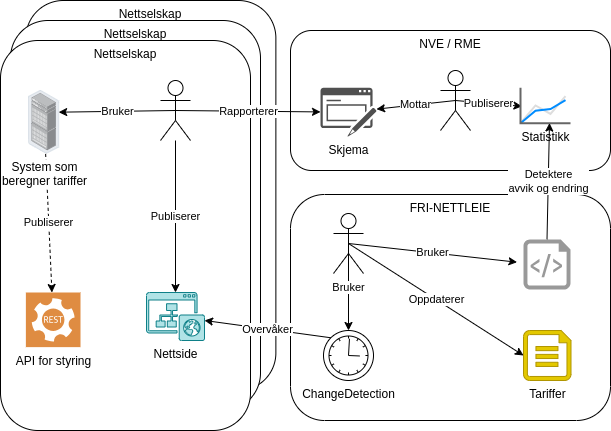
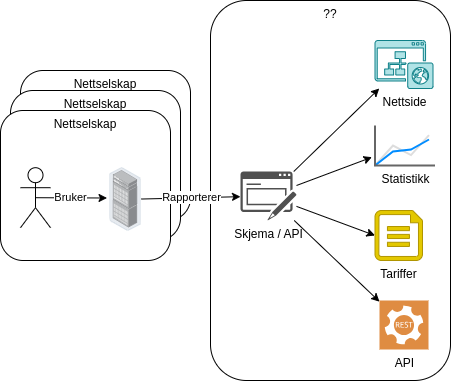

# Fri nettleie

> Slipp nettleien fri

En _dugnad_ for å samle nettleie-tariffer i det norske kraftsystemet.

<!-- toc -->

- [Åpen og gratis oversikt over nettleiepriser](#apen-og-gratis-oversikt-over-nettleiepriser)
- [Ta kontakt! 👋🏻](#ta-kontakt-%F0%9F%91%8B%F0%9F%8F%BB)
- [Dataene](#dataene)
  * [Prissignal](#prissignal)
- [Mål](#mal)
- [Anti-mål](#anti-mal)
- [Innsamling](#innsamling)
- [Hvordan gjør vi det](#hvordan-gjor-vi-det)
- [Utfordringer ved innsamling](#utfordringer-ved-innsamling)
  * [Ulike modeller](#ulike-modeller)
  * [Flere tariffer per netteier](#flere-tariffer-per-netteier)
  * [Priser oppgitt med og uten avgifter](#priser-oppgitt-med-og-uten-avgifter)
- [Avgifter](#avgifter)
  * [Enova-avgift](#enova-avgift)
  * [Forbruksavgift - Elavgift](#forbruksavgift---elavgift)
  * [Merverdiavgift](#merverdiavgift)
- [Bidra](#bidra)
  * [Samle data](#samle-data)
  * [Gi beskjed om feil eller kom med ideer](#gi-beskjed-om-feil-eller-kom-med-ideer)
  * [Gi oss en stjerne](#gi-oss-en-stjerne)
  * [Utvikle med oss.](#utvikle-med-oss)
  * [Spons Changedetection](#spons-changedetection)
  * [Si at du bruker våre data 📢](#si-at-du-bruker-vare-data-%F0%9F%93%A2)
- [Dataene i bruk](#dataene-i-bruk)
- [fri-nettleie i media](#fri-nettleie-i-media)
- [Netteiere](#netteiere)
- [Status](#status)
- [Forvaltere](#forvaltere)
- [Ofte stilte spørsmål](#ofte-stilte-sporsmal)
  * [Hvorfor gidder dere?](#hvorfor-gidder-dere)
  * [Bør ikke noen andre gjøre dette?](#bor-ikke-noen-andre-gjore-dette)
  * [Hva med NVE sine data?](#hva-med-nve-sine-data)
  * [Hva med Nettleie API fra Digin/Elbits?](#hva-med-nettleie-api-fra-diginelbits)
  * [Tilbyr dere et API?](#tilbyr-dere-et-api)
- [Lisens](#lisens)

<!-- tocstop -->

## Åpen og gratis oversikt over nettleiepriser

Nettleie er en del av [strømregningen](https://snl.no/str%C3%B8mregning) som går
til det lokale nettselskapet.
[Nettleie-tariffer skal være lett tilgjengelig for nettkundene](https://lovdata.no/forskrift/1999-03-11-302/§13-5),
men praksis i dag er at den distribueres av nettselskaper på mange ulike måter
og formater. Selv om det finnes
[gode initiativer](https://elhub.no/elhub-planlegger-a-tilby-en-felles-losning-for-distribusjon-av-nettariffer/),
[statistikk](https://api.nve.no/doc/nettleiestatistikk/),
[datasett](https://biapi.nve.no/nettleietariffer/swagger/index.html),
[kommersielle](https://docs.hark.eco/docs/developers/delivery-charge-api/)
[løsninger](https://stromradar.no/zohmapi/) og
[standarder for deling av nettleie](https://github.com/3lbits/API-nettleie-for-styring)
finnes det ikke noen åpen, gratis oversikt over nettleie på tvers av alle
nettselskaper i Norge som er oppdatert, uten feil og som inneholder både tariffmodeller og
prissignal. Før nå!

Dette prosjektet bruker kraften av en nettdugnad for å samle og systematisere
nettleie-priser for hele landet. **De innsamlede dataene er gratis og åpent
tilgengelig på standardisert format her på GitHub.** Hensikten er å legge til rette for at

* privatpersoner og selskaper skal kunne lage tekniske løsninger som viser
  kostnad eller styrer strømforbruk basert på nettleie.
* alle interesserte kan analysere dataene for eksempel for å se forskjeller mellom nettselskaper.

At sluttkunder får oversikt over alle komponentene i strømregningen er viktig
for energiøkonomisering, men det er vanskelig å oppnå uten at dataene er lett
tilgjengelig for hele Norge. Lett tilgjengelige data vil legge til rette for at
nettkundene reagerer på prissignalene i nettleien og styrer sitt forbruk på en
måte som hjelper nettet samtidig som de sparer penger.

## Ta kontakt! 👋🏻

Har du bruk for nettleie-data? Da ønsker vi å snakke med deg for å lære mer om
hva du trenger og ønsker! Er det noe som mangler for at du kan ta dataene i bruk?

Kom i kontakt med oss ved å bruke vårt
[kontaktskjema på tally.so](https://tally.so/r/wol2v1) eller åpne et issue her
på GitHub.

## Dataene

Dataene finner du under [tariffer](./tariffer/) som yaml-filer. Dataene
inneholder en beskrivelse av fastledd og energiledd uten avgifter.

Vi samler inn data per netteier og vil gjøre tilgjengelig data per
nettavregningsområde.

### Prissignal

Selv om tariff-dataene kun inneholder en _beskrivelse_ av tariffen er det fullt
mulig å lage en tidsserie - prissignal - basert på dette.

Et skript som viser hvordan dette kan gjøres konseptuelt finnes i
[scripts/prissignal.py](./scripts/prissignal.py). Brukes slik:

```bash
./scripts/prissignal.py --fra 2024-10-26 --til 2024-10-28 --tariff-fil tariffer/midtnett.yml
./scripts/prissignal.py --fra 2024-10-25 --til 2024-10-28 --tariff-fil tariffer/griug.yml
```

Dette prissignalet er uten alle avgifter. Det er mulig å beregne avgift basert
på når og hvor (hvilken kommune) forbruket er. Se [avsnittet om avgifter](#avgifter).

Et annet eksempel finnes på
[visningssidene for tariffene på kraftsystemet.no](https://kraftsystemet.no/fri-nettleie/tariffer/).
Der viser vi også en forenklet bereging av avgifter.

## Mål

- [x] Samle strukturdata for å identifisere alle netteier og nettområder
- [x] Definere format for innsamling
- [x] Vise at det kan genereres prissignal basert på formatet
- [x] Samle tariffer for private husholdninger og hytter/fritidseiendom på yaml
  format for et utvalg nettselskaper (med varierende tariffer)
- [x] Overvåke nettselskapenes sider for å varsle ved endring
- [x] Sammenstille og publisere informasjon per netteier på et "menneskelig" format på kraftsystemet.no/fri-nettleie
- [x] Publisere visualisert prissignal basert på de innsamlede tariffene
- [x] Samle tariffer for husholdninger og hytter/fritidshus for alle nettområder
- [x] Kontinuerlig oppdatere dataene ved endring hos nettselskapene
- [ ] Maskinlesbare filer for avgifter

## Anti-mål

Selv om det kan være nyttig er det følgende foreløpig ikke en del av dette
prosjektet

* tariffer for næring
* tariff for ikke automatisk avlesning
* vedlikeholde historiske priser

## Innsamling

Dataene i dette prosjektet samles inn manuelt fra netteiers hjemmesider og
lignende. Automatisk scraping er ikke et mål og det oppfordres til å unngå bruk av
roboter for innsamling. Vi respekterer andres systemer og immatrielle rettigheter og bruker
f.eks. ikke data fra andre kommersielle aktører som leverer samme type data.

Kilde-dataene som vi henter fra netteierne er
[offentlig eiendom/allemannseie/public domain](https://no.wikipedia.org/wiki/Offentlig_eiendom).
Tariffer og vilkår gjøres tilgjengelig fra netteierne i henhold til
[Forskrift om kontroll av nettvirksomhet](https://lovdata.no/dokument/SF/forskrift/1999-03-11-302/KAPITTEL_5-1#%C2%A713-5).
Vi samler og sammenstiller tariffene på vårt format og lisensierer datasettet
under [CC-BY-4.0](https://creativecommons.org/licenses/by/4.0/deed.no) som
krever navngivelse. Det er viktig at dataene som samles inn er public domain.
Det betyr f.eks. at vi ikke kan bruke andre sammenstilte datasett, APIer eller
lignende dersom det ikke eksplisitt er angitt som public domain.

Vi har også et verktøy som kan brukes ved innsamling som finnes på på
[kraftsystemet.no/fri-nettleie/innsamler/](http://kraftsystemet.no/fri-nettleie/innsamler/).

## Hvordan gjør vi det

Denne figuren gir et noe forenklet bilde av hvordan dataene til fri-nettleie
blir til.



Som figuren viser skjer følgende

* Noen hos nettselskapene beregner nettleietariffer i sine systemer. De
  rapporterer så tariffene til NVE ved nyttår og ved endringer gjennom året.
  Dette er et myndighetskrav og gjøres med et skjema på Altinn. I tillegg
  publiseres tariffene på nettselskapenes hjemmesider, og et fåtall tilbyr også
  tilgang via API-er.
* [NVE mottar tariffene](#hva-med-nve-sine-data) og publiserer dem som
  statistikk, visuelt og via API-er, men ofte med en viss forsinkelse.
* Vi i fri-nettleie overvåker nettsidene til netteierne og NVEs datasett. Når vi
  oppdager endringer samler vi inn dataene manuelt og oppdaterer dataene i dette
  repoet.
* Brukerne av nettleiedata benytter netteiers hjemmesider og APIer, NVEs statistikk
  eller fri-nettleie (eller en kombinasjon) til sine formål (forskning,
  tjenesteutvikling, styring osv). Formatene, og til dels dataene, er ulike
  mellom kildene.

Det er mulig å forenkle denne prosessen. Illustrasjonen under viser en mulighet
som reduserer unødvendig/dobbelt arbeid. Netteier rapporterer til _en_ part som
publiserer til alle formål og som ansees som autorativ kilde til nettleiedata i
Norge. Legg merke til at dette ikke er fri-nettleie. Vi er en midlertidig dugnad
frem til en slik løsning kommer på plass. Hvem som skal ta denne rollen er ikke
noe vi ønsker å mene noe om.



## Utfordringer ved innsamling

Ved innsamling og struktuering av data møter vi noen (overkommelige)
utfordringer. Kort fortalt er det variasjon i både tariffene og hvordan de
presenteres som gjør det lett å gjøre feil ved innsamling.

### Ulike modeller

Det eksisterer flere ulike modeller for nettleie. Det kan for eksempel være
forskjellige priser i løpet av døgnet,
[sesonger](https://fagne.no/kunde-og-nettleie/nettleie-priser-og-vilkar/priser-privatkunder/),
[brukstidstillegg](https://www.griug.no/om-nettleie-og-priser/priser/nettleiepriser-2024/) eller
[forskjell mellom hverdag og helg/helligdager](https://www.elvia.no/nettleie/alt-om-nettleiepriser/nettleiepriser-for-privatkunder/).

For fastleddet finnes det også flere modeller. For eksempel at fastledd regnes
ut
[fem høyeste effektene, løpende siste 12 mnd](https://www.fjellnett.no/nettleie/avtaler-og-vilkar/fellesbestemmelser/)
til forskjell fra den mer vanlige
[tre timene i måneden med høyest forbruk](https://norgesnett.no/kunde/ny-nettleie/).
I tilleg er det noen som oppgir priser per år mens andre per måned, samt om de
ulike trinnene er "til og med" eller "opp til, men ikke med".

### Flere tariffer per netteier

Noen netteiere har ulike tariffer for ulike deler av sitt nett. Dette er typisk
dersom det har vært sammenslåing av konsesjonsområder.

### Priser oppgitt med og uten avgifter

Ved innsamling av tariffer er det utfordrende for innsamling når noen netteiere
gjør tilgjengelig sine priser med avgifter, mens andre ikke inkluderer avgifter.
Avgiftsnivået er forskjellig avhengig av hvor i landet en netteier er
konsesjonær - det er fort å gjøre feil.

## Avgifter

Det er tre avgifter som gjelder for nettleie:

* Enova-avgift
* Elavgift/Forbruksavgift
* Merverdiavgift

Enova-avgiften gjelder alle, men forbruk- og merverdiavgiften er avhenging av
hvor i landet forbruket er. De følgende underkapitlene beskriver de tre
avgiftene, men i praksis deles landed inn i tre deler.

* Tiltakssonen i Finnmark og Nord-Troms - hverken elavgift eller moms
* Resten av Troms og Nordland - elavgift, men ikke moms
* Alle fylker sør for Nordland - alle avgifter

### Enova-avgift

[Forskrift om Energifondet](https://lovdata.no/dokument/SF/forskrift/2001-12-10-1377)
sier at netteier skal legge et påslag på tariffen til alle sluttbrukere på alle
nettnivåer når det faktureres.

> For husholdningsbruk skal påslaget utgjøre 1 øre/kWh.

Inkludert moms blir avgiften 1,25 øre/kWh.

### Forbruksavgift - Elavgift

En avgift på strøm som betales til netteier og netteier viderefører til Skatteetaten.

[Forskrift om særavgifter](https://lovdata.no/dokument/SF/forskrift/2001-12-11-1451/KAPITTEL_3-12#KAPITTEL_3-12)
fastsetter at avgift på elektrisk kraft settes ved
[stortingsvedtak](https://lovdata.no/register/stortingsvedtak).
[Vedtaket for 2024](https://lovdata.no/dokument/STV/forskrift/2024-12-13-3216)
fastsetter også lavere avgift for jan-mars og redusert sats for en del næringer. Fra 01.10.2025 er det forslått en [endring i særavgiften](https://lovdata.no/dokument/STV/forskrift/2025-06-20-1183/KAPITTEL_2#KAPITTEL_2), denne vil tre i kraft når departementet avgjør det. 

Personer som bor i
[tiltakssonen i Finnmark og Nord-Troms](https://www.regjeringen.no/no/tema/kommuner-og-regioner/regional--og-distriktspolitikk/Berekraftig-regional-utvikling-i-nord/virkemidler-i-tiltakssonen/id2362290/)
har fritak for el-avgift på forbruk.

### Merverdiavgift

Vanlig moms på 25% betales på nettleie, Enova-avgiften og Elavgiften.

Det er
[fritak for mva i Nord-Norge](https://www.skatteetaten.no/rettskilder/type/handboker/merverdiavgiftshandboken/2020/M-6/M-6-6/)
- Nordland, Troms og Finnmark.

## Bidra

Vi trenger all den hjelp vi kan få!

### Samle data

Vi har data for alle netteiere, men det oppstår stadig endringer. Følg med på
[issues](https://github.com/kraftsystemet/fri-nettleie/issues). Vi legger til
saker med `collecting` og `help wanted` labels når vi oppdager endringer.

Trykk på ✏️ ved netteieren for å bli sendt til innsamleren. Legg til nye data og
kopier tilbake til `.yml` filen.

Formatet er formalisert i filen
[tariff-eksempel.yml](./tariff-eksempel.yml) og kan valideres med
[cue](https://cuelang.org/) basert på [tariff.cue](./tariff.cue). Du bør se på
noen av de allerede innsamlede tariffene for å få en følelse av formatet.

Primært ønsker vi at bidrag gjøres gjennom pull-requests. Men du kan også åpne
et issue eller levere [kontaktskjema på tally.so](https://tally.so/r/wol2v1).
Alle bidrag teller!

### Gi beskjed om feil eller kom med ideer

Dersom du ser feil i dataene eller annet - åpne et issue her på GitHub eller
bruk vårt [kontaktskjema på tally.so](https://tally.so/r/wol2v1)! Det samme
gjelder om du har gode ideer om hvordan vi kan samle inn og/eller strukturere
data.

### Gi oss en stjerne

Det holder oss motivert!

### Utvikle med oss.

Se [UTVIKLING.md](./UTVIKLING.md).

### Spons Changedetection

Vi kjører for øyeblikket [changedetection](https://changedetection.io/) lokalt
for å detektere endringer på tariffer hos netteiere. Kan du sponse en hostet
instans? Ta kontakt.

### Si at du bruker våre data 📢

Se under. Gi oss beskjed om du bruker dataene så legger vi deg til i lista.

## Dataene i bruk

Dette avsnittet viser et utvalg av hvor dataene er i bruk.

* [Slipper](https://slipper.no/) har brukt dataene i sin app siden desember 2024 📈
* [Tadata](https://tadata.no/products/56efa72d-88a9-4688-aa66-df0cd1dd40bb) tilbyr et API for nettleiepriser basert på data fra ***fri-nettleie***
* EnergiWatch har brukt dataene i sin journalistikk bl.a. i [mai 2025](https://energiwatch.no/nyheter/nett_teknologi/article18222699.ece) 🗞️
* [Elmera Group](https://elmeragroup.no/about-elmeragroup/elmeragroup-in-brief/) bruker dataene i alle sine whitelabled apper i Norge fra august 2025 💡

## fri-nettleie i media

* Presentasjon av prosjektet på TechDay 2025 - [Fri Nettleie - en krevende travers gjennom tariffveggen](https://www.statnett.no/techday?videoId=6372414675112)
* Omtale i energiteknikk April 2025 - [Ryddet i jungelen av nettleie på dugnad](https://energiteknikk.net/2025/04/ryddet-i-jungelen-av-nettleie-pa-dugnad/)

## Netteiere

Vi samler inn nettleie-tariffer per netteier. Listen over netteiere er
fra [eSett Open Data](https://opendata.esett.com/dso) som er en kontinuerlig
oppdatert liste over nåværende netteiere. Dette er ikke en statisk liste, men
endrer seg over tid. Elhub publiserer informasjon om endring av f.eks.
[navn](https://elhub.no/aktorer-og-markedsstruktur/opprette-endre-og-avslutte-aktorer/navneendringer-for-nettselskap/)
og
[nettavregningsområder](https://elhub.no/aktorer-og-markedsstruktur/opprette-endre-og-avslutte-aktorer/planlagte-strukturendringer/).

Noen netteiere er ikke med i listen
siden de ikke har private sluttkunder. Vi filtrerer ved hjelp av en
[ignoreringsliste](./.statusignore).

Netteiere i Norge identifiseres med Global Location Number (GLN). Øsnker du å
vite organisasjonsnummeret kan du se på
[referansedataene fra Elhub](./referanse-data/elhub/grid_owners.json).

I noen
tilfeller kan det være avvik mellom områdekonsesjonærer i
[NVEs kartkatalog](https://kartkatalog.nve.no/) og eSett/Elhub. Dette skyldes
ofte etterslep i registrering mellom systemene. Vi vil alltid bruke eSett som
autoritativ kilde.

## Status

Vi har data for alle relevante netteiere og (prøver å) oppdatere dem kontinerlig
når vi blir oppmerksom på endringer/oppdatering 🎉🥳!

<!-- statusstart -->
<table>
    <tr>
        <th>Navn</th>
        <th>GLN</th>
        <th>Oppdatert</th>
        <th>Handling</th>
    </tr>
<tr>
  <td>Alut AS</td>
  <td>7080010004383</td>
  <td>2025-06-30</td>
  <td>
    <a href="https://kraftsystemet.no/fri-nettleie/tariffer/alut.html" title="Se på tariffen for Alut AS" target="_blank">🔍</a>
    <a href="./tariffer/alut.yml" title="Se dataene for Alut AS i YAML-format" target="_blank">📄</a>
    <a href='https://kraftsystemet.no/fri-nettleie/innsamler/?data=eyJnbG4iOiBbIjcwODAwMTAwMDQzODMiXSwgImtpbGRlciI6IFsiaHR0cHM6Ly9hbHV0Lm5vL25ldHRsZWllLyJdLCAibmV0dGVpZXIiOiAiQWx1dCBBUyIsICJzaXN0X29wcGRhdGVydCI6ICIyMDI1LTA2LTMwIiwgInRhcmlmZmVyIjogW3siZW5lcmdpbGVkZCI6IHsiZ3J1bm5wcmlzIjogMTMuMX0sICJmYXN0bGVkZCI6IHsibWV0b2RlIjogIk9WX1RSRUZBU0UiLCAidGVyc2tlbF9pbmtsdWRlcnQiOiBmYWxzZSwgInRlcnNrbGVyIjogW3sicHJpcyI6IDM1MDAsICJ0ZXJza2VsIjogMH0sIHsicHJpcyI6IDQ1MDAsICJ0ZXJza2VsIjogMTI1fV19LCAiZ3lsZGlnX2ZyYSI6ICIyMDI0LTAxLTAxIiwgImd5bGRpZ190aWwiOiAiMjAyNS0wNy0wMSIsICJrdW5kZWdydXBwZSI6ICJwcml2YXQifSwgeyJlbmVyZ2lsZWRkIjogeyJncnVubnByaXMiOiA5LjF9LCAiZmFzdGxlZGQiOiB7Im1ldG9kZSI6ICJPVl9UUkVGQVNFIiwgInRlcnNrZWxfaW5rbHVkZXJ0IjogZmFsc2UsICJ0ZXJza2xlciI6IFt7InByaXMiOiAzNTAwLCAidGVyc2tlbCI6IDB9LCB7InByaXMiOiA0NTAwLCAidGVyc2tlbCI6IDEyNX1dfSwgImd5bGRpZ19mcmEiOiAiMjAyNS0wNy0wMSIsICJneWxkaWdfdGlsIjogIjIwMjYtMDEtMDEiLCAia3VuZGVncnVwcGUiOiAicHJpdmF0In1dfQ==' title='Samle inn data for Alut AS' target='_blank'>✏️</a>
  </td>
</tr>
<tr>
  <td>Area Nett AS - Lega</td>
  <td>7080004087071</td>
  <td>2025-01-14</td>
  <td>
    <a href="https://kraftsystemet.no/fri-nettleie/tariffer/area-lega.html" title="Se på tariffen for Area Nett AS - Lega" target="_blank">🔍</a>
    <a href="./tariffer/area-lega.yml" title="Se dataene for Area Nett AS - Lega i YAML-format" target="_blank">📄</a>
    <a href='https://kraftsystemet.no/fri-nettleie/innsamler/?data=eyJuZXR0ZWllciI6ICJBcmVhIE5ldHQgQVMgLSBMZWdhIiwgImdsbiI6IFsiNzA4MDAwNDA4NzA3MSJdLCAic2lzdF9vcHBkYXRlcnQiOiAiMjAyNS0wMS0xNCIsICJraWxkZXIiOiBbImh0dHBzOi8vd3d3LmFyZWEubm8va3VuZGUtb2ctbmV0dGxlaWUvcHJpc2VyLW9nLW5ldHRsZWllLyIsICJodHRwczovL3d3dy5hcmVhLm5vL2dldGZpbGUucGhwLzEzMTMxOS0xNzM0NTI1MTIxL0ZpbGVyL1BSSVNCTEFEJTIwVEFSSUZGRVIlMjAyMDI1LnBkZiJdLCAidGFyaWZmZXIiOiBbeyJrdW5kZWdydXBwZSI6ICJwcml2YXQiLCAiZmFzdGxlZGQiOiB7Im1ldG9kZSI6ICJUUkVfRFx1MDBkOEdOTUFYX01ORCIsICJ0ZXJza2VsX2lua2x1ZGVydCI6IHRydWUsICJ0ZXJza2xlciI6IFt7InRlcnNrZWwiOiAwLCAicHJpcyI6IDMzMDB9LCB7InRlcnNrZWwiOiAyLCAicHJpcyI6IDQyOTB9LCB7InRlcnNrZWwiOiA1LCAicHJpcyI6IDUyODB9LCB7InRlcnNrZWwiOiAxMCwgInByaXMiOiA4NTgwfSwgeyJ0ZXJza2VsIjogMTUsICJwcmlzIjogMTAwNjV9LCB7InRlcnNrZWwiOiAyMCwgInByaXMiOiAxMTg4MH0sIHsidGVyc2tlbCI6IDI1LCAicHJpcyI6IDEzMjAwfV19LCAiZW5lcmdpbGVkZCI6IHsiZ3J1bm5wcmlzIjogMjEuMywgInVubnRhayI6IFt7Im5hdm4iOiAiTGF2bGFzdCAtIHNvbW1lciIsICJ0aW1lciI6ICIyMi01IiwgInByaXMiOiAxOS4zLCAibVx1MDBlNW5lZGVyIjogWyJhcHJpbCIsICJtYWkiLCAianVuaSIsICJqdWxpIiwgImF1Z3VzdCIsICJzZXB0ZW1iZXIiLCAib2t0b2JlciIsICJub3ZlbWJlciIsICJkZXNlbWJlciJdfSwgeyJuYXZuIjogIkhcdTAwZjh5bGFzdCAtIHZpbnRlciIsICJ0aW1lciI6ICI2LTIxIiwgIm1cdTAwZTVuZWRlciI6IFsiamFudWFyIiwgImZlYnJ1YXIiLCAibWFycyJdLCAicHJpcyI6IDI0LjN9XX0sICJneWxkaWdfZnJhIjogIjIwMjUtMDEtMDEifV19' title='Samle inn data for Area Nett AS - Lega' target='_blank'>✏️</a>
  </td>
</tr>
<tr>
  <td>Area Nett AS - Luostejok</td>
  <td>7080004087071</td>
  <td>2025-01-14</td>
  <td>
    <a href="https://kraftsystemet.no/fri-nettleie/tariffer/area-luostejok.html" title="Se på tariffen for Area Nett AS - Luostejok" target="_blank">🔍</a>
    <a href="./tariffer/area-luostejok.yml" title="Se dataene for Area Nett AS - Luostejok i YAML-format" target="_blank">📄</a>
    <a href='https://kraftsystemet.no/fri-nettleie/innsamler/?data=eyJuZXR0ZWllciI6ICJBcmVhIE5ldHQgQVMgLSBMdW9zdGVqb2siLCAiZ2xuIjogWyI3MDgwMDA0MDg3MDcxIl0sICJzaXN0X29wcGRhdGVydCI6ICIyMDI1LTAxLTE0IiwgImtpbGRlciI6IFsiaHR0cHM6Ly93d3cuYXJlYS5uby9rdW5kZS1vZy1uZXR0bGVpZS9wcmlzZXItb2ctbmV0dGxlaWUvIiwgImh0dHBzOi8vd3d3LmFyZWEubm8vZ2V0ZmlsZS5waHAvMTMxMzE5LTE3MzQ1MjUxMjEvRmlsZXIvUFJJU0JMQUQlMjBUQVJJRkZFUiUyMDIwMjUucGRmIl0sICJ0YXJpZmZlciI6IFt7Imt1bmRlZ3J1cHBlIjogInByaXZhdCIsICJmYXN0bGVkZCI6IHsibWV0b2RlIjogIlRSRV9EXHUwMGQ4R05NQVhfTU5EIiwgInRlcnNrZWxfaW5rbHVkZXJ0IjogdHJ1ZSwgInRlcnNrbGVyIjogW3sidGVyc2tlbCI6IDAsICJwcmlzIjogMzkwMH0sIHsidGVyc2tlbCI6IDIsICJwcmlzIjogNjU1Mn0sIHsidGVyc2tlbCI6IDUsICJwcmlzIjogODU4MH0sIHsidGVyc2tlbCI6IDEwLCAicHJpcyI6IDEwNzY0fSwgeyJ0ZXJza2VsIjogMTUsICJwcmlzIjogMTI0ODB9LCB7InRlcnNrZWwiOiAyMCwgInByaXMiOiAxNDUwOH0sIHsidGVyc2tlbCI6IDI1LCAicHJpcyI6IDI0NjQ4fV19LCAiZW5lcmdpbGVkZCI6IHsiZ3J1bm5wcmlzIjogMjYuODksICJ1bm50YWsiOiBbeyJuYXZuIjogIkxhdmxhc3QgLSBzb21tZXIiLCAidGltZXIiOiAiMjItNSIsICJwcmlzIjogMjMuODksICJtXHUwMGU1bmVkZXIiOiBbImFwcmlsIiwgIm1haSIsICJqdW5pIiwgImp1bGkiLCAiYXVndXN0IiwgInNlcHRlbWJlciIsICJva3RvYmVyIiwgIm5vdmVtYmVyIiwgImRlc2VtYmVyIl19LCB7Im5hdm4iOiAiSFx1MDBmOHlsYXN0IC0gdmludGVyIiwgInRpbWVyIjogIjYtMjEiLCAibVx1MDBlNW5lZGVyIjogWyJqYW51YXIiLCAiZmVicnVhciIsICJtYXJzIl0sICJwcmlzIjogMjkuODl9XX0sICJneWxkaWdfZnJhIjogIjIwMjUtMDEtMDEifV19' title='Samle inn data for Area Nett AS - Luostejok' target='_blank'>✏️</a>
  </td>
</tr>
<tr>
  <td>Area Nett AS - NettiNord</td>
  <td>7080004087071</td>
  <td>2025-01-14</td>
  <td>
    <a href="https://kraftsystemet.no/fri-nettleie/tariffer/area-nettinord.html" title="Se på tariffen for Area Nett AS - NettiNord" target="_blank">🔍</a>
    <a href="./tariffer/area-nettinord.yml" title="Se dataene for Area Nett AS - NettiNord i YAML-format" target="_blank">📄</a>
    <a href='https://kraftsystemet.no/fri-nettleie/innsamler/?data=eyJuZXR0ZWllciI6ICJBcmVhIE5ldHQgQVMgLSBOZXR0aU5vcmQiLCAiZ2xuIjogWyI3MDgwMDA0MDg3MDcxIl0sICJzaXN0X29wcGRhdGVydCI6ICIyMDI1LTAxLTE0IiwgImtpbGRlciI6IFsiaHR0cHM6Ly93d3cuYXJlYS5uby9rdW5kZS1vZy1uZXR0bGVpZS9wcmlzZXItb2ctbmV0dGxlaWUvIiwgImh0dHBzOi8vd3d3LmFyZWEubm8vZ2V0ZmlsZS5waHAvMTMxMzE5LTE3MzQ1MjUxMjEvRmlsZXIvUFJJU0JMQUQlMjBUQVJJRkZFUiUyMDIwMjUucGRmIl0sICJ0YXJpZmZlciI6IFt7Imt1bmRlZ3J1cHBlIjogInByaXZhdCIsICJmYXN0bGVkZCI6IHsibWV0b2RlIjogIlRSRV9EXHUwMGQ4R05NQVhfTU5EIiwgInRlcnNrZWxfaW5rbHVkZXJ0IjogdHJ1ZSwgInRlcnNrbGVyIjogW3sidGVyc2tlbCI6IDAsICJwcmlzIjogNjMwMH0sIHsidGVyc2tlbCI6IDIsICJwcmlzIjogNjYxNX0sIHsidGVyc2tlbCI6IDUsICJwcmlzIjogNzI0NX0sIHsidGVyc2tlbCI6IDEwLCAicHJpcyI6IDEwMDgwfSwgeyJ0ZXJza2VsIjogMTUsICJwcmlzIjogMTIxNDB9LCB7InRlcnNrZWwiOiAyMCwgInByaXMiOiAxNDAzMH0sIHsidGVyc2tlbCI6IDI1LCAicHJpcyI6IDE3MTgwfV19LCAiZW5lcmdpbGVkZCI6IHsiZ3J1bm5wcmlzIjogMjYuODksICJ1bm50YWsiOiBbeyJuYXZuIjogIkxhdmxhc3Qgc29tbWVyIiwgInRpbWVyIjogIjIyLTUiLCAicHJpcyI6IDI0Ljg5LCAibVx1MDBlNW5lZGVyIjogWyJhcHJpbCIsICJtYWkiLCAianVuaSIsICJqdWxpIiwgImF1Z3VzdCIsICJzZXB0ZW1iZXIiLCAib2t0b2JlciIsICJub3ZlbWJlciIsICJkZXNlbWJlciJdfSwgeyJuYXZuIjogIkhcdTAwZjh5bGFzdCB2aW50ZXIiLCAidGltZXIiOiAiNi0yMSIsICJtXHUwMGU1bmVkZXIiOiBbImphbnVhciIsICJmZWJydWFyIiwgIm1hcnMiXSwgInByaXMiOiAyOS44OX1dfSwgImd5bGRpZ19mcmEiOiAiMjAyNS0wMS0wMSJ9XX0=' title='Samle inn data for Area Nett AS - NettiNord' target='_blank'>✏️</a>
  </td>
</tr>
<tr>
  <td>Arva AS</td>
  <td>7080005051859, 7080005051361</td>
  <td>2024-12-27</td>
  <td>
    <a href="https://kraftsystemet.no/fri-nettleie/tariffer/arva.html" title="Se på tariffen for Arva AS" target="_blank">🔍</a>
    <a href="./tariffer/arva.yml" title="Se dataene for Arva AS i YAML-format" target="_blank">📄</a>
    <a href='https://kraftsystemet.no/fri-nettleie/innsamler/?data=eyJuZXR0ZWllciI6ICJBcnZhIEFTIiwgImdsbiI6IFsiNzA4MDAwNTA1MTg1OSIsICI3MDgwMDA1MDUxMzYxIl0sICJzaXN0X29wcGRhdGVydCI6ICIyMDI0LTEyLTI3IiwgImtpbGRlciI6IFsiaHR0cHM6Ly9hcnZhLm5vL2hqZW0vUHJpc2VyIl0sICJ0YXJpZmZlciI6IFt7Imt1bmRlZ3J1cHBlIjogInByaXZhdCIsICJmYXN0bGVkZCI6IHsibWV0b2RlIjogIlRSRV9EXHUwMGQ4R05NQVhfTU5EIiwgInRlcnNrZWxfaW5rbHVkZXJ0IjogdHJ1ZSwgInRlcnNrbGVyIjogW3sidGVyc2tlbCI6IDAsICJwcmlzIjogMTAyMH0sIHsidGVyc2tlbCI6IDIsICJwcmlzIjogMjQxMn0sIHsidGVyc2tlbCI6IDUsICJwcmlzIjogNDc3Nn0sIHsidGVyc2tlbCI6IDEwLCAicHJpcyI6IDcxNDB9LCB7InRlcnNrZWwiOiAxNSwgInByaXMiOiA5NTA0fSwgeyJ0ZXJza2VsIjogMjAsICJwcmlzIjogMTE4Njh9LCB7InRlcnNrZWwiOiAyNSwgInByaXMiOiAyMzY2NH0sIHsidGVyc2tlbCI6IDUwLCAicHJpcyI6IDM1NDYwfSwgeyJ0ZXJza2VsIjogNzUsICJwcmlzIjogNDcyNTZ9LCB7InRlcnNrZWwiOiAxMDAsICJwcmlzIjogNzEzNDB9XX0sICJlbmVyZ2lsZWRkIjogeyJncnVubnByaXMiOiAxMS42LCAidW5udGFrIjogW3sibmF2biI6ICJIXHUwMGY4eWxhc3QiLCAidGltZXIiOiAiNi0yMSIsICJwcmlzIjogMjMuMX1dfSwgImd5bGRpZ19mcmEiOiAiMjAyNC0wMS0wMSJ9XX0=' title='Samle inn data for Arva AS' target='_blank'>✏️</a>
  </td>
</tr>
<tr>
  <td>Asker Nett</td>
  <td>7080003858825</td>
  <td>2024-11-27</td>
  <td>
    <a href="https://kraftsystemet.no/fri-nettleie/tariffer/asker.html" title="Se på tariffen for Asker Nett" target="_blank">🔍</a>
    <a href="./tariffer/asker.yml" title="Se dataene for Asker Nett i YAML-format" target="_blank">📄</a>
    <a href='https://kraftsystemet.no/fri-nettleie/innsamler/?data=eyJuZXR0ZWllciI6ICJBc2tlciBOZXR0IiwgImdsbiI6IFsiNzA4MDAwMzg1ODgyNSJdLCAic2lzdF9vcHBkYXRlcnQiOiAiMjAyNC0xMS0yNyIsICJraWxkZXIiOiBbImh0dHBzOi8vYXNrZXJuZXR0Lm5vL25ldHRsZWllLW9nLXByaXNlci8iLCAiaHR0cHM6Ly9hc2tlcm5ldHQubm8vcHJpc2xpc3RlLWZvci1wcml2YXRrdW5kZXItaS0yMDI0LyJdLCAidGFyaWZmZXIiOiBbeyJrdW5kZWdydXBwZSI6ICJwcml2YXQiLCAiZmFzdGxlZGQiOiB7Im1ldG9kZSI6ICJUUkVfRFx1MDBkOEdOTUFYX01ORCIsICJ0ZXJza2VsX2lua2x1ZGVydCI6IHRydWUsICJ0ZXJza2xlciI6IFt7InRlcnNrZWwiOiAwLCAicHJpcyI6IDE3NzZ9LCB7InRlcnNrZWwiOiAyLCAicHJpcyI6IDIyMDh9LCB7InRlcnNrZWwiOiA1LCAicHJpcyI6IDMyNjR9LCB7InRlcnNrZWwiOiAxMCwgInByaXMiOiA2ODE2fSwgeyJ0ZXJza2VsIjogMTUsICJwcmlzIjogODU5Mn0sIHsidGVyc2tlbCI6IDIwLCAicHJpcyI6IDEwODQ4fSwgeyJ0ZXJza2VsIjogMjUsICJwcmlzIjogMTUzNjB9LCB7InRlcnNrZWwiOiA1MCwgInByaXMiOiAyNDM4NH0sIHsidGVyc2tlbCI6IDc1LCAicHJpcyI6IDMyNDQ4fSwgeyJ0ZXJza2VsIjogMTAwLCAicHJpcyI6IDUxODQwfV19LCAiZW5lcmdpbGVkZCI6IHsiZ3J1bm5wcmlzIjogMTUuODg4LCAidW5udGFrIjogW3sibmF2biI6ICJIXHUwMGY4eWxhc3QiLCAidGltZXIiOiAiNi0yMSIsICJwcmlzIjogMjMuODg4fV19LCAiZ3lsZGlnX2ZyYSI6ICIyMDI0LTAxLTAxIn1dfQ==' title='Samle inn data for Asker Nett' target='_blank'>✏️</a>
  </td>
</tr>
<tr>
  <td>BKK AS </td>
  <td>7080005051378</td>
  <td>2025-08-25</td>
  <td>
    <a href="https://kraftsystemet.no/fri-nettleie/tariffer/bkk.html" title="Se på tariffen for BKK AS " target="_blank">🔍</a>
    <a href="./tariffer/bkk.yml" title="Se dataene for BKK AS  i YAML-format" target="_blank">📄</a>
    <a href='https://kraftsystemet.no/fri-nettleie/innsamler/?data=eyJuZXR0ZWllciI6ICJCS0sgQVMgIiwgImdsbiI6IFsiNzA4MDAwNTA1MTM3OCJdLCAic2lzdF9vcHBkYXRlcnQiOiAiMjAyNS0wOC0yNSIsICJraWxkZXIiOiBbImh0dHBzOi8vd3d3LmJray5uby9hbHQtb20tbmV0dGxlaWUvbmV0dGxlaWVwcmlzZXIiLCAiaHR0cHM6Ly93d3cuYmtrLm5vL25ldHRsZWllcHJpc2VyL3ByaXNlci1wcml2YXRrdW5kZXIiXSwgInRhcmlmZmVyIjogW3sia3VuZGVncnVwcGUiOiAicHJpdmF0IiwgImZhc3RsZWRkIjogeyJtZXRvZGUiOiAiVFJFX0RcdTAwZDhHTk1BWF9NTkQiLCAidGVyc2tlbF9pbmtsdWRlcnQiOiB0cnVlLCAidGVyc2tsZXIiOiBbeyJ0ZXJza2VsIjogMCwgInByaXMiOiAxNTM2fSwgeyJ0ZXJza2VsIjogMiwgInByaXMiOiAyNDk2fSwgeyJ0ZXJza2VsIjogNSwgInByaXMiOiA0MTI4fSwgeyJ0ZXJza2VsIjogMTAsICJwcmlzIjogNTk1Mn0sIHsidGVyc2tlbCI6IDE1LCAicHJpcyI6IDc2ODB9LCB7InRlcnNrZWwiOiAyMCwgInByaXMiOiA5MzYwfSwgeyJ0ZXJza2VsIjogMjUsICJwcmlzIjogMTc5NTJ9LCB7InRlcnNrZWwiOiA1MCwgInByaXMiOiAyNjQ5Nn0sIHsidGVyc2tlbCI6IDc1LCAicHJpcyI6IDM1MDQwfSwgeyJ0ZXJza2VsIjogMTAwLCAicHJpcyI6IDY5MTIwfV19LCAiZW5lcmdpbGVkZCI6IHsiZ3J1bm5wcmlzIjogMTkuNzc2LCAidW5udGFrIjogW3sibmF2biI6ICJIXHUwMGY4eWxhc3Qgdmlya2VkYWciLCAidGltZXIiOiAiNi0yMSIsICJwcmlzIjogMjkuOTYsICJkYWdlciI6IFsidmlya2VkYWciXX1dfSwgImd5bGRpZ19mcmEiOiAiMjAyNC0wNC0wMSIsICJneWxkaWdfdGlsIjogIjIwMjUtMDktMDEifSwgeyJrdW5kZWdydXBwZSI6ICJwcml2YXQiLCAiZmFzdGxlZGQiOiB7Im1ldG9kZSI6ICJUUkVfRFx1MDBkOEdOTUFYX01ORCIsICJ0ZXJza2VsX2lua2x1ZGVydCI6IHRydWUsICJ0ZXJza2xlciI6IFt7InRlcnNrZWwiOiAwLCAicHJpcyI6IDE0ODh9LCB7InRlcnNrZWwiOiAyLCAicHJpcyI6IDI0MDB9LCB7InRlcnNrZWwiOiA1LCAicHJpcyI6IDM5ODR9LCB7InRlcnNrZWwiOiAxMCwgInByaXMiOiA1NzYwfSwgeyJ0ZXJza2VsIjogMTUsICJwcmlzIjogNzM5Mn0sIHsidGVyc2tlbCI6IDIwLCAicHJpcyI6IDkwMjR9LCB7InRlcnNrZWwiOiAyNSwgInByaXMiOiAxNzI4MH0sIHsidGVyc2tlbCI6IDUwLCAicHJpcyI6IDI1NDQwfSwgeyJ0ZXJza2VsIjogNzUsICJwcmlzIjogMzM2MDB9LCB7InRlcnNrZWwiOiAxMDAsICJwcmlzIjogNjYyNDB9XX0sICJlbmVyZ2lsZWRkIjogeyJncnVubnByaXMiOiAxOC45OSwgInVubnRhayI6IFt7Im5hdm4iOiAiSFx1MDBmOHlsYXN0IHZpcmtlZGFnIiwgInRpbWVyIjogIjYtMjEiLCAiZGFnZXIiOiBbInZpcmtlZGFnIl0sICJwcmlzIjogMjguNzd9XX0sICJneWxkaWdfZnJhIjogIjIwMjUtMDktMDEifV19' title='Samle inn data for BKK AS ' target='_blank'>✏️</a>
  </td>
</tr>
<tr>
  <td>Barents Nett AS</td>
  <td>7080005051934</td>
  <td>2025-07-02</td>
  <td>
    <a href="https://kraftsystemet.no/fri-nettleie/tariffer/barentsnett.html" title="Se på tariffen for Barents Nett AS" target="_blank">🔍</a>
    <a href="./tariffer/barentsnett.yml" title="Se dataene for Barents Nett AS i YAML-format" target="_blank">📄</a>
    <a href='https://kraftsystemet.no/fri-nettleie/innsamler/?data=eyJuZXR0ZWllciI6ICJCYXJlbnRzIE5ldHQgQVMiLCAiZ2xuIjogWyI3MDgwMDA1MDUxOTM0Il0sICJraWxkZXIiOiBbImh0dHBzOi8vd3d3LmJhcmVudHMtbmV0dC5uby9rdW5kZXNlcnZpY2UvbmV0dC1vZy1uZXR0bGVpZS8iLCAiaHR0cHM6Ly93d3cuYmFyZW50cy1uZXR0Lm5vL2dldGZpbGUucGhwLzEzMTQxMTYtMTc1MTAwNzUzMi9Eb2t1bWVudGVyL05ldHQvTmV0dGxlaWUvTmV0dGxlaWVicm9zanlyZSUyMDAxLjA3LjIwMjUucGRmIl0sICJzaXN0X29wcGRhdGVydCI6ICIyMDI1LTA3LTAyIiwgInRhcmlmZmVyIjogW3sia3VuZGVncnVwcGUiOiAicHJpdmF0IiwgImZhc3RsZWRkIjogeyJtZXRvZGUiOiAiVFJFX0RcdTAwZDhHTk1BWF9NTkQiLCAidGVyc2tlbF9pbmtsdWRlcnQiOiB0cnVlLCAidGVyc2tsZXIiOiBbeyJ0ZXJza2VsIjogMCwgInByaXMiOiA3MjI0fSwgeyJ0ZXJza2VsIjogMiwgInByaXMiOiA3OTQ0fSwgeyJ0ZXJza2VsIjogNSwgInByaXMiOiA4NjY0fSwgeyJ0ZXJza2VsIjogMTAsICJwcmlzIjogOTM4NH0sIHsidGVyc2tlbCI6IDE1LCAicHJpcyI6IDEwODM2fSwgeyJ0ZXJza2VsIjogMjAsICJwcmlzIjogMTMwMDh9XX0sICJlbmVyZ2lsZWRkIjogeyJncnVubnByaXMiOiAxMy4xfSwgImd5bGRpZ19mcmEiOiAiMjAyNS0wMS0wMSIsICJneWxkaWdfdGlsIjogIjIwMjUtMDctMDEifSwgeyJrdW5kZWdydXBwZSI6ICJwcml2YXQiLCAiZmFzdGxlZGQiOiB7Im1ldG9kZSI6ICJUUkVfRFx1MDBkOEdOTUFYX01ORCIsICJ0ZXJza2VsX2lua2x1ZGVydCI6IHRydWUsICJ0ZXJza2xlciI6IFt7InRlcnNrZWwiOiAwLCAicHJpcyI6IDYwMjR9LCB7InRlcnNrZWwiOiAyLCAicHJpcyI6IDY2MjR9LCB7InRlcnNrZWwiOiA1LCAicHJpcyI6IDcyMjR9LCB7InRlcnNrZWwiOiAxMCwgInByaXMiOiA3ODM2fSwgeyJ0ZXJza2VsIjogMTUsICJwcmlzIjogOTAzNn0sIHsidGVyc2tlbCI6IDIwLCAicHJpcyI6IDEwODQ4fV19LCAiZW5lcmdpbGVkZCI6IHsiZ3J1bm5wcmlzIjogMTF9LCAiZ3lsZGlnX2ZyYSI6ICIyMDI1LTA3LTAxIn1dfQ==' title='Samle inn data for Barents Nett AS' target='_blank'>✏️</a>
  </td>
</tr>
<tr>
  <td>Bindal Kraftlag Nett</td>
  <td>7080005055963</td>
  <td>2025-01-09</td>
  <td>
    <a href="https://kraftsystemet.no/fri-nettleie/tariffer/bindalkraftlag.html" title="Se på tariffen for Bindal Kraftlag Nett" target="_blank">🔍</a>
    <a href="./tariffer/bindalkraftlag.yml" title="Se dataene for Bindal Kraftlag Nett i YAML-format" target="_blank">📄</a>
    <a href='https://kraftsystemet.no/fri-nettleie/innsamler/?data=eyJuZXR0ZWllciI6ICJCaW5kYWwgS3JhZnRsYWcgTmV0dCIsICJnbG4iOiBbIjcwODAwMDUwNTU5NjMiXSwgImtpbGRlciI6IFsiaHR0cHM6Ly9uZXR0LmJpbmRhbGtyYWZ0bGFnLm5vL25ldHQvcHJpc2VyLyIsICJodHRwczovL25ldHQuYmluZGFsa3JhZnRsYWcubm8vMjAyNC8xMi8zMC9uZXR0bGVpZS0yMDI1LyJdLCAidGFyaWZmZXIiOiBbeyJrdW5kZWdydXBwZSI6ICJwcml2YXQiLCAiZmFzdGxlZGQiOiB7Im1ldG9kZSI6ICJUUkVfRFx1MDBkOEdOTUFYX01ORCIsICJ0ZXJza2VsX2lua2x1ZGVydCI6IGZhbHNlLCAidGVyc2tsZXIiOiBbeyJ0ZXJza2VsIjogMCwgInByaXMiOiAzMTY4fSwgeyJ0ZXJza2VsIjogNSwgInByaXMiOiA0NzQwfSwgeyJ0ZXJza2VsIjogMTAsICJwcmlzIjogNjk2MH0sIHsidGVyc2tlbCI6IDE1LCAicHJpcyI6IDg4NTZ9LCB7InRlcnNrZWwiOiAyMCwgInByaXMiOiAxMDc1Mn0sIHsidGVyc2tlbCI6IDI1LCAicHJpcyI6IDEyNjYwfSwgeyJ0ZXJza2VsIjogMzAsICJwcmlzIjogMTU4MTZ9LCB7InRlcnNrZWwiOiA1MCwgInByaXMiOiAyNTMwOH0sIHsidGVyc2tlbCI6IDc1LCAicHJpcyI6IDM3OTY4fSwgeyJ0ZXJza2VsIjogMTAwLCAicHJpcyI6IDQ3NDQ4fV19LCAiZW5lcmdpbGVkZCI6IHsiZ3J1bm5wcmlzIjogMjEuMywgInVubnRhayI6IFt7Im5hdm4iOiAiRGFnIiwgInRpbWVyIjogIjYtMjEiLCAicHJpcyI6IDI2LjN9XX0sICJneWxkaWdfZnJhIjogIjIwMjUtMDEtMDEifV0sICJzaXN0X29wcGRhdGVydCI6ICIyMDI1LTAxLTA5In0=' title='Samle inn data for Bindal Kraftlag Nett' target='_blank'>✏️</a>
  </td>
</tr>
<tr>
  <td>Breheim Nett</td>
  <td>7080010010919</td>
  <td>2025-01-15</td>
  <td>
    <a href="https://kraftsystemet.no/fri-nettleie/tariffer/breheim.html" title="Se på tariffen for Breheim Nett" target="_blank">🔍</a>
    <a href="./tariffer/breheim.yml" title="Se dataene for Breheim Nett i YAML-format" target="_blank">📄</a>
    <a href='https://kraftsystemet.no/fri-nettleie/innsamler/?data=eyJuZXR0ZWllciI6ICJCcmVoZWltIE5ldHQiLCAiZ2xuIjogWyI3MDgwMDEwMDEwOTE5Il0sICJzaXN0X29wcGRhdGVydCI6ICIyMDI1LTAxLTE1IiwgImtpbGRlciI6IFsiaHR0cHM6Ly93d3cuYnJlaGVpbW5ldHQubm8vdmFyZS10YXJpZmZhcjIwMjUiLCAiaHR0cHM6Ly93d3cuYnJlaGVpbW5ldHQubm8vbmV0dGxlaWdlLWZvci1rdW5kYXItdW5kZXItMTAwLTAwMC1rd2gtaS1hcnNmb3JicnVrMjAyNSJdLCAidGFyaWZmZXIiOiBbeyJrdW5kZWdydXBwZSI6ICJwcml2YXQiLCAiZmFzdGxlZGQiOiB7Im1ldG9kZSI6ICJUUkVfRFx1MDBkOEdOTUFYX01ORCIsICJ0ZXJza2VsX2lua2x1ZGVydCI6IHRydWUsICJ0ZXJza2xlciI6IFt7InRlcnNrZWwiOiAwLCAicHJpcyI6IDIxNjB9LCB7InRlcnNrZWwiOiA1LCAicHJpcyI6IDQzMjB9LCB7InRlcnNrZWwiOiAxMCwgInByaXMiOiA2NDgwfSwgeyJ0ZXJza2VsIjogMTUsICJwcmlzIjogODY0MH0sIHsidGVyc2tlbCI6IDIwLCAicHJpcyI6IDEwOTI0Ljh9LCB7InRlcnNrZWwiOiAyNSwgInByaXMiOiAyMTcyNC44fSwgeyJ0ZXJza2VsIjogNTAsICJwcmlzIjogMzI2NDB9LCB7InRlcnNrZWwiOiA3NSwgInByaXMiOiA0MzU2NC44fSwgeyJ0ZXJza2VsIjogMTAwLCAicHJpcyI6IDY1MjgwfSwgeyJ0ZXJza2VsIjogMTUwLCAicHJpcyI6IDg3MTIwfSwgeyJ0ZXJza2VsIjogMjAwLCAicHJpcyI6IDEzMDY4NC44fV19LCAiZW5lcmdpbGVkZCI6IHsiZ3J1bm5wcmlzIjogNi41MDIsICJ1bm50YWsiOiBbeyJuYXZuIjogIkhcdTAwZjh5bGFzdCIsICJ0aW1lciI6ICI2LTIxIiwgInByaXMiOiAxNC41MDJ9XX0sICJneWxkaWdfZnJhIjogIjIwMjUtMDEtMDEifV19' title='Samle inn data for Breheim Nett' target='_blank'>✏️</a>
  </td>
</tr>
<tr>
  <td>Bømlo Kraftnett AS</td>
  <td>7080010002327</td>
  <td>2025-01-15</td>
  <td>
    <a href="https://kraftsystemet.no/fri-nettleie/tariffer/bomlokraftnett.html" title="Se på tariffen for Bømlo Kraftnett AS" target="_blank">🔍</a>
    <a href="./tariffer/bomlokraftnett.yml" title="Se dataene for Bømlo Kraftnett AS i YAML-format" target="_blank">📄</a>
    <a href='https://kraftsystemet.no/fri-nettleie/innsamler/?data=eyJuZXR0ZWllciI6ICJCXHUwMGY4bWxvIEtyYWZ0bmV0dCBBUyIsICJnbG4iOiBbIjcwODAwMTAwMDIzMjciXSwgImtpbGRlciI6IFsiaHR0cHM6Ly9uZXR0LmZpbm5hcy1rcmFmdGxhZy5uby9uZXR0bGVpZ2Utb2ctdmlsa2FyL2NhdGVnb3J5MTYxOC5odG1sIiwgImh0dHBzOi8vbmV0dC5maW5uYXMta3JhZnRsYWcubm8vZ2V0ZmlsZS5waHAvMTM5MjkyLTE3MzQ2MTU2OTEvRmlsZXIvTkVUVC9UYXJpZmZhci9UYXJpZmZhciUyMEIlQzMlQjhtbG8lMjBLcmFmdG5ldHQlMjBBUyUyMGdqZWxkYW5kZSUyMGZyJUMzJUE1JTIwMDEuMDEuMjUlMjBFdHRlciUyMFJNRSUyMGVuZHJpbmclMjgxJTI5LnBkZiJdLCAic2lzdF9vcHBkYXRlcnQiOiAiMjAyNS0wMS0xNSIsICJ0YXJpZmZlciI6IFt7Imt1bmRlZ3J1cHBlIjogInByaXZhdCIsICJmYXN0bGVkZCI6IHsibWV0b2RlIjogIlRSRV9EXHUwMGQ4R05NQVhfTU5EIiwgInRlcnNrZWxfaW5rbHVkZXJ0IjogdHJ1ZSwgInRlcnNrbGVyIjogW3sidGVyc2tlbCI6IDAsICJwcmlzIjogMTkyMH0sIHsidGVyc2tlbCI6IDIsICJwcmlzIjogMjg4MH0sIHsidGVyc2tlbCI6IDUsICJwcmlzIjogMzg0MH0sIHsidGVyc2tlbCI6IDEwLCAicHJpcyI6IDQ4MDB9LCB7InRlcnNrZWwiOiAxNSwgInByaXMiOiA2MjQwfSwgeyJ0ZXJza2VsIjogMjAsICJwcmlzIjogNzY4MH0sIHsidGVyc2tlbCI6IDI1LCAicHJpcyI6IDE5MjAwfSwgeyJ0ZXJza2VsIjogNTAsICJwcmlzIjogMjg4MDB9LCB7InRlcnNrZWwiOiA3NSwgInByaXMiOiAzODQwMH0sIHsidGVyc2tlbCI6IDEwMCwgInByaXMiOiA0ODAwMH1dfSwgImVuZXJnaWxlZGQiOiB7ImdydW5ucHJpcyI6IDI2LjA2NCwgInVubnRhayI6IFt7Im5hdm4iOiAiSFx1MDBmOHlsYXN0IiwgInRpbWVyIjogIjYtMjEiLCAicHJpcyI6IDMxLjA2NH1dfSwgImd5bGRpZ19mcmEiOiAiMjAyNS0wMS0wMSJ9XX0=' title='Samle inn data for Bømlo Kraftnett AS' target='_blank'>✏️</a>
  </td>
</tr>
<tr>
  <td>DE Nett AS</td>
  <td>7080010003614</td>
  <td>2025-01-15</td>
  <td>
    <a href="https://kraftsystemet.no/fri-nettleie/tariffer/denett.html" title="Se på tariffen for DE Nett AS" target="_blank">🔍</a>
    <a href="./tariffer/denett.yml" title="Se dataene for DE Nett AS i YAML-format" target="_blank">📄</a>
    <a href='https://kraftsystemet.no/fri-nettleie/innsamler/?data=eyJuZXR0ZWllciI6ICJERSBOZXR0IEFTIiwgImdsbiI6IFsiNzA4MDAxMDAwMzYxNCJdLCAic2lzdF9vcHBkYXRlcnQiOiAiMjAyNS0wMS0xNSIsICJraWxkZXIiOiBbImh0dHBzOi8vZGVuZXR0Lm5vL3ByaXNlci10YXJpZmZlciIsICJodHRwczovL2RlbmV0dC5uby91cGxvYWRzL05ldHRsZWlldGFyaWZmZXItZnJhLTAxLjAxLjIwMjUucGRmIl0sICJ0YXJpZmZlciI6IFt7Imt1bmRlZ3J1cHBlIjogInByaXZhdCIsICJmYXN0bGVkZCI6IHsibWV0b2RlIjogIlRSRV9EXHUwMGQ4R05NQVhfTU5EIiwgInRlcnNrZWxfaW5rbHVkZXJ0IjogdHJ1ZSwgInRlcnNrbGVyIjogW3sidGVyc2tlbCI6IDAsICJwcmlzIjogMzEyMH0sIHsidGVyc2tlbCI6IDIsICJwcmlzIjogNDAyMH0sIHsidGVyc2tlbCI6IDUsICJwcmlzIjogNDkyMH0sIHsidGVyc2tlbCI6IDEwLCAicHJpcyI6IDY3ODB9LCB7InRlcnNrZWwiOiAxNSwgInByaXMiOiA4NTgwfSwgeyJ0ZXJza2VsIjogMjAsICJwcmlzIjogMTA0NDB9LCB7InRlcnNrZWwiOiAyNSwgInByaXMiOiAxNTg0MH0sIHsidGVyc2tlbCI6IDUwLCAicHJpcyI6IDI0OTYwfSwgeyJ0ZXJza2VsIjogNzUsICJwcmlzIjogMzQwODB9LCB7InRlcnNrZWwiOiAxMDAsICJwcmlzIjogNDgwMDB9LCB7InRlcnNrZWwiOiAxNTAsICJwcmlzIjogNjYwMDB9LCB7InRlcnNrZWwiOiAyMDAsICJwcmlzIjogOTMzMDB9XX0sICJlbmVyZ2lsZWRkIjogeyJncnVubnByaXMiOiAyMS4xNSwgInVubnRhayI6IFt7Im5hdm4iOiAiU29tbWVyIGRhZyIsICJ0aW1lciI6ICI2LTIxIiwgInByaXMiOiAyNC4xNSwgIm1cdTAwZTVuZWRlciI6IFsiYXByaWwiLCAibWFpIiwgImp1bmkiLCAianVsaSIsICJhdWd1c3QiLCAic2VwdGVtYmVyIl19LCB7Im5hdm4iOiAiVmludGVyIGRhZyIsICJ0aW1lciI6ICI2LTIxIiwgIm1cdTAwZTVuZWRlciI6IFsiamFudWFyIiwgImZlYnJ1YXIiLCAibWFycyIsICJva3RvYmVyIiwgIm5vdmVtYmVyIiwgImRlc2VtYmVyIl0sICJwcmlzIjogMjguMzV9LCB7Im5hdm4iOiAiVmludGVyIG5hdHQiLCAidGltZXIiOiAiMjItNSIsICJtXHUwMGU1bmVkZXIiOiBbImphbnVhciIsICJmZWJydWFyIiwgIm1hcnMiLCAib2t0b2JlciIsICJub3ZlbWJlciIsICJkZXNlbWJlciJdLCAicHJpcyI6IDI1LjM1fV19LCAiZ3lsZGlnX2ZyYSI6ICIyMDI1LTAxLTAxIn1dfQ==' title='Samle inn data for DE Nett AS' target='_blank'>✏️</a>
  </td>
</tr>
<tr>
  <td>Elinett AS</td>
  <td>7080005053044</td>
  <td>2024-12-07</td>
  <td>
    <a href="https://kraftsystemet.no/fri-nettleie/tariffer/elinett.html" title="Se på tariffen for Elinett AS" target="_blank">🔍</a>
    <a href="./tariffer/elinett.yml" title="Se dataene for Elinett AS i YAML-format" target="_blank">📄</a>
    <a href='https://kraftsystemet.no/fri-nettleie/innsamler/?data=eyJuZXR0ZWllciI6ICJFbGluZXR0IEFTIiwgImdsbiI6IFsiNzA4MDAwNTA1MzA0NCJdLCAia2lsZGVyIjogWyJodHRwczovL3d3dy5lbGluZXR0Lm5vL2t1bmRlL25ldHRsZWllLTIiLCAiaHR0cHM6Ly93d3cuZWxpbmV0dC5uby9rdW5kZS9uZXR0bGVpZS0yL25ldHRsZWllIl0sICJzaXN0X29wcGRhdGVydCI6ICIyMDI0LTEyLTA3IiwgInRhcmlmZmVyIjogW3sia3VuZGVncnVwcGUiOiAicHJpdmF0IiwgImZhc3RsZWRkIjogeyJtZXRvZGUiOiAiVFJFX0RcdTAwZDhHTk1BWF9NTkQiLCAidGVyc2tlbF9pbmtsdWRlcnQiOiB0cnVlLCAidGVyc2tsZXIiOiBbeyJ0ZXJza2VsIjogMCwgInByaXMiOiAyNDA5LjZ9LCB7InRlcnNrZWwiOiAyLCAicHJpcyI6IDMwMTQuNH0sIHsidGVyc2tlbCI6IDUsICJwcmlzIjogMzYwOS42fSwgeyJ0ZXJza2VsIjogMTAsICJwcmlzIjogNjAxOS4yfSwgeyJ0ZXJza2VsIjogMTUsICJwcmlzIjogNzIyOC44fSwgeyJ0ZXJza2VsIjogMjAsICJwcmlzIjogODQyOC44fSwgeyJ0ZXJza2VsIjogMjUsICJwcmlzIjogMTIwMzguNH0sIHsidGVyc2tlbCI6IDUwLCAicHJpcyI6IDEzMjM4LjR9LCB7InRlcnNrZWwiOiA3NSwgInByaXMiOiAxNDQ0OH0sIHsidGVyc2tlbCI6IDEwMCwgInByaXMiOiAxODA1Ny42fV19LCAiZW5lcmdpbGVkZCI6IHsiZ3J1bm5wcmlzIjogMTcuODQsICJ1bm50YWsiOiBbeyJuYXZuIjogIlZpcmtlZGFnIiwgInRpbWVyIjogIjYtMjEiLCAicHJpcyI6IDI1Ljg0LCAiZGFnZXIiOiBbInZpcmtlZGFnIl19XX0sICJneWxkaWdfZnJhIjogIjIwMjQtMDQtMDEifV19' title='Samle inn data for Elinett AS' target='_blank'>✏️</a>
  </td>
</tr>
<tr>
  <td>Elmea AS Nett</td>
  <td>7080005046442</td>
  <td>2025-01-09</td>
  <td>
    <a href="https://kraftsystemet.no/fri-nettleie/tariffer/elmea.html" title="Se på tariffen for Elmea AS Nett" target="_blank">🔍</a>
    <a href="./tariffer/elmea.yml" title="Se dataene for Elmea AS Nett i YAML-format" target="_blank">📄</a>
    <a href='https://kraftsystemet.no/fri-nettleie/innsamler/?data=eyJuZXR0ZWllciI6ICJFbG1lYSBBUyBOZXR0IiwgImdsbiI6IFsiNzA4MDAwNTA0NjQ0MiJdLCAic2lzdF9vcHBkYXRlcnQiOiAiMjAyNS0wMS0wOSIsICJraWxkZXIiOiBbImh0dHBzOi8vd3d3LmVsbWVhLm5vL25ldHRsZWllcHJpc2VyLyJdLCAidGFyaWZmZXIiOiBbeyJrdW5kZWdydXBwZSI6ICJwcml2YXQiLCAiZmFzdGxlZGQiOiB7Im1ldG9kZSI6ICJUUkVfRFx1MDBkOEdOTUFYX01ORCIsICJ0ZXJza2VsX2lua2x1ZGVydCI6IHRydWUsICJ0ZXJza2xlciI6IFt7InRlcnNrZWwiOiAwLCAicHJpcyI6IDM5MjR9LCB7InRlcnNrZWwiOiAyLCAicHJpcyI6IDU4Njh9LCB7InRlcnNrZWwiOiA1LCAicHJpcyI6IDg5NjR9LCB7InRlcnNrZWwiOiAxMCwgInByaXMiOiAxMjg0MH0sIHsidGVyc2tlbCI6IDE1LCAicHJpcyI6IDE2NzA0fSwgeyJ0ZXJza2VsIjogMjAsICJwcmlzIjogMjA1ODB9LCB7InRlcnNrZWwiOiAyNSwgInByaXMiOiAzMjE5Nn0sIHsidGVyc2tlbCI6IDUwLCAicHJpcyI6IDUxNTY0fSwgeyJ0ZXJza2VsIjogNzUsICJwcmlzIjogNzA5MzJ9LCB7InRlcnNrZWwiOiAxMDAsICJwcmlzIjogMTM4Njk2fSwgeyJ0ZXJza2VsIjogMjAwLCAicHJpcyI6IDI5MzYxNn1dfSwgImVuZXJnaWxlZGQiOiB7ImdydW5ucHJpcyI6IDI1LjYsICJ1bm50YWsiOiBbeyJuYXZuIjogIkRhZyIsICJ0aW1lciI6ICI2LTIxIiwgInByaXMiOiAzNy45fV19LCAiZ3lsZGlnX2ZyYSI6ICIyMDI1LTAxLTAxIn1dfQ==' title='Samle inn data for Elmea AS Nett' target='_blank'>✏️</a>
  </td>
</tr>
<tr>
  <td>Elvenett AS</td>
  <td>7080005052917</td>
  <td>2025-05-03</td>
  <td>
    <a href="https://kraftsystemet.no/fri-nettleie/tariffer/elvenett.html" title="Se på tariffen for Elvenett AS" target="_blank">🔍</a>
    <a href="./tariffer/elvenett.yml" title="Se dataene for Elvenett AS i YAML-format" target="_blank">📄</a>
    <a href='https://kraftsystemet.no/fri-nettleie/innsamler/?data=eyJuZXR0ZWllciI6ICJFbHZlbmV0dCBBUyIsICJnbG4iOiBbIjcwODAwMDUwNTI5MTciXSwgInNpc3Rfb3BwZGF0ZXJ0IjogIjIwMjUtMDUtMDMiLCAia2lsZGVyIjogWyJodHRwczovL3d3dy5lbHZlbmV0dC5uby9wcmlzZXItb2ctYXZ0YWxlci8iLCAiaHR0cHM6Ly93d3cuZWx2ZW5ldHQubm8vbWVkaWEvZ3VhcHF5MGcvbnllLXByaXNlci1wcml2YXQtMDEwNDIwMjVfbnllLXRyaW5uLnBkZiJdLCAidGFyaWZmZXIiOiBbeyJrdW5kZWdydXBwZSI6ICJwcml2YXQiLCAiZmFzdGxlZGQiOiB7Im1ldG9kZSI6ICJUUkVfRFx1MDBkOEdOTUFYX01ORCIsICJ0ZXJza2VsX2lua2x1ZGVydCI6IGZhbHNlLCAidGVyc2tsZXIiOiBbeyJ0ZXJza2VsIjogMCwgInByaXMiOiAyOTMxfSwgeyJ0ZXJza2VsIjogMiwgInByaXMiOiAzNTE4fSwgeyJ0ZXJza2VsIjogNSwgInByaXMiOiAzODExfSwgeyJ0ZXJza2VsIjogMTAsICJwcmlzIjogNDEwNH0sIHsidGVyc2tlbCI6IDE1LCAicHJpcyI6IDQzOTd9LCB7InRlcnNrZWwiOiAyMCwgInByaXMiOiA1MTMwfSwgeyJ0ZXJza2VsIjogMjUsICJwcmlzIjogNTU2OX1dfSwgImVuZXJnaWxlZGQiOiB7ImdydW5ucHJpcyI6IDE5LjUsICJ1bm50YWsiOiBbeyJuYXZuIjogIkhcdTAwZjh5bGFzdCIsICJ0aW1lciI6ICI2LTIxIiwgInByaXMiOiAyNC41fV19LCAiZ3lsZGlnX2ZyYSI6ICIyMDI1LTAxLTAxIiwgImd5bGRpZ190aWwiOiAiMjAyNS0wNC0wMSJ9LCB7Imt1bmRlZ3J1cHBlIjogInByaXZhdCIsICJmYXN0bGVkZCI6IHsibWV0b2RlIjogIlRSRV9EXHUwMGQ4R05NQVhfTU5EIiwgInRlcnNrZWxfaW5rbHVkZXJ0IjogdHJ1ZSwgInRlcnNrbGVyIjogW3sidGVyc2tlbCI6IDAsICJwcmlzIjogMTg2MH0sIHsidGVyc2tlbCI6IDIsICJwcmlzIjogMjY0MH0sIHsidGVyc2tlbCI6IDUsICJwcmlzIjogMzY0OH0sIHsidGVyc2tlbCI6IDEwLCAicHJpcyI6IDQ3NjR9LCB7InRlcnNrZWwiOiAxNSwgInByaXMiOiA2MTIwfSwgeyJ0ZXJza2VsIjogMjAsICJwcmlzIjogNzcwNH0sIHsidGVyc2tlbCI6IDI1LCAicHJpcyI6IDEwODcyfSwgeyJ0ZXJza2VsIjogNTAsICJwcmlzIjogMTQ1MDh9LCB7InRlcnNrZWwiOiA3NSwgInByaXMiOiAxODE4MH0sIHsidGVyc2tlbCI6IDEwMCwgInByaXMiOiAyMTg0MH1dfSwgImVuZXJnaWxlZGQiOiB7ImdydW5ucHJpcyI6IDIwLCAidW5udGFrIjogW3sibmF2biI6ICJOYXR0IiwgInRpbWVyIjogIjIyLTUiLCAicHJpcyI6IDExfV19LCAiZ3lsZGlnX2ZyYSI6ICIyMDI1LTA0LTAxIn1dfQ==' title='Samle inn data for Elvenett AS' target='_blank'>✏️</a>
  </td>
</tr>
<tr>
  <td>Elvia AS</td>
  <td>7080005046220</td>
  <td>2025-03-29</td>
  <td>
    <a href="https://kraftsystemet.no/fri-nettleie/tariffer/elvia.html" title="Se på tariffen for Elvia AS" target="_blank">🔍</a>
    <a href="./tariffer/elvia.yml" title="Se dataene for Elvia AS i YAML-format" target="_blank">📄</a>
    <a href='https://kraftsystemet.no/fri-nettleie/innsamler/?data=eyJuZXR0ZWllciI6ICJFbHZpYSBBUyIsICJnbG4iOiBbIjcwODAwMDUwNDYyMjAiXSwgInNpc3Rfb3BwZGF0ZXJ0IjogIjIwMjUtMDMtMjkiLCAia2lsZGVyIjogWyJodHRwczovL3d3dy5lbHZpYS5uby9uZXR0bGVpZS9hbHQtb20tbmV0dGxlaWVwcmlzZXIvbmV0dGxlaWVwcmlzZXItZm9yLXByaXZhdGt1bmRlci8iLCAiaHR0cHM6Ly93d3cuZWx2aWEubm8vbmV0dGxlaWUvYWx0LW9tLW5ldHRsZWllcHJpc2VyLyIsICJodHRwczovL3d3dy5lbHZpYS5uby9uZXR0bGVpZS9hbHQtb20tbmV0dGxlaWVwcmlzZXIvbmV0dGxlaWUtcHJpcy8iXSwgInRhcmlmZmVyIjogW3sia3VuZGVncnVwcGUiOiAicHJpdmF0IiwgImZhc3RsZWRkIjogeyJtZXRvZGUiOiAiVFJFX0RcdTAwZDhHTk1BWF9NTkQiLCAidGVyc2tlbF9pbmtsdWRlcnQiOiB0cnVlLCAidGVyc2tsZXIiOiBbeyJ0ZXJza2VsIjogMCwgInByaXMiOiAxMzQ0fSwgeyJ0ZXJza2VsIjogMiwgInByaXMiOiAyMjA4fSwgeyJ0ZXJza2VsIjogNSwgInByaXMiOiAzNjAwfSwgeyJ0ZXJza2VsIjogMTAsICJwcmlzIjogNTA0MH0sIHsidGVyc2tlbCI6IDE1LCAicHJpcyI6IDY0ODB9LCB7InRlcnNrZWwiOiAyMCwgInByaXMiOiA3ODcyfSwgeyJ0ZXJza2VsIjogMjUsICJwcmlzIjogMTQ5NzZ9LCB7InRlcnNrZWwiOiA1MCwgInByaXMiOiAyMjA4MH0sIHsidGVyc2tlbCI6IDc1LCAicHJpcyI6IDI5MDg4fSwgeyJ0ZXJza2VsIjogMTAwLCAicHJpcyI6IDU4MDgwfV19LCAiZW5lcmdpbGVkZCI6IHsiZ3J1bm5wcmlzIjogMTguNTYsICJ1bm50YWsiOiBbeyJuYXZuIjogIlZpcmtlZGFnIiwgInRpbWVyIjogIjYtMjEiLCAiZGFnZXIiOiBbInZpcmtlZGFnIl0sICJwcmlzIjogMjQuNTZ9XX0sICJneWxkaWdfZnJhIjogIjIwMjQtMTAtMDEiLCAiZ3lsZGlnX3RpbCI6ICIyMDI1LTAxLTAxIn0sIHsia3VuZGVncnVwcGUiOiAicHJpdmF0IiwgImZhc3RsZWRkIjogeyJtZXRvZGUiOiAiVFJFX0RcdTAwZDhHTk1BWF9NTkQiLCAidGVyc2tlbF9pbmtsdWRlcnQiOiB0cnVlLCAidGVyc2tsZXIiOiBbeyJ0ZXJza2VsIjogMCwgInByaXMiOiAxMjk2fSwgeyJ0ZXJza2VsIjogMiwgInByaXMiOiAyMDY0fSwgeyJ0ZXJza2VsIjogNSwgInByaXMiOiAzMzYwfSwgeyJ0ZXJza2VsIjogMTAsICJwcmlzIjogNDY1Nn0sIHsidGVyc2tlbCI6IDE1LCAicHJpcyI6IDU5NTJ9LCB7InRlcnNrZWwiOiAyMCwgInByaXMiOiA3MjQ4fSwgeyJ0ZXJza2VsIjogMjUsICJwcmlzIjogMTM2ODB9LCB7InRlcnNrZWwiOiA1MCwgInByaXMiOiAyMDE2MH0sIHsidGVyc2tlbCI6IDc1LCAicHJpcyI6IDI2NjQwfSwgeyJ0ZXJza2VsIjogMTAwLCAicHJpcyI6IDUzODA4fV19LCAiZW5lcmdpbGVkZCI6IHsiZ3J1bm5wcmlzIjogMTUuMjEsICJ1bm50YWsiOiBbeyJuYXZuIjogIlZpcmtlZGFnIiwgInRpbWVyIjogIjYtMjEiLCAiZGFnZXIiOiBbInZpcmtlZGFnIl0sICJwcmlzIjogMjMuMjF9XX0sICJneWxkaWdfZnJhIjogIjIwMjUtMDEtMDEiLCAiZ3lsZGlnX3RpbCI6ICIyMDI1LTA0LTAxIn0sIHsia3VuZGVncnVwcGUiOiAicHJpdmF0IiwgImZhc3RsZWRkIjogeyJtZXRvZGUiOiAiVFJFX0RcdTAwZDhHTk1BWF9NTkQiLCAidGVyc2tlbF9pbmtsdWRlcnQiOiB0cnVlLCAidGVyc2tsZXIiOiBbeyJ0ZXJza2VsIjogMCwgInByaXMiOiAxMjAwfSwgeyJ0ZXJza2VsIjogMiwgInByaXMiOiAxODI0fSwgeyJ0ZXJza2VsIjogNSwgInByaXMiOiAyODgwfSwgeyJ0ZXJza2VsIjogMTAsICJwcmlzIjogMzkzNn0sIHsidGVyc2tlbCI6IDE1LCAicHJpcyI6IDQ5OTJ9LCB7InRlcnNrZWwiOiAyMCwgInByaXMiOiA2MDQ4fSwgeyJ0ZXJza2VsIjogMjUsICJwcmlzIjogMTEyODB9LCB7InRlcnNrZWwiOiA1MCwgInByaXMiOiAxNjUxMn0sIHsidGVyc2tlbCI6IDc1LCAicHJpcyI6IDIxNzkyfSwgeyJ0ZXJza2VsIjogMTAwLCAicHJpcyI6IDQzODcyfV19LCAiZW5lcmdpbGVkZCI6IHsiZ3J1bm5wcmlzIjogMTIuOTksICJ1bm50YWsiOiBbeyJuYXZuIjogIlZpcmtlZGFnIiwgInRpbWVyIjogIjYtMjEiLCAicHJpcyI6IDIwLjk5LCAiZGFnZXIiOiBbInZpcmtlZGFnIl19XX0sICJneWxkaWdfZnJhIjogIjIwMjUtMDQtMDEifV19' title='Samle inn data for Elvia AS' target='_blank'>✏️</a>
  </td>
</tr>
<tr>
  <td>Enida AS</td>
  <td>7080003871534</td>
  <td>2025-07-07</td>
  <td>
    <a href="https://kraftsystemet.no/fri-nettleie/tariffer/enida.html" title="Se på tariffen for Enida AS" target="_blank">🔍</a>
    <a href="./tariffer/enida.yml" title="Se dataene for Enida AS i YAML-format" target="_blank">📄</a>
    <a href='https://kraftsystemet.no/fri-nettleie/innsamler/?data=eyJuZXR0ZWllciI6ICJFbmlkYSBBUyIsICJnbG4iOiBbIjcwODAwMDM4NzE1MzQiXSwgInNpc3Rfb3BwZGF0ZXJ0IjogIjIwMjUtMDctMDciLCAia2lsZGVyIjogWyJodHRwczovL2VuaWRhLm5vL3N0cm9tcHJpcyIsICJodHRwczovL2VuaWRhLm5vL3VwbG9hZHMvVGFyaWZmZXItZnJhLTEuamFuLTIwMjQucGRmIiwgImh0dHBzOi8vZW5pZGEubm8vdXBsb2Fkcy9UYXJpZmZlci1mcmEtMS5hdWctMjAyNV8yMDI1LTA3LTA0LTEyMTI1OF96enFuLnBkZiJdLCAidGFyaWZmZXIiOiBbeyJrdW5kZWdydXBwZSI6ICJwcml2YXQiLCAiZmFzdGxlZGQiOiB7Im1ldG9kZSI6ICJUUkVfRFx1MDBkOEdOTUFYX01ORCIsICJ0ZXJza2VsX2lua2x1ZGVydCI6IHRydWUsICJ0ZXJza2xlciI6IFt7InRlcnNrZWwiOiAwLCAicHJpcyI6IDI3ODR9LCB7InRlcnNrZWwiOiAyLCAicHJpcyI6IDMzNjB9LCB7InRlcnNrZWwiOiA1LCAicHJpcyI6IDQ1NjB9LCB7InRlcnNrZWwiOiAxMCwgInByaXMiOiA1NDYwfSwgeyJ0ZXJza2VsIjogMTUsICJwcmlzIjogNjUxNn0sIHsidGVyc2tlbCI6IDIwLCAicHJpcyI6IDc1ODR9LCB7InRlcnNrZWwiOiAyNSwgInByaXMiOiAxMjAwMH0sIHsidGVyc2tlbCI6IDUwLCAicHJpcyI6IDE4MDAwfSwgeyJ0ZXJza2VsIjogNzUsICJwcmlzIjogMjQwMDB9LCB7InRlcnNrZWwiOiAxMDAsICJwcmlzIjogNDgwMDB9XX0sICJlbmVyZ2lsZWRkIjogeyJncnVubnByaXMiOiAxNiwgInVubnRhayI6IFt7Im5hdm4iOiAiSFx1MDBmOHlsYXN0IiwgInRpbWVyIjogIjYtMjEiLCAicHJpcyI6IDIyLCAiZGFnZXIiOiBbInVrZWRhZyJdfV19LCAiZ3lsZGlnX2ZyYSI6ICIyMDI0LTAxLTAxIiwgImd5bGRpZ190aWwiOiAiMjAyNS0wOC0wMSJ9LCB7Imt1bmRlZ3J1cHBlIjogInByaXZhdCIsICJmYXN0bGVkZCI6IHsibWV0b2RlIjogIlRSRV9EXHUwMGQ4R05NQVhfTU5EIiwgInRlcnNrZWxfaW5rbHVkZXJ0IjogdHJ1ZSwgInRlcnNrbGVyIjogW3sidGVyc2tlbCI6IDAsICJwcmlzIjogMjc4NH0sIHsidGVyc2tlbCI6IDIsICJwcmlzIjogMzM2MH0sIHsidGVyc2tlbCI6IDUsICJwcmlzIjogNDU2MH0sIHsidGVyc2tlbCI6IDEwLCAicHJpcyI6IDU0NjIuNH0sIHsidGVyc2tlbCI6IDE1LCAicHJpcyI6IDY1MTguNH0sIHsidGVyc2tlbCI6IDIwLCAicHJpcyI6IDc1ODR9LCB7InRlcnNrZWwiOiAyNSwgInByaXMiOiAxMjAwMH0sIHsidGVyc2tlbCI6IDUwLCAicHJpcyI6IDE4MDAwfSwgeyJ0ZXJza2VsIjogNzUsICJwcmlzIjogMjQwMDB9LCB7InRlcnNrZWwiOiAxMDAsICJwcmlzIjogNDgwMDB9XX0sICJlbmVyZ2lsZWRkIjogeyJncnVubnByaXMiOiAyMSwgInVubnRhayI6IFt7Im5hdm4iOiAiSFx1MDBmOHlsYXN0IiwgInRpbWVyIjogIjYtMjEiLCAicHJpcyI6IDI3LCAiZGFnZXIiOiBbInVrZWRhZyJdfV19LCAiZ3lsZGlnX2ZyYSI6ICIyMDI1LTA4LTAxIn1dfQ==' title='Samle inn data for Enida AS' target='_blank'>✏️</a>
  </td>
</tr>
<tr>
  <td>Etna Nett AS</td>
  <td>7080005046404</td>
  <td>2025-03-29</td>
  <td>
    <a href="https://kraftsystemet.no/fri-nettleie/tariffer/etna.html" title="Se på tariffen for Etna Nett AS" target="_blank">🔍</a>
    <a href="./tariffer/etna.yml" title="Se dataene for Etna Nett AS i YAML-format" target="_blank">📄</a>
    <a href='https://kraftsystemet.no/fri-nettleie/innsamler/?data=eyJuZXR0ZWllciI6ICJFdG5hIE5ldHQgQVMiLCAiZ2xuIjogWyI3MDgwMDA1MDQ2NDA0Il0sICJzaXN0X29wcGRhdGVydCI6ICIyMDI1LTAzLTI5IiwgImtpbGRlciI6IFsiaHR0cHM6Ly9ldG5hLm5vL3VwbG9hZHMvS3VuZGUtb2ctbmV0dGxlaWUvRXRuYS1OZXR0LU5ldHRhcmlmZi0xLW1hcnMtMjAyNS5wZGYiLCAiaHR0cHM6Ly9ldG5hLm5vL29tLW5ldHRsZWllIl0sICJ0YXJpZmZlciI6IFt7Imt1bmRlZ3J1cHBlIjogInByaXZhdCIsICJmYXN0bGVkZCI6IHsibWV0b2RlIjogIlRSRV9EXHUwMGQ4R05NQVhfTU5EIiwgInRlcnNrZWxfaW5rbHVkZXJ0IjogdHJ1ZSwgInRlcnNrbGVyIjogW3sidGVyc2tlbCI6IDAsICJwcmlzIjogMjY0MH0sIHsidGVyc2tlbCI6IDIsICJwcmlzIjogMzk2MH0sIHsidGVyc2tlbCI6IDUsICJwcmlzIjogNTE2MH0sIHsidGVyc2tlbCI6IDEwLCAicHJpcyI6IDYzNjB9LCB7InRlcnNrZWwiOiAxNSwgInByaXMiOiAxMDIwMH0sIHsidGVyc2tlbCI6IDIwLCAicHJpcyI6IDEyMDAwfV19LCAiZW5lcmdpbGVkZCI6IHsiZ3J1bm5wcmlzIjogMTUuMTYsICJ1bm50YWsiOiBbeyJuYXZuIjogIlZpcmtlZGFnIiwgInRpbWVyIjogIjYtMjEiLCAicHJpcyI6IDIxLjE2LCAiZGFnZXIiOiBbInZpcmtlZGFnIl19XX0sICJneWxkaWdfZnJhIjogIjIwMjQtMDMtMDEiLCAiZ3lsZGlnX3RpbCI6ICIyMDI1LTAzLTAxIn0sIHsia3VuZGVncnVwcGUiOiAicHJpdmF0IiwgImZhc3RsZWRkIjogeyJtZXRvZGUiOiAiVFJFX0RcdTAwZDhHTk1BWF9NTkQiLCAidGVyc2tlbF9pbmtsdWRlcnQiOiB0cnVlLCAidGVyc2tsZXIiOiBbeyJ0ZXJza2VsIjogMCwgInByaXMiOiAyOTE2LjQ4fSwgeyJ0ZXJza2VsIjogMiwgInByaXMiOiA0MzczLjc2fSwgeyJ0ZXJza2VsIjogNSwgInByaXMiOiA1Njk5LjUyfSwgeyJ0ZXJza2VsIjogMTAsICJwcmlzIjogNzAyNS4yOH0sIHsidGVyc2tlbCI6IDE1LCAicHJpcyI6IDkyNzguNH0sIHsidGVyc2tlbCI6IDIwLCAicHJpcyI6IDExNTk4LjcyfV19LCAiZW5lcmdpbGVkZCI6IHsiZ3J1bm5wcmlzIjogMTYuNTMsICJ1bm50YWsiOiBbeyJuYXZuIjogIkRhZyIsICJ0aW1lciI6ICI2LTIxIiwgInByaXMiOiAyMy4xNywgImRhZ2VyIjogWyJ2aXJrZWRhZyJdfV19LCAiZ3lsZGlnX2ZyYSI6ICIyMDI1LTAzLTAxIn1dfQ==' title='Samle inn data for Etna Nett AS' target='_blank'>✏️</a>
  </td>
</tr>
<tr>
  <td>Everket AS</td>
  <td>7080005052825</td>
  <td>2025-01-16</td>
  <td>
    <a href="https://kraftsystemet.no/fri-nettleie/tariffer/everket.html" title="Se på tariffen for Everket AS" target="_blank">🔍</a>
    <a href="./tariffer/everket.yml" title="Se dataene for Everket AS i YAML-format" target="_blank">📄</a>
    <a href='https://kraftsystemet.no/fri-nettleie/innsamler/?data=eyJuZXR0ZWllciI6ICJFdmVya2V0IEFTIiwgInNpc3Rfb3BwZGF0ZXJ0IjogIjIwMjUtMDEtMTYiLCAiZ2xuIjogWyI3MDgwMDA1MDUyODI1Il0sICJraWxkZXIiOiBbImh0dHBzOi8vZXZlcmtldC1ub3RvZGRlbi5uby93cC1jb250ZW50L3VwbG9hZHMvMjAyMy8xMi8yNDAxMDEtTmV0dGxlaWUtRXZlcmtldC5wZGYiLCAiaHR0cHM6Ly9ldmVya2V0LW5vdG9kZGVuLm5vL2t1bmRlLyNuZXR0bGVpZSJdLCAidGFyaWZmZXIiOiBbeyJrdW5kZWdydXBwZSI6ICJwcml2YXQiLCAiZmFzdGxlZGQiOiB7Im1ldG9kZSI6ICJUUkVfRFx1MDBkOEdOTUFYX01ORCIsICJ0ZXJza2VsX2lua2x1ZGVydCI6IHRydWUsICJ0ZXJza2xlciI6IFt7InRlcnNrZWwiOiAwLCAicHJpcyI6IDMyNjR9LCB7InRlcnNrZWwiOiAyLCAicHJpcyI6IDQxMjh9LCB7InRlcnNrZWwiOiA1LCAicHJpcyI6IDQ5OTJ9LCB7InRlcnNrZWwiOiAxMCwgInByaXMiOiA2MDQ4fSwgeyJ0ZXJza2VsIjogMTUsICJwcmlzIjogNzQ4OH0sIHsidGVyc2tlbCI6IDIwLCAicHJpcyI6IDk2MDB9LCB7InRlcnNrZWwiOiAyNSwgInByaXMiOiAxMjk2MH0sIHsidGVyc2tlbCI6IDUwLCAicHJpcyI6IDE3NzYwfSwgeyJ0ZXJza2VsIjogNzUsICJwcmlzIjogMjQwMDB9LCB7InRlcnNrZWwiOiAxMDAsICJwcmlzIjogMzI2NDB9LCB7InRlcnNrZWwiOiAxNTAsICJwcmlzIjogNDMyMDB9LCB7InRlcnNrZWwiOiAyMDAsICJwcmlzIjogNTc2MDB9XX0sICJlbmVyZ2lsZWRkIjogeyJncnVubnByaXMiOiAyNC44fSwgImd5bGRpZ19mcmEiOiAiMjAyNC0wMS0wMSJ9XX0=' title='Samle inn data for Everket AS' target='_blank'>✏️</a>
  </td>
</tr>
<tr>
  <td>Fagne AS</td>
  <td>7080003809599</td>
  <td>2024-12-07</td>
  <td>
    <a href="https://kraftsystemet.no/fri-nettleie/tariffer/fagne.html" title="Se på tariffen for Fagne AS" target="_blank">🔍</a>
    <a href="./tariffer/fagne.yml" title="Se dataene for Fagne AS i YAML-format" target="_blank">📄</a>
    <a href='https://kraftsystemet.no/fri-nettleie/innsamler/?data=eyJuZXR0ZWllciI6ICJGYWduZSBBUyIsICJnbG4iOiBbIjcwODAwMDM4MDk1OTkiXSwgInNpc3Rfb3BwZGF0ZXJ0IjogIjIwMjQtMTItMDciLCAia2lsZGVyIjogWyJodHRwczovL2ZhZ25lLm5vL2t1bmRlLW9nLW5ldHRsZWllL25ldHRsZWllLXByaXNlci1vZy12aWxrYXIvcHJpc2VyLXByaXZhdGt1bmRlci8iXSwgInRhcmlmZmVyIjogW3sia3VuZGVncnVwcGUiOiAicHJpdmF0IiwgImZhc3RsZWRkIjogeyJtZXRvZGUiOiAiVFJFX0RcdTAwZDhHTk1BWF9NTkQiLCAidGVyc2tlbF9pbmtsdWRlcnQiOiB0cnVlLCAidGVyc2tsZXIiOiBbeyJ0ZXJza2VsIjogMCwgInByaXMiOiAzNDU2fSwgeyJ0ZXJza2VsIjogNSwgInByaXMiOiA0NDE2fSwgeyJ0ZXJza2VsIjogMTAsICJwcmlzIjogNTM3Nn0sIHsidGVyc2tlbCI6IDE1LCAicHJpcyI6IDYzMzZ9LCB7InRlcnNrZWwiOiAyMCwgInByaXMiOiA3Mjk2fSwgeyJ0ZXJza2VsIjogMjUsICJwcmlzIjogMjExMjB9LCB7InRlcnNrZWwiOiA1MCwgInByaXMiOiAzMDcyMH0sIHsidGVyc2tlbCI6IDc1LCAicHJpcyI6IDQwMzIwfSwgeyJ0ZXJza2VsIjogMTAwLCAicHJpcyI6IDQ5OTIwfV19LCAiZW5lcmdpbGVkZCI6IHsiZ3J1bm5wcmlzIjogMjAsICJ1bm50YWsiOiBbeyJuYXZuIjogIlVrZWRhZ2VyIiwgInRpbWVyIjogIjYtMjEiLCAicHJpcyI6IDI4LCAiZGFnZXIiOiBbInVrZWRhZyJdfV19LCAiZ3lsZGlnX2ZyYSI6ICIyMDI0LTA0LTAxIn1dfQ==' title='Samle inn data for Fagne AS' target='_blank'>✏️</a>
  </td>
</tr>
<tr>
  <td>Fjellnett AS</td>
  <td>7080010000316</td>
  <td>2025-07-02</td>
  <td>
    <a href="https://kraftsystemet.no/fri-nettleie/tariffer/fjellnett.html" title="Se på tariffen for Fjellnett AS" target="_blank">🔍</a>
    <a href="./tariffer/fjellnett.yml" title="Se dataene for Fjellnett AS i YAML-format" target="_blank">📄</a>
    <a href='https://kraftsystemet.no/fri-nettleie/innsamler/?data=eyJnbG4iOiBbIjcwODAwMTAwMDAzMTYiXSwgImtpbGRlciI6IFsiaHR0cHM6Ly93d3cuZmplbGxuZXR0Lm5vL25ldHRsZWllL2F2dGFsZXItb2ctdmlsa2FyL2ZlbGxlc2Jlc3RlbW1lbHNlci8iLCAiaHR0cHM6Ly93d3cuZmplbGxuZXR0Lm5vL25ldHRsZWllL25ldHRsZWllcHJpc2VyLyJdLCAibmV0dGVpZXIiOiAiRmplbGxuZXR0IEFTIiwgInNpc3Rfb3BwZGF0ZXJ0IjogIjIwMjUtMDctMDIiLCAidGFyaWZmZXIiOiBbeyJlbmVyZ2lsZWRkIjogeyJncnVubnByaXMiOiAxMC42MX0sICJmYXN0bGVkZCI6IHsibWV0b2RlIjogIkZFTV9WRUtURVRfXHUwMGM1UiIsICJ0ZXJza2VsX2lua2x1ZGVydCI6IHRydWUsICJ0ZXJza2xlciI6IFt7InByaXMiOiAxNzAwLCAidGVyc2tlbCI6IDB9LCB7InByaXMiOiAyMTY4LjgsICJ0ZXJza2VsIjogMn0sIHsicHJpcyI6IDI2MzcuNiwgInRlcnNrZWwiOiAzfSwgeyJwcmlzIjogMzU3NS4yLCAidGVyc2tlbCI6IDR9LCB7InByaXMiOiA0MDQ0LCAidGVyc2tlbCI6IDV9LCB7InByaXMiOiA0NTEyLjgsICJ0ZXJza2VsIjogNn0sIHsicHJpcyI6IDQ5ODEuNiwgInRlcnNrZWwiOiA3fSwgeyJwcmlzIjogNTQ1MC40LCAidGVyc2tlbCI6IDh9LCB7InByaXMiOiA1OTE5LjIsICJ0ZXJza2VsIjogOX0sIHsicHJpcyI6IDYzODgsICJ0ZXJza2VsIjogMTB9LCB7InByaXMiOiA2ODU2LjgsICJ0ZXJza2VsIjogMTF9LCB7InByaXMiOiA3MzI1LjYsICJ0ZXJza2VsIjogMTJ9LCB7InByaXMiOiA3Nzk0LjQsICJ0ZXJza2VsIjogMTN9LCB7InByaXMiOiA4MjYzLjIsICJ0ZXJza2VsIjogMTR9LCB7InByaXMiOiA4NzMyLCAidGVyc2tlbCI6IDE1fSwgeyJwcmlzIjogOTIwMC44LCAidGVyc2tlbCI6IDE2fSwgeyJwcmlzIjogOTY2OS42LCAidGVyc2tlbCI6IDE3fSwgeyJwcmlzIjogMTAxMzguNCwgInRlcnNrZWwiOiAxOH0sIHsicHJpcyI6IDEwNjA3LjIsICJ0ZXJza2VsIjogMTl9LCB7InByaXMiOiAxMTA3NiwgInRlcnNrZWwiOiAyMH1dfSwgImd5bGRpZ19mcmEiOiAiMjAyNC0wMS0wMSIsICJneWxkaWdfdGlsIjogIjIwMjUtMDEtMDEiLCAia3VuZGVncnVwcGUiOiAicHJpdmF0In0sIHsia3VuZGVncnVwcGUiOiAicHJpdmF0IiwgImZhc3RsZWRkIjogeyJtZXRvZGUiOiAiRkVNX1ZFS1RFVF9cdTAwYzVSIiwgInRlcnNrZWxfaW5rbHVkZXJ0IjogdHJ1ZSwgInRlcnNrbGVyIjogW3sidGVyc2tlbCI6IDAsICJwcmlzIjogMjAwMH0sIHsidGVyc2tlbCI6IDEsICJwcmlzIjogMjUyNC44fSwgeyJ0ZXJza2VsIjogMiwgInByaXMiOiAzMDQ5LjZ9LCB7InRlcnNrZWwiOiAzLCAicHJpcyI6IDM1NzQuNH0sIHsidGVyc2tlbCI6IDQsICJwcmlzIjogNDA5OS4yfSwgeyJ0ZXJza2VsIjogNSwgInByaXMiOiA0NjI0fSwgeyJ0ZXJza2VsIjogNiwgInByaXMiOiA1MTQ4Ljh9LCB7InRlcnNrZWwiOiA3LCAicHJpcyI6IDU2NzMuNn0sIHsidGVyc2tlbCI6IDgsICJwcmlzIjogNjE5OC40fSwgeyJ0ZXJza2VsIjogOSwgInByaXMiOiA2NzIzLjJ9LCB7InRlcnNrZWwiOiAxMCwgInByaXMiOiA3MjQ4fSwgeyJ0ZXJza2VsIjogMTEsICJwcmlzIjogNzc3Mi44fSwgeyJ0ZXJza2VsIjogMTIsICJwcmlzIjogODI5Ny42fSwgeyJ0ZXJza2VsIjogMTMsICJwcmlzIjogODgyMi40fSwgeyJ0ZXJza2VsIjogMTQsICJwcmlzIjogOTM0Ny4yfSwgeyJ0ZXJza2VsIjogMTUsICJwcmlzIjogOTg3Mn0sIHsidGVyc2tlbCI6IDE2LCAicHJpcyI6IDEwMzk2Ljh9LCB7InRlcnNrZWwiOiAxNywgInByaXMiOiAxMDkyMS42fSwgeyJ0ZXJza2VsIjogMTgsICJwcmlzIjogMTE0NDYuNH0sIHsidGVyc2tlbCI6IDE5LCAicHJpcyI6IDExOTcxLjJ9LCB7InRlcnNrZWwiOiAyMCwgInByaXMiOiAxMjQ5Nn0sIHsidGVyc2tlbCI6IDI1LCAicHJpcyI6IDE1MTIwfV19LCAiZW5lcmdpbGVkZCI6IHsiZ3J1bm5wcmlzIjogMTIuNDN9LCAiZ3lsZGlnX2ZyYSI6ICIyMDI1LTAxLTAxIiwgImd5bGRpZ190aWwiOiAiMjAyNS0wNy0wMSJ9LCB7Imt1bmRlZ3J1cHBlIjogInByaXZhdCIsICJmYXN0bGVkZCI6IHsibWV0b2RlIjogIkZFTV9WRUtURVRfXHUwMGM1UiIsICJ0ZXJza2VsX2lua2x1ZGVydCI6IHRydWUsICJ0ZXJza2xlciI6IFt7InRlcnNrZWwiOiAwLCAicHJpcyI6IDIwMDB9LCB7InRlcnNrZWwiOiAwLCAicHJpcyI6IDI0ODIuNH0sIHsidGVyc2tlbCI6IDEsICJwcmlzIjogMjk2NH0sIHsidGVyc2tlbCI6IDIsICJwcmlzIjogMzQ0Ni40fSwgeyJ0ZXJza2VsIjogMywgInByaXMiOiAzOTI4fSwgeyJ0ZXJza2VsIjogNSwgInByaXMiOiA0NDEwLjR9LCB7InRlcnNrZWwiOiA2LCAicHJpcyI6IDQ4OTJ9LCB7InRlcnNrZWwiOiA3LCAicHJpcyI6IDUzNzQuNH0sIHsidGVyc2tlbCI6IDgsICJwcmlzIjogNTg1Nn0sIHsidGVyc2tlbCI6IDksICJwcmlzIjogNjMzOC40fSwgeyJ0ZXJza2VsIjogMTAsICJwcmlzIjogNjgyMH0sIHsidGVyc2tlbCI6IDExLCAicHJpcyI6IDczMDIuNH0sIHsidGVyc2tlbCI6IDEyLCAicHJpcyI6IDc3ODR9LCB7InRlcnNrZWwiOiAxMywgInByaXMiOiA4MjY2LjR9LCB7InRlcnNrZWwiOiAxNCwgInByaXMiOiA4NzQ4fSwgeyJ0ZXJza2VsIjogMTUsICJwcmlzIjogOTIzMC40fSwgeyJ0ZXJza2VsIjogMTYsICJwcmlzIjogOTcxMn0sIHsidGVyc2tlbCI6IDE3LCAicHJpcyI6IDEwMTk0LjR9LCB7InRlcnNrZWwiOiAxOCwgInByaXMiOiAxMDY3Nn0sIHsidGVyc2tlbCI6IDE5LCAicHJpcyI6IDExMTU4LjR9LCB7InRlcnNrZWwiOiAyMCwgInByaXMiOiAxMTY0MH0sIHsidGVyc2tlbCI6IDI1LCAicHJpcyI6IDE0MDUwLjR9XX0sICJlbmVyZ2lsZWRkIjogeyJncnVubnByaXMiOiAxMS40M30sICJneWxkaWdfZnJhIjogIjIwMjUtMDctMDEifV19' title='Samle inn data for Fjellnett AS' target='_blank'>✏️</a>
  </td>
</tr>
<tr>
  <td>Føie AS</td>
  <td>7080005048415, 7080004067882, 7080005050654</td>
  <td>2025-08-11</td>
  <td>
    <a href="https://kraftsystemet.no/fri-nettleie/tariffer/foie.html" title="Se på tariffen for Føie AS" target="_blank">🔍</a>
    <a href="./tariffer/foie.yml" title="Se dataene for Føie AS i YAML-format" target="_blank">📄</a>
    <a href='https://kraftsystemet.no/fri-nettleie/innsamler/?data=eyJuZXR0ZWllciI6ICJGXHUwMGY4aWUgQVMiLCAiZ2xuIjogWyI3MDgwMDA1MDQ4NDE1IiwgIjcwODAwMDQwNjc4ODIiLCAiNzA4MDAwNTA1MDY1NCJdLCAia2lsZGVyIjogWyJodHRwczovL3d3dy5mb2llLm5vL25ldHRsZWllL3ByaXNlciJdLCAic2lzdF9vcHBkYXRlcnQiOiAiMjAyNS0wOC0xMSIsICJ0YXJpZmZlciI6IFt7Imt1bmRlZ3J1cHBlIjogInByaXZhdCIsICJmYXN0bGVkZCI6IHsibWV0b2RlIjogIlRSRV9EXHUwMGQ4R05NQVhfTU5EIiwgInRlcnNrZWxfaW5rbHVkZXJ0IjogdHJ1ZSwgInRlcnNrbGVyIjogW3sidGVyc2tlbCI6IDAsICJwcmlzIjogMjQwMH0sIHsidGVyc2tlbCI6IDIsICJwcmlzIjogMzAwMH0sIHsidGVyc2tlbCI6IDUsICJwcmlzIjogNDIwMH0sIHsidGVyc2tlbCI6IDEwLCAicHJpcyI6IDY2MDB9LCB7InRlcnNrZWwiOiAxNSwgInByaXMiOiA4NDAwfSwgeyJ0ZXJza2VsIjogMjAsICJwcmlzIjogMTA4MDB9LCB7InRlcnNrZWwiOiAyNSwgInByaXMiOiAxNDQwMH0sIHsidGVyc2tlbCI6IDUwLCAicHJpcyI6IDI0MDAwfSwgeyJ0ZXJza2VsIjogNzUsICJwcmlzIjogMzkwMDB9XX0sICJlbmVyZ2lsZWRkIjogeyJncnVubnByaXMiOiAxMSwgInVubnRhayI6IFt7Im5hdm4iOiAiRGFnIiwgInRpbWVyIjogIjYtMjEiLCAicHJpcyI6IDE3LjV9XX0sICJneWxkaWdfZnJhIjogIjIwMjUtMDctMDEifV19' title='Samle inn data for Føie AS' target='_blank'>✏️</a>
  </td>
</tr>
<tr>
  <td>Føre AS</td>
  <td>7080010003836</td>
  <td>2025-01-13</td>
  <td>
    <a href="https://kraftsystemet.no/fri-nettleie/tariffer/foere.html" title="Se på tariffen for Føre AS" target="_blank">🔍</a>
    <a href="./tariffer/foere.yml" title="Se dataene for Føre AS i YAML-format" target="_blank">📄</a>
    <a href='https://kraftsystemet.no/fri-nettleie/innsamler/?data=eyJuZXR0ZWllciI6ICJGXHUwMGY4cmUgQVMiLCAiZ2xuIjogWyI3MDgwMDEwMDAzODM2Il0sICJraWxkZXIiOiBbImh0dHBzOi8vZm9lcmUubmV0L25ldHRsZWllLyJdLCAic2lzdF9vcHBkYXRlcnQiOiAiMjAyNS0wMS0xMyIsICJ0YXJpZmZlciI6IFt7Imt1bmRlZ3J1cHBlIjogInByaXZhdCIsICJmYXN0bGVkZCI6IHsibWV0b2RlIjogIlRSRV9EXHUwMGQ4R05NQVhfTU5EIiwgInRlcnNrZWxfaW5rbHVkZXJ0IjogZmFsc2UsICJ0ZXJza2xlciI6IFt7InRlcnNrZWwiOiAwLCAicHJpcyI6IDMxNTZ9LCB7InRlcnNrZWwiOiAyLCAicHJpcyI6IDQxMDR9LCB7InRlcnNrZWwiOiA1LCAicHJpcyI6IDUwNTJ9LCB7InRlcnNrZWwiOiAxMCwgInByaXMiOiA2MDAwfSwgeyJ0ZXJza2VsIjogMTUsICJwcmlzIjogNjk0OH0sIHsidGVyc2tlbCI6IDIwLCAicHJpcyI6IDEzMjYwfSwgeyJ0ZXJza2VsIjogMjUsICJwcmlzIjogMTk1NzJ9LCB7InRlcnNrZWwiOiA1MCwgInByaXMiOiAyNTg4NH0sIHsidGVyc2tlbCI6IDc1LCAicHJpcyI6IDMyMTk2fSwgeyJ0ZXJza2VsIjogMTAwLCAicHJpcyI6IDM4NTA4fSwgeyJ0ZXJza2VsIjogMTUwLCAicHJpcyI6IDQ0ODIwfSwgeyJ0ZXJza2VsIjogMjAwLCAicHJpcyI6IDQyNjF9XX0sICJlbmVyZ2lsZWRkIjogeyJncnVubnByaXMiOiAxOS4yOX0sICJneWxkaWdfZnJhIjogIjIwMjUtMDEtMDEifV19' title='Samle inn data for Føre AS' target='_blank'>✏️</a>
  </td>
</tr>
<tr>
  <td>Glitre Nett AS</td>
  <td>7080005056069, 7080005052672, 7080005053273</td>
  <td>2025-01-21</td>
  <td>
    <a href="https://kraftsystemet.no/fri-nettleie/tariffer/glitre.html" title="Se på tariffen for Glitre Nett AS" target="_blank">🔍</a>
    <a href="./tariffer/glitre.yml" title="Se dataene for Glitre Nett AS i YAML-format" target="_blank">📄</a>
    <a href='https://kraftsystemet.no/fri-nettleie/innsamler/?data=eyJuZXR0ZWllciI6ICJHbGl0cmUgTmV0dCBBUyIsICJnbG4iOiBbIjcwODAwMDUwNTYwNjkiLCAiNzA4MDAwNTA1MjY3MiIsICI3MDgwMDA1MDUzMjczIl0sICJzaXN0X29wcGRhdGVydCI6ICIyMDI1LTAxLTIxIiwgImtpbGRlciI6IFsiaHR0cHM6Ly93d3cuZ2xpdHJlbmV0dC5uby9rdW5kZS9uZXR0bGVpZS1vZy1wcmlzZXIvbmV0dGxlaWVwcmlzZXItcHJpdmF0a3VuZGUiXSwgInRhcmlmZmVyIjogW3sia3VuZGVncnVwcGUiOiAicHJpdmF0IiwgImZhc3RsZWRkIjogeyJtZXRvZGUiOiAiVFJFX0RcdTAwZDhHTk1BWF9NTkQiLCAidGVyc2tlbF9pbmtsdWRlcnQiOiB0cnVlLCAidGVyc2tsZXIiOiBbeyJ0ZXJza2VsIjogMCwgInByaXMiOiAxNjMyfSwgeyJ0ZXJza2VsIjogMiwgInByaXMiOiAyMDY0fSwgeyJ0ZXJza2VsIjogNSwgInByaXMiOiAzNTUyfSwgeyJ0ZXJza2VsIjogMTAsICJwcmlzIjogNzI5Nn0sIHsidGVyc2tlbCI6IDE1LCAicHJpcyI6IDk1MDR9LCB7InRlcnNrZWwiOiAyMCwgInByaXMiOiAxMTkwNH0sIHsidGVyc2tlbCI6IDI1LCAicHJpcyI6IDE4NDMyfSwgeyJ0ZXJza2VsIjogNTAsICJwcmlzIjogMjkxODR9LCB7InRlcnNrZWwiOiA3NSwgInByaXMiOiAzODg4MH0sIHsidGVyc2tlbCI6IDEwMCwgInByaXMiOiA2MzE2OH1dfSwgImVuZXJnaWxlZGQiOiB7ImdydW5ucHJpcyI6IDE1LjM2LCAidW5udGFrIjogW3sibmF2biI6ICJIXHUwMGY4eWxhc3QiLCAidGltZXIiOiAiNi0yMSIsICJwcmlzIjogMjQuOTZ9XX0sICJneWxkaWdfZnJhIjogIjIwMjQtMTAtMDEiLCAiZ3lsZGlnX3RpbCI6ICIyMDI1LTA5LTAxIn0sIHsia3VuZGVncnVwcGUiOiAicHJpdmF0IiwgImZhc3RsZWRkIjogeyJtZXRvZGUiOiAiVFJFX0RcdTAwZDhHTk1BWF9NTkQiLCAidGVyc2tlbF9pbmtsdWRlcnQiOiB0cnVlLCAidGVyc2tsZXIiOiBbeyJ0ZXJza2VsIjogMCwgInByaXMiOiAxNTM2fSwgeyJ0ZXJza2VsIjogMiwgInByaXMiOiAxOTY4fSwgeyJ0ZXJza2VsIjogNSwgInByaXMiOiAzMzYwfSwgeyJ0ZXJza2VsIjogMTAsICJwcmlzIjogNjk2MH0sIHsidGVyc2tlbCI6IDE1LCAicHJpcyI6IDkwMjR9LCB7InRlcnNrZWwiOiAyMCwgInByaXMiOiAxMTMyOH0sIHsidGVyc2tlbCI6IDI1LCAicHJpcyI6IDE3NTIwfSwgeyJ0ZXJza2VsIjogNTAsICJwcmlzIjogMjc3NDR9LCB7InRlcnNrZWwiOiA3NSwgInByaXMiOiAzNjk2MH0sIHsidGVyc2tlbCI6IDEwMCwgInByaXMiOiA2MDAwMH1dfSwgImVuZXJnaWxlZGQiOiB7ImdydW5ucHJpcyI6IDEyLjYsICJ1bm50YWsiOiBbeyJuYXZuIjogIkhcdTAwZjh5bGFzdCIsICJ0aW1lciI6ICI2LTIxIiwgInByaXMiOiAyNC42fV19LCAiZ3lsZGlnX2ZyYSI6ICIyMDI1LTA5LTAxIn1dfQ==' title='Samle inn data for Glitre Nett AS' target='_blank'>✏️</a>
  </td>
</tr>
<tr>
  <td>Griug AS</td>
  <td>7080005052900</td>
  <td>2025-03-30</td>
  <td>
    <a href="https://kraftsystemet.no/fri-nettleie/tariffer/griug.html" title="Se på tariffen for Griug AS" target="_blank">🔍</a>
    <a href="./tariffer/griug.yml" title="Se dataene for Griug AS i YAML-format" target="_blank">📄</a>
    <a href='https://kraftsystemet.no/fri-nettleie/innsamler/?data=eyJnbG4iOiBbIjcwODAwMDUwNTI5MDAiXSwgImtpbGRlciI6IFsiaHR0cHM6Ly93d3cuZ3JpdWcubm8vb20tbmV0dGxlaWUtb2ctcHJpc2VyL3ByaXNlci8iLCAiaHR0cHM6Ly93d3cuZ3JpdWcubm8vb20tbmV0dGxlaWUtb2ctcHJpc2VyL3ByaXNlci9uZXR0bGVpZXByaXNlci0yMDI1LyJdLCAibmV0dGVpZXIiOiAiR3JpdWcgQVMiLCAic2lzdF9vcHBkYXRlcnQiOiAiMjAyNS0wMy0zMCIsICJ0YXJpZmZlciI6IFt7ImVuZXJnaWxlZGQiOiB7ImdydW5ucHJpcyI6IDkuOCwgInVubnRhayI6IFt7ImRhZ2VyIjogWyJmcmVkYWciXSwgIm1cdTAwZTVuZWRlciI6IFsiamFudWFyIiwgImZlYnJ1YXIiLCAibWFycyIsICJva3RvYmVyIiwgIm5vdmVtYmVyIiwgImRlc2VtYmVyIl0sICJuYXZuIjogIkJydWtzdGlkc3RpbGxlZ2ciLCAicHJpcyI6IDIwLjgsICJ0aW1lciI6ICIxNi0yMSJ9XX0sICJmYXN0bGVkZCI6IHsibWV0b2RlIjogIlRSRV9EXHUwMGQ4R05NQVhfTU5EIiwgInRlcnNrZWxfaW5rbHVkZXJ0IjogdHJ1ZSwgInRlcnNrbGVyIjogW3sicHJpcyI6IDIxMTIsICJ0ZXJza2VsIjogMH0sIHsicHJpcyI6IDMxNjgsICJ0ZXJza2VsIjogMn0sIHsicHJpcyI6IDQ3NTIsICJ0ZXJza2VsIjogNX0sIHsicHJpcyI6IDYwOTYsICJ0ZXJza2VsIjogMTB9LCB7InByaXMiOiA3NjgwLCAidGVyc2tlbCI6IDE1fSwgeyJwcmlzIjogOTMxMiwgInRlcnNrZWwiOiAyMH0sIHsicHJpcyI6IDE3NDI0LCAidGVyc2tlbCI6IDI1fSwgeyJwcmlzIjogMjU1ODQsICJ0ZXJza2VsIjogNTB9LCB7InByaXMiOiAzNDMyMCwgInRlcnNrZWwiOiA3NX0sIHsicHJpcyI6IDY4MTEyLCAidGVyc2tlbCI6IDEwMH1dfSwgImd5bGRpZ19mcmEiOiAiMjAyNC0wMS0wMSIsICJrdW5kZWdydXBwZSI6ICJwcml2YXQiLCAiZ3lsZGlnX3RpbCI6ICIyMDI1LTAxLTAxIn0sIHsia3VuZGVncnVwcGUiOiAicHJpdmF0IiwgImZhc3RsZWRkIjogeyJtZXRvZGUiOiAiVFJFX0RcdTAwZDhHTk1BWF9NTkQiLCAidGVyc2tlbF9pbmtsdWRlcnQiOiB0cnVlLCAidGVyc2tsZXIiOiBbeyJ0ZXJza2VsIjogMCwgInByaXMiOiAyNDAwfSwgeyJ0ZXJza2VsIjogMiwgInByaXMiOiAzNjQ4fSwgeyJ0ZXJza2VsIjogNSwgInByaXMiOiA1NDcyfSwgeyJ0ZXJza2VsIjogMTAsICJwcmlzIjogNzAwOH0sIHsidGVyc2tlbCI6IDE1LCAicHJpcyI6IDg4MzJ9LCB7InRlcnNrZWwiOiAyMCwgInByaXMiOiAxMDcwNH0sIHsidGVyc2tlbCI6IDI1LCAicHJpcyI6IDIwMDE2fSwgeyJ0ZXJza2VsIjogNTAsICJwcmlzIjogMjkzNzZ9LCB7InRlcnNrZWwiOiA3NSwgInByaXMiOiAzOTQ1Nn0sIHsidGVyc2tlbCI6IDEwMCwgInByaXMiOiA3ODI0MH1dfSwgImVuZXJnaWxlZGQiOiB7ImdydW5ucHJpcyI6IDEyLjMyLCAidW5udGFrIjogW3sibmF2biI6ICJCcnVrc3RpZHN0aWxsZWdnIiwgImRhZ2VyIjogWyJmcmVkYWciXSwgIm1cdTAwZTVuZWRlciI6IFsiamFudWFyIiwgImZlYnJ1YXIiLCAibWFycyJdLCAicHJpcyI6IDI3LjUyLCAidGltZXIiOiAiMTYtMjEifV19LCAiZ3lsZGlnX2ZyYSI6ICIyMDI1LTAxLTAxIn1dfQ==' title='Samle inn data for Griug AS' target='_blank'>✏️</a>
  </td>
</tr>
<tr>
  <td>Haringnett AS</td>
  <td>7080010001276</td>
  <td>2025-03-30</td>
  <td>
    <a href="https://kraftsystemet.no/fri-nettleie/tariffer/haringnett.html" title="Se på tariffen for Haringnett AS" target="_blank">🔍</a>
    <a href="./tariffer/haringnett.yml" title="Se dataene for Haringnett AS i YAML-format" target="_blank">📄</a>
    <a href='https://kraftsystemet.no/fri-nettleie/innsamler/?data=eyJuZXR0ZWllciI6ICJIYXJpbmduZXR0IEFTIiwgImdsbiI6IFsiNzA4MDAxMDAwMTI3NiJdLCAic2lzdF9vcHBkYXRlcnQiOiAiMjAyNS0wMy0zMCIsICJraWxkZXIiOiBbImh0dHBzOi8vd3d3LmhhcmluZ25ldHQubm8vbmV0dGxlaWdlcHJpc2FyMjAyNSJdLCAidGFyaWZmZXIiOiBbeyJrdW5kZWdydXBwZSI6ICJwcml2YXQiLCAiZmFzdGxlZGQiOiB7Im1ldG9kZSI6ICJUUkVfRFx1MDBkOEdOTUFYX01ORCIsICJ0ZXJza2VsX2lua2x1ZGVydCI6IHRydWUsICJ0ZXJza2xlciI6IFt7InRlcnNrZWwiOiAwLCAicHJpcyI6IDI0MDB9LCB7InRlcnNrZWwiOiAyLCAicHJpcyI6IDM2MDB9LCB7InRlcnNrZWwiOiA1LCAicHJpcyI6IDU1MjB9LCB7InRlcnNrZWwiOiAxMCwgInByaXMiOiA4NDAwfSwgeyJ0ZXJza2VsIjogMTUsICJwcmlzIjogMTAwODB9LCB7InRlcnNrZWwiOiAyMCwgInByaXMiOiAxMjAwMH0sIHsidGVyc2tlbCI6IDI1LCAicHJpcyI6IDI0MDAwfSwgeyJ0ZXJza2VsIjogNTAsICJwcmlzIjogMzYwMDB9LCB7InRlcnNrZWwiOiA3NSwgInByaXMiOiA0ODAwMH0sIHsidGVyc2tlbCI6IDEwMCwgInByaXMiOiA3MjAwMH1dfSwgImVuZXJnaWxlZGQiOiB7ImdydW5ucHJpcyI6IDE0LjUsICJ1bm50YWsiOiBbeyJuYXZuIjogIlVrZWRhZyIsICJ0aW1lciI6ICI2LTIxIiwgImRhZ2VyIjogWyJ1a2VkYWciXSwgInByaXMiOiAyMi41fV19LCAiZ3lsZGlnX2ZyYSI6ICIyMDI0LTA1LTAxIiwgImd5bGRpZ190aWwiOiAiMjAyNS0wMS0wMSJ9LCB7Imt1bmRlZ3J1cHBlIjogInByaXZhdCIsICJmYXN0bGVkZCI6IHsibWV0b2RlIjogIlRSRV9EXHUwMGQ4R05NQVhfTU5EIiwgInRlcnNrZWxfaW5rbHVkZXJ0IjogdHJ1ZSwgInRlcnNrbGVyIjogW3sidGVyc2tlbCI6IDAsICJwcmlzIjogMjY0MH0sIHsidGVyc2tlbCI6IDIsICJwcmlzIjogMzYwMH0sIHsidGVyc2tlbCI6IDUsICJwcmlzIjogNTUyMH0sIHsidGVyc2tlbCI6IDEwLCAicHJpcyI6IDg0MDB9LCB7InRlcnNrZWwiOiAxNSwgInByaXMiOiAxMDA4MH0sIHsidGVyc2tlbCI6IDIwLCAicHJpcyI6IDEyMDAwfV19LCAiZW5lcmdpbGVkZCI6IHsiZ3J1bm5wcmlzIjogMTQuNSwgInVubnRhayI6IFt7Im5hdm4iOiAiVWtlZGFnIiwgInRpbWVyIjogIjYtMjEiLCAicHJpcyI6IDIyLjUsICJkYWdlciI6IFsidWtlZGFnIl19XX0sICJneWxkaWdfZnJhIjogIjIwMjUtMDEtMDEiLCAiZ3lsZGlnX3RpbCI6ICIyMDI1LTA0LTAxIn0sIHsia3VuZGVncnVwcGUiOiAicHJpdmF0IiwgImZhc3RsZWRkIjogeyJtZXRvZGUiOiAiVFJFX0RcdTAwZDhHTk1BWF9NTkQiLCAidGVyc2tlbF9pbmtsdWRlcnQiOiB0cnVlLCAidGVyc2tsZXIiOiBbeyJ0ZXJza2VsIjogMCwgInByaXMiOiAyNjQwfSwgeyJ0ZXJza2VsIjogMiwgInByaXMiOiAzNjAwfSwgeyJ0ZXJza2VsIjogNSwgInByaXMiOiA1NTIwfSwgeyJ0ZXJza2VsIjogMTAsICJwcmlzIjogODQwMH0sIHsidGVyc2tlbCI6IDE1LCAicHJpcyI6IDEwMDgwfSwgeyJ0ZXJza2VsIjogMjAsICJwcmlzIjogMTIwMDB9XX0sICJlbmVyZ2lsZWRkIjogeyJncnVubnByaXMiOiAxMiwgInVubnRhayI6IFt7Im5hdm4iOiAiVWtlZGFnIiwgInRpbWVyIjogIjYtMjEiLCAicHJpcyI6IDIwLCAiZGFnZXIiOiBbInVrZWRhZyJdfV19LCAiZ3lsZGlnX2ZyYSI6ICIyMDI1LTA0LTAxIn1dfQ==' title='Samle inn data for Haringnett AS' target='_blank'>✏️</a>
  </td>
</tr>
<tr>
  <td>Havnett AS</td>
  <td>7080010001832</td>
  <td>2025-02-24</td>
  <td>
    <a href="https://kraftsystemet.no/fri-nettleie/tariffer/havnett.html" title="Se på tariffen for Havnett AS" target="_blank">🔍</a>
    <a href="./tariffer/havnett.yml" title="Se dataene for Havnett AS i YAML-format" target="_blank">📄</a>
    <a href='https://kraftsystemet.no/fri-nettleie/innsamler/?data=eyJuZXR0ZWllciI6ICJIYXZuZXR0IEFTIiwgImdsbiI6IFsiNzA4MDAxMDAwMTgzMiJdLCAic2lzdF9vcHBkYXRlcnQiOiAiMjAyNS0wMi0yNCIsICJraWxkZXIiOiBbImh0dHBzOi8vaGF2bmV0dC5hcy9wcmlzZXIvbmV0dGxlaWdldGFyaWZmLyJdLCAidGFyaWZmZXIiOiBbeyJrdW5kZWdydXBwZSI6ICJwcml2YXQiLCAiZmFzdGxlZGQiOiB7Im1ldG9kZSI6ICJUUkVfRFx1MDBkOEdOTUFYX01ORCIsICJ0ZXJza2VsX2lua2x1ZGVydCI6IHRydWUsICJ0ZXJza2xlciI6IFt7InRlcnNrZWwiOiAwLCAicHJpcyI6IDI0MDB9LCB7InRlcnNrZWwiOiA1LCAicHJpcyI6IDMwNzJ9LCB7InRlcnNrZWwiOiAxMCwgInByaXMiOiA1NDA0Ljh9LCB7InRlcnNrZWwiOiAxNSwgInByaXMiOiA3NTY0Ljh9LCB7InRlcnNrZWwiOiAyMCwgInByaXMiOiA4Mjg0Ljh9XX0sICJlbmVyZ2lsZWRkIjogeyJncnVubnByaXMiOiAyOS43Mn0sICJneWxkaWdfZnJhIjogIjIwMjQtMDgtMDEifV19' title='Samle inn data for Havnett AS' target='_blank'>✏️</a>
  </td>
</tr>
<tr>
  <td>Høland og Setskog Elverk AS</td>
  <td>7080004320253</td>
  <td>2025-07-11</td>
  <td>
    <a href="https://kraftsystemet.no/fri-nettleie/tariffer/holandogsetskogelverk.html" title="Se på tariffen for Høland og Setskog Elverk AS" target="_blank">🔍</a>
    <a href="./tariffer/holandogsetskogelverk.yml" title="Se dataene for Høland og Setskog Elverk AS i YAML-format" target="_blank">📄</a>
    <a href='https://kraftsystemet.no/fri-nettleie/innsamler/?data=eyJuZXR0ZWllciI6ICJIXHUwMGY4bGFuZCBvZyBTZXRza29nIEVsdmVyayBBUyIsICJnbG4iOiBbIjcwODAwMDQzMjAyNTMiXSwgInNpc3Rfb3BwZGF0ZXJ0IjogIjIwMjUtMDctMTEiLCAia2lsZGVyIjogWyJodHRwczovL2hzZXYubm8vbmV0dGxlaWUiLCAiaHR0cHM6Ly9oc2V2Lm5vL3VwbG9hZHMvSFNFVi1uZXR0bGVpZS1wcml2YXRrdW5kZXItMS4tanVsaS0yMDI1LnBkZiJdLCAidGFyaWZmZXIiOiBbeyJrdW5kZWdydXBwZSI6ICJwcml2YXQiLCAiZmFzdGxlZGQiOiB7Im1ldG9kZSI6ICJUUkVfRFx1MDBkOEdOTUFYX01ORCIsICJ0ZXJza2VsX2lua2x1ZGVydCI6IHRydWUsICJ0ZXJza2xlciI6IFt7InRlcnNrZWwiOiAwLCAicHJpcyI6IDIwNjR9LCB7InRlcnNrZWwiOiAyLCAicHJpcyI6IDI4ODB9LCB7InRlcnNrZWwiOiA1LCAicHJpcyI6IDQwODB9LCB7InRlcnNrZWwiOiAxMCwgInByaXMiOiA1NzYwfSwgeyJ0ZXJza2VsIjogMTUsICJwcmlzIjogNjkxMn0sIHsidGVyc2tlbCI6IDIwLCAicHJpcyI6IDg4MzJ9LCB7InRlcnNrZWwiOiAyNSwgInByaXMiOiAxNTU1Mn0sIHsidGVyc2tlbCI6IDUwLCAicHJpcyI6IDI0MDAwfSwgeyJ0ZXJza2VsIjogNzUsICJwcmlzIjogMzA3MjB9LCB7InRlcnNrZWwiOiAxMDAsICJwcmlzIjogNTk1MjB9XX0sICJlbmVyZ2lsZWRkIjogeyJncnVubnByaXMiOiAyMCwgInVubnRhayI6IFt7Im5hdm4iOiAiVmlya2VkYWciLCAidGltZXIiOiAiNi0yMSIsICJwcmlzIjogMjUsICJkYWdlciI6IFsidmlya2VkYWciXX1dfSwgImd5bGRpZ19mcmEiOiAiMjAyNC0xMC0wMSIsICJneWxkaWdfdGlsIjogIjIwMjUtMDItMDEifSwgeyJrdW5kZWdydXBwZSI6ICJwcml2YXQiLCAiZmFzdGxlZGQiOiB7Im1ldG9kZSI6ICJUUkVfRFx1MDBkOEdOTUFYX01ORCIsICJ0ZXJza2VsX2lua2x1ZGVydCI6IHRydWUsICJ0ZXJza2xlciI6IFt7InRlcnNrZWwiOiAwLCAicHJpcyI6IDIwMTZ9LCB7InRlcnNrZWwiOiAyLCAicHJpcyI6IDI0MDB9LCB7InRlcnNrZWwiOiA1LCAicHJpcyI6IDM3NDR9LCB7InRlcnNrZWwiOiAxMCwgInByaXMiOiA0MzIwfSwgeyJ0ZXJza2VsIjogMTUsICJwcmlzIjogNTc2MH0sIHsidGVyc2tlbCI6IDIwLCAicHJpcyI6IDY3MjB9LCB7InRlcnNrZWwiOiAyNSwgInByaXMiOiAxNDQwMH0sIHsidGVyc2tlbCI6IDUwLCAicHJpcyI6IDIyMDgwfSwgeyJ0ZXJza2VsIjogNzUsICJwcmlzIjogMjg4MDB9LCB7InRlcnNrZWwiOiAxMDAsICJwcmlzIjogNTc2MDB9XX0sICJlbmVyZ2lsZWRkIjogeyJncnVubnByaXMiOiAyMS41LCAidW5udGFrIjogW3sibmF2biI6ICJWaXJrZWRhZyIsICJ0aW1lciI6ICI2LTIxIiwgInByaXMiOiAyNi41LCAiZGFnZXIiOiBbInZpcmtlZGFnIl19XX0sICJneWxkaWdfZnJhIjogIjIwMjUtMDItMDEiLCAiZ3lsZGlnX3RpbCI6ICIyMDI1LTA3LTAxIn0sIHsia3VuZGVncnVwcGUiOiAicHJpdmF0IiwgImZhc3RsZWRkIjogeyJtZXRvZGUiOiAiVFJFX0RcdTAwZDhHTk1BWF9NTkQiLCAidGVyc2tlbF9pbmtsdWRlcnQiOiB0cnVlLCAidGVyc2tsZXIiOiBbeyJ0ZXJza2VsIjogMCwgInByaXMiOiAxOTIwfSwgeyJ0ZXJza2VsIjogMiwgInByaXMiOiAyMzA0fSwgeyJ0ZXJza2VsIjogNSwgInByaXMiOiAzMzYwfSwgeyJ0ZXJza2VsIjogMTAsICJwcmlzIjogNDIyNH0sIHsidGVyc2tlbCI6IDE1LCAicHJpcyI6IDU2NjR9LCB7InRlcnNrZWwiOiAyMCwgInByaXMiOiA2NjI0fSwgeyJ0ZXJza2VsIjogMjUsICJwcmlzIjogMTM5MjB9LCB7InRlcnNrZWwiOiA1MCwgInByaXMiOiAyMTEyMH0sIHsidGVyc2tlbCI6IDc1LCAicHJpcyI6IDI4ODAwfSwgeyJ0ZXJza2VsIjogMTAwLCAicHJpcyI6IDU2NjQwfV19LCAiZW5lcmdpbGVkZCI6IHsiZ3J1bm5wcmlzIjogMTcuNSwgInVubnRhayI6IFt7Im5hdm4iOiAiVmlya2VkYWciLCAidGltZXIiOiAiNi0yMSIsICJwcmlzIjogMjIuNSwgImRhZ2VyIjogWyJ2aXJrZWRhZyJdfV19LCAiZ3lsZGlnX2ZyYSI6ICIyMDI1LTA3LTAxIn1dfQ==' title='Samle inn data for Høland og Setskog Elverk AS' target='_blank'>✏️</a>
  </td>
</tr>
<tr>
  <td>Indre Hordaland Kraftnett AS</td>
  <td>7080010008367</td>
  <td>2024-12-07</td>
  <td>
    <a href="https://kraftsystemet.no/fri-nettleie/tariffer/indrehordalandkraftnett.html" title="Se på tariffen for Indre Hordaland Kraftnett AS" target="_blank">🔍</a>
    <a href="./tariffer/indrehordalandkraftnett.yml" title="Se dataene for Indre Hordaland Kraftnett AS i YAML-format" target="_blank">📄</a>
    <a href='https://kraftsystemet.no/fri-nettleie/innsamler/?data=eyJuZXR0ZWllciI6ICJJbmRyZSBIb3JkYWxhbmQgS3JhZnRuZXR0IEFTIiwgImdsbiI6IFsiNzA4MDAxMDAwODM2NyJdLCAidGFyaWZmZXIiOiBbeyJrdW5kZWdydXBwZSI6ICJwcml2YXQiLCAiZmFzdGxlZGQiOiB7Im1ldG9kZSI6ICJUUkVfRFx1MDBkOEdOTUFYX01ORCIsICJ0ZXJza2VsX2lua2x1ZGVydCI6IHRydWUsICJ0ZXJza2xlciI6IFt7InRlcnNrZWwiOiAwLCAicHJpcyI6IDIzMDR9LCB7InRlcnNrZWwiOiAyLCAicHJpcyI6IDI4ODB9LCB7InRlcnNrZWwiOiA1LCAicHJpcyI6IDM4NDB9LCB7InRlcnNrZWwiOiAxMCwgInByaXMiOiA1NzYwfSwgeyJ0ZXJza2VsIjogMTUsICJwcmlzIjogNzY4MH0sIHsidGVyc2tlbCI6IDIwLCAicHJpcyI6IDk2MDB9LCB7InRlcnNrZWwiOiAyNSwgInByaXMiOiAxMTUyMH1dfSwgImVuZXJnaWxlZGQiOiB7ImdydW5ucHJpcyI6IDI4LjU2fSwgImd5bGRpZ19mcmEiOiAiMjAyNC0xMC0wMSIsICJneWxkaWdfdGlsIjogIjIwMjUtMDUtMDEifSwgeyJrdW5kZWdydXBwZSI6ICJwcml2YXQiLCAiZmFzdGxlZGQiOiB7Im1ldG9kZSI6ICJUUkVfRFx1MDBkOEdOTUFYX01ORCIsICJ0ZXJza2VsX2lua2x1ZGVydCI6IHRydWUsICJ0ZXJza2xlciI6IFt7InRlcnNrZWwiOiAwLCAicHJpcyI6IDIzMDR9LCB7InRlcnNrZWwiOiAyLCAicHJpcyI6IDI4ODB9LCB7InRlcnNrZWwiOiA1LCAicHJpcyI6IDQzMjB9LCB7InRlcnNrZWwiOiAxMCwgInByaXMiOiA2NzIwfSwgeyJ0ZXJza2VsIjogMTUsICJwcmlzIjogOTEyMH0sIHsidGVyc2tlbCI6IDIwLCAicHJpcyI6IDExNTIwfSwgeyJ0ZXJza2VsIjogMjUsICJwcmlzIjogMTkyMDB9LCB7InRlcnNrZWwiOiA1MCwgInByaXMiOiAzMDAwMH0sIHsidGVyc2tlbCI6IDc1LCAicHJpcyI6IDQwODAwfSwgeyJ0ZXJza2VsIjogMTAwLCAicHJpcyI6IDY5MTIwfV19LCAiZW5lcmdpbGVkZCI6IHsiZ3J1bm5wcmlzIjogMjguNTZ9LCAiZ3lsZGlnX2ZyYSI6ICIyMDI1LTA1LTAxIn1dLCAic2lzdF9vcHBkYXRlcnQiOiAiMjAyNC0xMi0wNyIsICJraWxkZXIiOiBbImh0dHBzOi8vd3d3Lmloay5uby9wcmlzYXIvbmV0dGxlaWdlIiwgImh0dHBzOi8vd3d3Lmloay5uby9pbWFnZXMvcGRmL05ldHRsZWlnZV9wcml2YXRfMDEuMDUuMjAyNS5wZGYiXX0=' title='Samle inn data for Indre Hordaland Kraftnett AS' target='_blank'>✏️</a>
  </td>
</tr>
<tr>
  <td>Jæren Everk AS</td>
  <td>7080010002419</td>
  <td>2025-09-01</td>
  <td>
    <a href="https://kraftsystemet.no/fri-nettleie/tariffer/jaereneverk.html" title="Se på tariffen for Jæren Everk AS" target="_blank">🔍</a>
    <a href="./tariffer/jaereneverk.yml" title="Se dataene for Jæren Everk AS i YAML-format" target="_blank">📄</a>
    <a href='https://kraftsystemet.no/fri-nettleie/innsamler/?data=eyJuZXR0ZWllciI6ICJKXHUwMGU2cmVuIEV2ZXJrIEFTIiwgImdsbiI6IFsiNzA4MDAxMDAwMjQxOSJdLCAia2lsZGVyIjogWyJodHRwczovL2pldi5uby90YXJpZmZlciIsICJodHRwczovL2pldi5uby9uZXR0bGVpZS1mb3Ita3VuZGVyLW1lZC1mb3JicnVrLXVuZGVyLTEwMC0wMDAta3doLTItMi0yLTIiXSwgInNpc3Rfb3BwZGF0ZXJ0IjogIjIwMjUtMDktMDEiLCAidGFyaWZmZXIiOiBbeyJrdW5kZWdydXBwZSI6ICJwcml2YXQiLCAiZmFzdGxlZGQiOiB7Im1ldG9kZSI6ICJUUkVfRFx1MDBkOEdOTUFYX01ORCIsICJ0ZXJza2VsX2lua2x1ZGVydCI6IHRydWUsICJ0ZXJza2xlciI6IFt7InRlcnNrZWwiOiAwLCAicHJpcyI6IDE4OTZ9LCB7InRlcnNrZWwiOiAyLCAicHJpcyI6IDMwNjB9LCB7InRlcnNrZWwiOiA1LCAicHJpcyI6IDQ4OTZ9LCB7InRlcnNrZWwiOiAxMCwgInByaXMiOiA3MjAwfSwgeyJ0ZXJza2VsIjogMTUsICJwcmlzIjogOTUxNn0sIHsidGVyc2tlbCI6IDIwLCAicHJpcyI6IDExODIwfSwgeyJ0ZXJza2VsIjogMjUsICJwcmlzIjogMTg3MzJ9LCB7InRlcnNrZWwiOiA1MCwgInByaXMiOiAzMDI2NH0sIHsidGVyc2tlbCI6IDc1LCAicHJpcyI6IDQxNzk2fSwgeyJ0ZXJza2VsIjogMTAwLCAicHJpcyI6IDU5MTAwfSwgeyJ0ZXJza2VsIjogMTUwLCAicHJpcyI6IDgyMTI4fSwgeyJ0ZXJza2VsIjogMjAwLCAicHJpcyI6IDEwNTE1Nn1dfSwgImVuZXJnaWxlZGQiOiB7ImdydW5ucHJpcyI6IDEzLCAidW5udGFrIjogW3sibmF2biI6ICJVa2VkYWciLCAidGltZXIiOiAiNi0yMSIsICJkYWdlciI6IFsidWtlZGFnIl0sICJwcmlzIjogMTl9XX0sICJneWxkaWdfZnJhIjogIjIwMjQtMDEtMDEiLCAiZ3lsZGlnX3RpbCI6ICIyMDI1LTA5LTAxIn0sIHsia3VuZGVncnVwcGUiOiAicHJpdmF0IiwgImZhc3RsZWRkIjogeyJtZXRvZGUiOiAiVFJFX0RcdTAwZDhHTk1BWF9NTkQiLCAidGVyc2tlbF9pbmtsdWRlcnQiOiB0cnVlLCAidGVyc2tsZXIiOiBbeyJ0ZXJza2VsIjogMCwgInByaXMiOiAxODk2fSwgeyJ0ZXJza2VsIjogMiwgInByaXMiOiAzMDYwfSwgeyJ0ZXJza2VsIjogNSwgInByaXMiOiA0ODk2fSwgeyJ0ZXJza2VsIjogMTAsICJwcmlzIjogNzIwMH0sIHsidGVyc2tlbCI6IDE1LCAicHJpcyI6IDk1MTZ9LCB7InRlcnNrZWwiOiAyMCwgInByaXMiOiAxMTgyMH0sIHsidGVyc2tlbCI6IDI1LCAicHJpcyI6IDE4NzMyfSwgeyJ0ZXJza2VsIjogNTAsICJwcmlzIjogMzAyNjR9LCB7InRlcnNrZWwiOiA3NSwgInByaXMiOiA0MTc5Nn0sIHsidGVyc2tlbCI6IDEwMCwgInByaXMiOiA1OTEwMH0sIHsidGVyc2tlbCI6IDE1MCwgInByaXMiOiA4MjEyOH0sIHsidGVyc2tlbCI6IDIwMCwgInByaXMiOiAxMDUxNTZ9XX0sICJlbmVyZ2lsZWRkIjogeyJncnVubnByaXMiOiAxMCwgInVubnRhayI6IFt7Im5hdm4iOiAiVWtlZGFnIiwgInRpbWVyIjogIjYtMjEiLCAiZGFnZXIiOiBbInVrZWRhZyJdLCAicHJpcyI6IDE2fV19LCAiZ3lsZGlnX2ZyYSI6ICIyMDI1LTA5LTAxIn1dfQ==' title='Samle inn data for Jæren Everk AS' target='_blank'>✏️</a>
  </td>
</tr>
<tr>
  <td>KE Nett AS</td>
  <td>7080005046060</td>
  <td>2024-12-04</td>
  <td>
    <a href="https://kraftsystemet.no/fri-nettleie/tariffer/kenett.html" title="Se på tariffen for KE Nett AS" target="_blank">🔍</a>
    <a href="./tariffer/kenett.yml" title="Se dataene for KE Nett AS i YAML-format" target="_blank">📄</a>
    <a href='https://kraftsystemet.no/fri-nettleie/innsamler/?data=eyJuZXR0ZWllciI6ICJLRSBOZXR0IEFTIiwgImdsbiI6IFsiNzA4MDAwNTA0NjA2MCJdLCAic2lzdF9vcHBkYXRlcnQiOiAiMjAyNC0xMi0wNCIsICJ0YXJpZmZlciI6IFt7Imt1bmRlZ3J1cHBlIjogInByaXZhdCIsICJmYXN0bGVkZCI6IHsibWV0b2RlIjogIlRSRV9EXHUwMGQ4R05NQVhfTU5EIiwgInRlcnNrZWxfaW5rbHVkZXJ0IjogdHJ1ZSwgInRlcnNrbGVyIjogW3sidGVyc2tlbCI6IDAsICJwcmlzIjogMzAwMH0sIHsidGVyc2tlbCI6IDUsICJwcmlzIjogNDY4MH0sIHsidGVyc2tlbCI6IDEwLCAicHJpcyI6IDYzNjB9LCB7InRlcnNrZWwiOiAxNSwgInByaXMiOiA4MDQwfSwgeyJ0ZXJza2VsIjogMjAsICJwcmlzIjogOTcyMH0sIHsidGVyc2tlbCI6IDI1LCAicHJpcyI6IDE5ODAwfSwgeyJ0ZXJza2VsIjogNTAsICJwcmlzIjogMjUyMDB9LCB7InRlcnNrZWwiOiA3NSwgInByaXMiOiAzMzYwMH0sIHsidGVyc2tlbCI6IDEwMCwgInByaXMiOiA2NDY4MH1dfSwgImVuZXJnaWxlZGQiOiB7ImdydW5ucHJpcyI6IC0yLCAidW5udGFrIjogW3sibmF2biI6ICJVa2VkYWciLCAidGltZXIiOiAiNi0yMSIsICJwcmlzIjogMTAsICJkYWdlciI6IFsidWtlZGFnIl19XX0sICJneWxkaWdfZnJhIjogIjIwMjQtMTAtMDEiLCAiZ3lsZGlnX3RpbCI6ICIyMDI1LTAxLTAxIn0sIHsia3VuZGVncnVwcGUiOiAicHJpdmF0IiwgImZhc3RsZWRkIjogeyJtZXRvZGUiOiAiVFJFX0RcdTAwZDhHTk1BWF9NTkQiLCAidGVyc2tlbF9pbmtsdWRlcnQiOiB0cnVlLCAidGVyc2tsZXIiOiBbeyJ0ZXJza2VsIjogMCwgInByaXMiOiAzMDAwfSwgeyJ0ZXJza2VsIjogNSwgInByaXMiOiA0NjgwfSwgeyJ0ZXJza2VsIjogMTAsICJwcmlzIjogNjM2MH0sIHsidGVyc2tlbCI6IDE1LCAicHJpcyI6IDgwNDB9LCB7InRlcnNrZWwiOiAyMCwgInByaXMiOiA5NzIwfSwgeyJ0ZXJza2VsIjogMjUsICJwcmlzIjogMTk4MDB9LCB7InRlcnNrZWwiOiA1MCwgInByaXMiOiAyNTIwMH0sIHsidGVyc2tlbCI6IDc1LCAicHJpcyI6IDMzNjAwfSwgeyJ0ZXJza2VsIjogMTAwLCAicHJpcyI6IDY0NjgwfV19LCAiZW5lcmdpbGVkZCI6IHsiZ3J1bm5wcmlzIjogMTEsICJ1bm50YWsiOiBbeyJuYXZuIjogIlVrZWRhZyIsICJ0aW1lciI6ICI2LTIxIiwgInByaXMiOiAyMywgImRhZ2VyIjogWyJ1a2VkYWciXX1dfSwgImd5bGRpZ19mcmEiOiAiMjAyNS0wMS0wMSIsICJneWxkaWdfdGlsIjogIjIwMjUtMDUtMDEifSwgeyJrdW5kZWdydXBwZSI6ICJwcml2YXQiLCAiZmFzdGxlZGQiOiB7Im1ldG9kZSI6ICJUUkVfRFx1MDBkOEdOTUFYX01ORCIsICJ0ZXJza2VsX2lua2x1ZGVydCI6IHRydWUsICJ0ZXJza2xlciI6IFt7InRlcnNrZWwiOiAwLCAicHJpcyI6IDMwMDB9LCB7InRlcnNrZWwiOiA1LCAicHJpcyI6IDQ2ODB9LCB7InRlcnNrZWwiOiAxMCwgInByaXMiOiA2MzYwfSwgeyJ0ZXJza2VsIjogMTUsICJwcmlzIjogODA0MH0sIHsidGVyc2tlbCI6IDIwLCAicHJpcyI6IDk3MjB9LCB7InRlcnNrZWwiOiAyNSwgInByaXMiOiAxOTgwMH0sIHsidGVyc2tlbCI6IDUwLCAicHJpcyI6IDI1MjAwfSwgeyJ0ZXJza2VsIjogNzUsICJwcmlzIjogMzM2MDB9LCB7InRlcnNrZWwiOiAxMDAsICJwcmlzIjogNjQ2ODB9XX0sICJlbmVyZ2lsZWRkIjogeyJncnVubnByaXMiOiAxLCAidW5udGFrIjogW3sibmF2biI6ICJVa2VkYWciLCAidGltZXIiOiAiNi0yMSIsICJwcmlzIjogMTMsICJkYWdlciI6IFsidWtlZGFnIl19XX0sICJneWxkaWdfZnJhIjogIjIwMjUtMDUtMDEifV0sICJraWxkZXIiOiBbImh0dHBzOi8va2UtbmV0dC5uby9nZXRmaWxlLnBocC8xMzIyODUtMTc0NDcxMDk3Mi9Eb2t1bWVudGVyL05ldHRsZWlnZS9OZXR0bGVpZ2Vicm9zanlyZSUyMDIwMjVfMDEwNTIwMjUucGRmIiwgImh0dHBzOi8va2UtbmV0dC5uby9OZXR0bGVpZXByaXNlci8iXX0=' title='Samle inn data for KE Nett AS' target='_blank'>✏️</a>
  </td>
</tr>
<tr>
  <td>Klive AS</td>
  <td>7080010000132</td>
  <td>2024-12-27</td>
  <td>
    <a href="https://kraftsystemet.no/fri-nettleie/tariffer/klive.html" title="Se på tariffen for Klive AS" target="_blank">🔍</a>
    <a href="./tariffer/klive.yml" title="Se dataene for Klive AS i YAML-format" target="_blank">📄</a>
    <a href='https://kraftsystemet.no/fri-nettleie/innsamler/?data=eyJuZXR0ZWllciI6ICJLbGl2ZSBBUyIsICJnbG4iOiBbIjcwODAwMTAwMDAxMzIiXSwgImtpbGRlciI6IFsiaHR0cHM6Ly9rbGl2ZS5uby9oYXItc3Ryb20vIiwgImh0dHBzOi8va2xpdmUubm8vaGFyLXN0cm9tL25ldHRsZWllcHJpc2VyLyIsICJodHRwczovL2tsaXZlLm5vL3dwLWNvbnRlbnQvdXBsb2Fkcy8yMDI0LzEwL05ldHRsZWllcHJpc2VyLTIwMjQtMTEtMDEtMS5wZGYiXSwgInNpc3Rfb3BwZGF0ZXJ0IjogIjIwMjQtMTItMjciLCAidGFyaWZmZXIiOiBbeyJrdW5kZWdydXBwZSI6ICJwcml2YXQiLCAiZmFzdGxlZGQiOiB7Im1ldG9kZSI6ICJUUkVfRFx1MDBkOEdOTUFYX01ORCIsICJ0ZXJza2VsX2lua2x1ZGVydCI6IHRydWUsICJ0ZXJza2xlciI6IFt7InRlcnNrZWwiOiAwLCAicHJpcyI6IDQ2MTQuMjR9LCB7InRlcnNrZWwiOiA1LCAicHJpcyI6IDU3MzEuMzJ9LCB7InRlcnNrZWwiOiAxMCwgInByaXMiOiA3NjA2LjMyfSwgeyJ0ZXJza2VsIjogMTUsICJwcmlzIjogMTAxNDYuMTJ9LCB7InRlcnNrZWwiOiAyMCwgInByaXMiOiAxMjY4Ni4wNH0sIHsidGVyc2tlbCI6IDI1LCAicHJpcyI6IDI1MzU4LjY0fSwgeyJ0ZXJza2VsIjogNTAsICJwcmlzIjogMzgwNDQuNjh9LCB7InRlcnNrZWwiOiA3NSwgInByaXMiOiA1MDczMC42fSwgeyJ0ZXJza2VsIjogMTAwLCAicHJpcyI6IDc2MDg5LjM2fSwgeyJ0ZXJza2VsIjogMTUwLCAicHJpcyI6IDEwMTQ0OH0sIHsidGVyc2tlbCI6IDIwMCwgInByaXMiOiAxNTIxNzguNn0sIHsidGVyc2tlbCI6IDMwMCwgInByaXMiOiAyNTM2MjYuNn0sIHsidGVyc2tlbCI6IDUwMCwgInByaXMiOiAzNTUwNzQuNn1dfSwgImVuZXJnaWxlZGQiOiB7ImdydW5ucHJpcyI6IDE3LjYzMn0sICJneWxkaWdfZnJhIjogIjIwMjQtMTEtMDEifV19' title='Samle inn data for Klive AS' target='_blank'>✏️</a>
  </td>
</tr>
<tr>
  <td>Kystnett AS</td>
  <td>7080010000064</td>
  <td>2024-01-01</td>
  <td>
    <a href="https://kraftsystemet.no/fri-nettleie/tariffer/kystnett.html" title="Se på tariffen for Kystnett AS" target="_blank">🔍</a>
    <a href="./tariffer/kystnett.yml" title="Se dataene for Kystnett AS i YAML-format" target="_blank">📄</a>
    <a href='https://kraftsystemet.no/fri-nettleie/innsamler/?data=eyJuZXR0ZWllciI6ICJLeXN0bmV0dCBBUyIsICJnbG4iOiBbIjcwODAwMTAwMDAwNjQiXSwgInNpc3Rfb3BwZGF0ZXJ0IjogIjIwMjQtMDEtMDEiLCAia2lsZGVyIjogWyJodHRwczovL2t5c3RuZXR0Lm5vL05ldHRsZWllIiwgImh0dHBzOi8va3lzdG5ldHQubm8vTmV0dGxlaWUvP0FydGljbGU9NjgiXSwgInRhcmlmZmVyIjogW3sia3VuZGVncnVwcGUiOiAicHJpdmF0IiwgImZhc3RsZWRkIjogeyJtZXRvZGUiOiAiVFJFX0RcdTAwZDhHTk1BWF9NTkQiLCAidGVyc2tlbF9pbmtsdWRlcnQiOiB0cnVlLCAidGVyc2tsZXIiOiBbeyJ0ZXJza2VsIjogMCwgInByaXMiOiA1OTE2fSwgeyJ0ZXJza2VsIjogNSwgInByaXMiOiAxMDY4MH0sIHsidGVyc2tlbCI6IDEwLCAicHJpcyI6IDE1NDMyfSwgeyJ0ZXJza2VsIjogMTUsICJwcmlzIjogMjAxODR9LCB7InRlcnNrZWwiOiAyMCwgInByaXMiOiAyNDk0OH0sIHsidGVyc2tlbCI6IDI1LCAicHJpcyI6IDM5MjE2fSwgeyJ0ZXJza2VsIjogNTAsICJwcmlzIjogNjMwMDB9LCB7InRlcnNrZWwiOiA3NSwgInByaXMiOiA4Njc3Mn0sIHsidGVyc2tlbCI6IDEwMCwgInByaXMiOiAxMjI0NDh9LCB7InRlcnNrZWwiOiAxNTAsICJwcmlzIjogMTcwMDE2fV19LCAiZW5lcmdpbGVkZCI6IHsiZ3J1bm5wcmlzIjogMTh9LCAiZ3lsZGlnX2ZyYSI6ICIyMDI0LTAxLTAxIn1dfQ==' title='Samle inn data for Kystnett AS' target='_blank'>✏️</a>
  </td>
</tr>
<tr>
  <td>Lede AS</td>
  <td>7080005050975</td>
  <td>2024-12-02</td>
  <td>
    <a href="https://kraftsystemet.no/fri-nettleie/tariffer/lede.html" title="Se på tariffen for Lede AS" target="_blank">🔍</a>
    <a href="./tariffer/lede.yml" title="Se dataene for Lede AS i YAML-format" target="_blank">📄</a>
    <a href='https://kraftsystemet.no/fri-nettleie/innsamler/?data=eyJuZXR0ZWllciI6ICJMZWRlIEFTIiwgImdsbiI6IFsiNzA4MDAwNTA1MDk3NSJdLCAic2lzdF9vcHBkYXRlcnQiOiAiMjAyNC0xMi0wMiIsICJraWxkZXIiOiBbImh0dHBzOi8vbGVkZS5uby9nZXRmaWxlLnBocC8xMzUzMzk5LTE3MjAxNzM5MjYvTGVkZS9GaWxlci9QcmlzbGlzdGVyL1ByaXNlciUyMG5ldHRsZWllJTIwMDEuMDguMjQucGRmIiwgImh0dHBzOi8vbGVkZS5uby9wcmlzZXIvbmV0dGxlaWUtcHJpdmF0a3VuZGVyLyJdLCAidGFyaWZmZXIiOiBbeyJrdW5kZWdydXBwZSI6ICJwcml2YXQiLCAiZmFzdGxlZGQiOiB7Im1ldG9kZSI6ICJUUkVfRFx1MDBkOEdOTUFYX01ORCIsICJ0ZXJza2VsX2lua2x1ZGVydCI6IHRydWUsICJ0ZXJza2xlciI6IFt7InRlcnNrZWwiOiAwLCAicHJpcyI6IDI4MjB9LCB7InRlcnNrZWwiOiA1LCAicHJpcyI6IDQ4MjR9LCB7InRlcnNrZWwiOiAxMCwgInByaXMiOiA2NzkyfSwgeyJ0ZXJza2VsIjogMTUsICJwcmlzIjogODc5Nn0sIHsidGVyc2tlbCI6IDIwLCAicHJpcyI6IDEwNzg4fSwgeyJ0ZXJza2VsIjogMjUsICJwcmlzIjogMTY3NjR9LCB7InRlcnNrZWwiOiA1MCwgInByaXMiOiAyNjcyNH0sIHsidGVyc2tlbCI6IDc1LCAicHJpcyI6IDM2NjcyfSwgeyJ0ZXJza2VsIjogMTAwLCAicHJpcyI6IDUxNjEyfSwgeyJ0ZXJza2VsIjogMTUwLCAicHJpcyI6IDcxNTIwfSwgeyJ0ZXJza2VsIjogMjAwLCAicHJpcyI6IDEwMTQwMH1dfSwgImVuZXJnaWxlZGQiOiB7ImdydW5ucHJpcyI6IDI0LjM4fSwgImd5bGRpZ19mcmEiOiAiMjAyNC0wOC0wMSJ9XX0=' title='Samle inn data for Lede AS' target='_blank'>✏️</a>
  </td>
</tr>
<tr>
  <td>Linea AS</td>
  <td>7080003965325</td>
  <td>2025-07-07</td>
  <td>
    <a href="https://kraftsystemet.no/fri-nettleie/tariffer/linea.html" title="Se på tariffen for Linea AS" target="_blank">🔍</a>
    <a href="./tariffer/linea.yml" title="Se dataene for Linea AS i YAML-format" target="_blank">📄</a>
    <a href='https://kraftsystemet.no/fri-nettleie/innsamler/?data=eyJuZXR0ZWllciI6ICJMaW5lYSBBUyIsICJnbG4iOiBbIjcwODAwMDM5NjUzMjUiXSwgInNpc3Rfb3BwZGF0ZXJ0IjogIjIwMjUtMDctMDciLCAia2lsZGVyIjogWyJodHRwczovL3d3dy5saW5lYS5uby9uby9rdW5kZS9uZXR0bGVpZS9uZXR0bGVpZXByaXNlciIsICJodHRwczovL2Nkbi5zYW5pdHkuaW8vZmlsZXMvZnFub3dwejUvb3Blbi1wcm9kL2FhZWM0ZmU1NGE2ZDVkZGQ4ZmUzMTgwN2FlMzM1NDJiY2Q0ODJjYTMucGRmIl0sICJ0YXJpZmZlciI6IFt7Imt1bmRlZ3J1cHBlIjogInByaXZhdCIsICJmYXN0bGVkZCI6IHsibWV0b2RlIjogIlRSRV9EXHUwMGQ4R05NQVhfTU5EIiwgInRlcnNrZWxfaW5rbHVkZXJ0IjogdHJ1ZSwgInRlcnNrbGVyIjogW3sidGVyc2tlbCI6IDAsICJwcmlzIjogMzEyMH0sIHsidGVyc2tlbCI6IDIsICJwcmlzIjogMzEyMH0sIHsidGVyc2tlbCI6IDUsICJwcmlzIjogMzk2MH0sIHsidGVyc2tlbCI6IDEwLCAicHJpcyI6IDU3NjB9LCB7InRlcnNrZWwiOiAxNSwgInByaXMiOiA4MTYwfSwgeyJ0ZXJza2VsIjogMjAsICJwcmlzIjogMTExNjB9LCB7InRlcnNrZWwiOiAyNSwgInByaXMiOiAxNTk2MH0sIHsidGVyc2tlbCI6IDUwLCAicHJpcyI6IDIzMTYwfSwgeyJ0ZXJza2VsIjogNzUsICJwcmlzIjogMzAzNjB9LCB7InRlcnNrZWwiOiAxMDAsICJwcmlzIjogNDExNjB9LCB7InRlcnNrZWwiOiAxNTAsICJwcmlzIjogNTU1NjB9LCB7InRlcnNrZWwiOiAyMDAsICJwcmlzIjogNzcxNjB9XX0sICJlbmVyZ2lsZWRkIjogeyJncnVubnByaXMiOiA5LjcsICJ1bm50YWsiOiBbeyJuYXZuIjogIlZpcmtlZGFnZXIiLCAidGltZXIiOiAiNi0yMSIsICJwcmlzIjogMTkuNywgImRhZ2VyIjogWyJ2aXJrZWRhZyJdfV19LCAiZ3lsZGlnX2ZyYSI6ICIyMDI0LTA1LTAxIiwgImd5bGRpZ190aWwiOiAiMjAyNS0wMS0wMSJ9LCB7Imt1bmRlZ3J1cHBlIjogInByaXZhdCIsICJmYXN0bGVkZCI6IHsibWV0b2RlIjogIlRSRV9EXHUwMGQ4R05NQVhfTU5EIiwgInRlcnNrZWxfaW5rbHVkZXJ0IjogdHJ1ZSwgInRlcnNrbGVyIjogW3sidGVyc2tlbCI6IDAsICJwcmlzIjogMzAwMH0sIHsidGVyc2tlbCI6IDIsICJwcmlzIjogMzAwMH0sIHsidGVyc2tlbCI6IDUsICJwcmlzIjogNDY1Nn0sIHsidGVyc2tlbCI6IDEwLCAicHJpcyI6IDY1NDB9LCB7InRlcnNrZWwiOiAxNSwgInByaXMiOiA4NDM2fSwgeyJ0ZXJza2VsIjogMjAsICJwcmlzIjogMTAzNDR9LCB7InRlcnNrZWwiOiAyNSwgInByaXMiOiAxNzI5Mn0sIHsidGVyc2tlbCI6IDUwLCAicHJpcyI6IDI2NzcyfSwgeyJ0ZXJza2VsIjogNzUsICJwcmlzIjogMzYyNTJ9LCB7InRlcnNrZWwiOiAxMDAsICJwcmlzIjogNTIwNjh9LCB7InRlcnNrZWwiOiAxNTAsICJwcmlzIjogNzEwMTZ9LCB7InRlcnNrZWwiOiAyMDAsICJwcmlzIjogMTAyNTc2fSwgeyJ0ZXJza2VsIjogMzAwLCAicHJpcyI6IDE0MDU0NH0sIHsidGVyc2tlbCI6IDQwMCwgInByaXMiOiAxNzg0NDB9LCB7InRlcnNrZWwiOiA1MDAsICJwcmlzIjogMjE2MzcyfV19LCAiZW5lcmdpbGVkZCI6IHsiZ3J1bm5wcmlzIjogMTYuMSwgInVubnRhayI6IFt7Im5hdm4iOiAiSFx1MDBmOHlsYXN0IiwgInRpbWVyIjogIjYtMjEiLCAicHJpcyI6IDI2LjEsICJkYWdlciI6IFsidmlya2VkYWciXX1dfSwgImd5bGRpZ19mcmEiOiAiMjAyNS0wMS0wMSIsICJneWxkaWdfdGlsIjogIjIwMjUtMDctMDEifSwgeyJrdW5kZWdydXBwZSI6ICJwcml2YXQiLCAiZmFzdGxlZGQiOiB7Im1ldG9kZSI6ICJUUkVfRFx1MDBkOEdOTUFYX01ORCIsICJ0ZXJza2VsX2lua2x1ZGVydCI6IHRydWUsICJ0ZXJza2xlciI6IFt7InRlcnNrZWwiOiAwLCAicHJpcyI6IDI3MDB9LCB7InRlcnNrZWwiOiAyLCAicHJpcyI6IDI3MDB9LCB7InRlcnNrZWwiOiA1LCAicHJpcyI6IDQxODh9LCB7InRlcnNrZWwiOiAxMCwgInByaXMiOiA1ODkyfSwgeyJ0ZXJza2VsIjogMTUsICJwcmlzIjogNzU5Nn0sIHsidGVyc2tlbCI6IDIwLCAicHJpcyI6IDkzMTJ9LCB7InRlcnNrZWwiOiAyNSwgInByaXMiOiAxNTU2NH0sIHsidGVyc2tlbCI6IDUwLCAicHJpcyI6IDI0MDk2fSwgeyJ0ZXJza2VsIjogNzUsICJwcmlzIjogMzI2Mjh9LCB7InRlcnNrZWwiOiAxMDAsICJwcmlzIjogNDY4NjB9LCB7InRlcnNrZWwiOiAxNTAsICJwcmlzIjogNjM5MTJ9LCB7InRlcnNrZWwiOiAyMDAsICJwcmlzIjogOTIzMTZ9LCB7InRlcnNrZWwiOiAzMDAsICJwcmlzIjogMTI2NDkyfSwgeyJ0ZXJza2VsIjogNDAwLCAicHJpcyI6IDE2MDU5Nn0sIHsidGVyc2tlbCI6IDUwMCwgInByaXMiOiAxOTQ3MzZ9XX0sICJlbmVyZ2lsZWRkIjogeyJncnVubnByaXMiOiAxMy41LCAidW5udGFrIjogW3sibmF2biI6ICJIXHUwMGY4eWxhc3QiLCAidGltZXIiOiAiNi0yMSIsICJwcmlzIjogMjMuNSwgImRhZ2VyIjogWyJ2aXJrZWRhZyJdfV19LCAiZ3lsZGlnX2ZyYSI6ICIyMDI1LTA3LTAxIn1dfQ==' title='Samle inn data for Linea AS' target='_blank'>✏️</a>
  </td>
</tr>
<tr>
  <td>Linja AS - Nord (Mørenett)</td>
  <td>7080001319830</td>
  <td>2025-06-23</td>
  <td>
    <a href="https://kraftsystemet.no/fri-nettleie/tariffer/linja-nord.html" title="Se på tariffen for Linja AS - Nord (Mørenett)" target="_blank">🔍</a>
    <a href="./tariffer/linja-nord.yml" title="Se dataene for Linja AS - Nord (Mørenett) i YAML-format" target="_blank">📄</a>
    <a href='https://kraftsystemet.no/fri-nettleie/innsamler/?data=eyJnbG4iOiBbIjcwODAwMDEzMTk4MzAiXSwgIm1nYSI6IFsiNTBZWDYzUjBHRzE4QzBHRCIsICI1MFlTR0xLWTAxWEdNRzg4Il0sICJraWxkZXIiOiBbImh0dHBzOi8vd3d3LmxpbmphLm5vL25ldHRsZWlnZSJdLCAibmV0dGVpZXIiOiAiTGluamEgQVMgLSBOb3JkIChNXHUwMGY4cmVuZXR0KSIsICJzaXN0X29wcGRhdGVydCI6ICIyMDI1LTA2LTIzIiwgInRhcmlmZmVyIjogW3siZW5lcmdpbGVkZCI6IHsiZ3J1bm5wcmlzIjogMTUuMzg0LCAidW5udGFrIjogW3sibmF2biI6ICJIXHUwMGY4eWxhc3QiLCAicHJpcyI6IDIyLjM4NCwgInRpbWVyIjogIjYtMjEifV19LCAiZmFzdGxlZGQiOiB7Im1ldG9kZSI6ICJUUkVfRFx1MDBkOEdOTUFYX01ORCIsICJ0ZXJza2VsX2lua2x1ZGVydCI6IHRydWUsICJ0ZXJza2xlciI6IFt7InByaXMiOiAyNjQwLCAidGVyc2tlbCI6IDB9LCB7InByaXMiOiAzMjkyLjgsICJ0ZXJza2VsIjogMn0sIHsicHJpcyI6IDM5NDUuNiwgInRlcnNrZWwiOiA1fSwgeyJwcmlzIjogNjU4NS42LCAidGVyc2tlbCI6IDEwfSwgeyJwcmlzIjogNzkxMC40LCAidGVyc2tlbCI6IDE1fSwgeyJwcmlzIjogOTIxNiwgInRlcnNrZWwiOiAyMH0sIHsicHJpcyI6IDEzMTgwLjgsICJ0ZXJza2VsIjogMjV9LCB7InByaXMiOiAxNDQ5NiwgInRlcnNrZWwiOiA1MH0sIHsicHJpcyI6IDE1ODAxLjYsICJ0ZXJza2VsIjogNzV9LCB7InByaXMiOiAxOTc2Ni40LCAidGVyc2tlbCI6IDEwMH1dfSwgImd5bGRpZ19mcmEiOiAiMjAyNC0wNy0wMSIsICJuYXZuIjogIk5vcmQiLCAia3VuZGVncnVwcGUiOiAicHJpdmF0In1dfQ==' title='Samle inn data for Linja AS - Nord (Mørenett)' target='_blank'>✏️</a>
  </td>
</tr>
<tr>
  <td>Linja AS - Sør</td>
  <td>7080001319830</td>
  <td>2025-06-23</td>
  <td>
    <a href="https://kraftsystemet.no/fri-nettleie/tariffer/linja-sor.html" title="Se på tariffen for Linja AS - Sør" target="_blank">🔍</a>
    <a href="./tariffer/linja-sor.yml" title="Se dataene for Linja AS - Sør i YAML-format" target="_blank">📄</a>
    <a href='https://kraftsystemet.no/fri-nettleie/innsamler/?data=eyJnbG4iOiBbIjcwODAwMDEzMTk4MzAiXSwgIm1nYSI6IFsiNTBZNEYyNkJGMENSUkNERSIsICI1MFlQLVpCRUc5TzBWSDhKIiwgIjUwWTdRMU5UN0U1UUxNS1giLCAiNTBZU1BaQkNPUFlHMUlXViJdLCAia2lsZGVyIjogWyJodHRwczovL3d3dy5saW5qYS5uby9uZXR0bGVpZ2UiXSwgIm5ldHRlaWVyIjogIkxpbmphIEFTIC0gU1x1MDBmOHIiLCAic2lzdF9vcHBkYXRlcnQiOiAiMjAyNS0wNi0yMyIsICJ0YXJpZmZlciI6IFt7ImVuZXJnaWxlZGQiOiB7ImdydW5ucHJpcyI6IDIwLjQyNCwgInVubnRhayI6IFt7Im5hdm4iOiAiSFx1MDBmOHlsYXN0IiwgInByaXMiOiAyNy4yMzIsICJ0aW1lciI6ICI2LTIxIn1dfSwgImZhc3RsZWRkIjogeyJtZXRvZGUiOiAiVFJFX0RcdTAwZDhHTk1BWF9NTkQiLCAidGVyc2tlbF9pbmtsdWRlcnQiOiB0cnVlLCAidGVyc2tsZXIiOiBbeyJwcmlzIjogMjY2OC44LCAidGVyc2tlbCI6IDB9LCB7InByaXMiOiAzNzA1LjYsICJ0ZXJza2VsIjogMn0sIHsicHJpcyI6IDQ3NDIuNCwgInRlcnNrZWwiOiA1fSwgeyJwcmlzIjogNjgxNiwgInRlcnNrZWwiOiAxMH0sIHsicHJpcyI6IDgxOTguNCwgInRlcnNrZWwiOiAxNX0sIHsicHJpcyI6IDk1OTAuNCwgInRlcnNrZWwiOiAyMH0sIHsicHJpcyI6IDEyMTgyLjQsICJ0ZXJza2VsIjogMjV9LCB7InByaXMiOiAxMzU2NC44LCAidGVyc2tlbCI6IDUwfSwgeyJwcmlzIjogMTQ5NTYuOCwgInRlcnNrZWwiOiA3NX0sIHsicHJpcyI6IDE4NDEyLjgsICJ0ZXJza2VsIjogMTAwfV19LCAiZ3lsZGlnX2ZyYSI6ICIyMDI0LTA3LTAxIiwgIm5hdm4iOiAiU1x1MDBmOHIiLCAia3VuZGVncnVwcGUiOiAicHJpdmF0In1dfQ==' title='Samle inn data for Linja AS - Sør' target='_blank'>✏️</a>
  </td>
</tr>
<tr>
  <td>Lnett AS</td>
  <td>7080005046053</td>
  <td>2024-11-29</td>
  <td>
    <a href="https://kraftsystemet.no/fri-nettleie/tariffer/lnett.html" title="Se på tariffen for Lnett AS" target="_blank">🔍</a>
    <a href="./tariffer/lnett.yml" title="Se dataene for Lnett AS i YAML-format" target="_blank">📄</a>
    <a href='https://kraftsystemet.no/fri-nettleie/innsamler/?data=eyJuZXR0ZWllciI6ICJMbmV0dCBBUyIsICJnbG4iOiBbIjcwODAwMDUwNDYwNTMiXSwgInNpc3Rfb3BwZGF0ZXJ0IjogIjIwMjQtMTEtMjkiLCAia2lsZGVyIjogWyJodHRwczovL3d3dy5sLW5ldHQubm8vbmV0dGxlaWUvcHJpc2VyLW9nLXZpbGthci1wcml2YXQvIiwgImh0dHBzOi8vd3d3LmwtbmV0dC5uby9nZXRmaWxlLnBocC8xMzE1NDU3MTAtMTc0NzI5OTE0NC9Eb2t1bWVudGVyL1ByaXNoZWZ0ZXIlMjBvZyUyMHZpbGslQzMlQTVyL1ByaXNoZWZ0ZTIwMjUlMkMlMjAxLiUyMGp1bmktMzEuJTIwZGVzLnBkZiJdLCAidGFyaWZmZXIiOiBbeyJrdW5kZWdydXBwZSI6ICJwcml2YXQiLCAiZmFzdGxlZGQiOiB7Im1ldG9kZSI6ICJUUkVfRFx1MDBkOEdOTUFYX01ORCIsICJ0ZXJza2VsX2lua2x1ZGVydCI6IHRydWUsICJ0ZXJza2xlciI6IFt7InRlcnNrZWwiOiAwLCAicHJpcyI6IDI3ODR9LCB7InRlcnNrZWwiOiA1LCAicHJpcyI6IDQ0NjR9LCB7InRlcnNrZWwiOiAxMCwgInByaXMiOiA2ODY0fSwgeyJ0ZXJza2VsIjogMTUsICJwcmlzIjogOTI2NH0sIHsidGVyc2tlbCI6IDIwLCAicHJpcyI6IDExNjY0fSwgeyJ0ZXJza2VsIjogMjUsICJwcmlzIjogMjEyNjR9LCB7InRlcnNrZWwiOiA1MCwgInByaXMiOiAzMDg2NH0sIHsidGVyc2tlbCI6IDc1LCAicHJpcyI6IDQwNDY0fSwgeyJ0ZXJza2VsIjogMTAwLCAicHJpcyI6IDY3MjAwfV19LCAiZW5lcmdpbGVkZCI6IHsiZ3J1bm5wcmlzIjogMjQuNTcsICJ1bm50YWsiOiBbeyJuYXZuIjogIlZpcmtlZGFnIiwgInRpbWVyIjogIjYtMjEiLCAicHJpcyI6IDMwLjk3LCAiZGFnZXIiOiBbInZpcmtlZGFnIl19XX0sICJneWxkaWdfZnJhIjogIjIwMjQtMDctMDEiLCAiZ3lsZGlnX3RpbCI6ICIyMDI1LTAxLTAxIn0sIHsia3VuZGVncnVwcGUiOiAicHJpdmF0IiwgImZhc3RsZWRkIjogeyJtZXRvZGUiOiAiVFJFX0RcdTAwZDhHTk1BWF9NTkQiLCAidGVyc2tlbF9pbmtsdWRlcnQiOiB0cnVlLCAidGVyc2tsZXIiOiBbeyJ0ZXJza2VsIjogMCwgInByaXMiOiAxNjMyfSwgeyJ0ZXJza2VsIjogMiwgInByaXMiOiAyNzg0fSwgeyJ0ZXJza2VsIjogNSwgInByaXMiOiA0NDY0fSwgeyJ0ZXJza2VsIjogMTAsICJwcmlzIjogNjg2NH0sIHsidGVyc2tlbCI6IDE1LCAicHJpcyI6IDkyNjR9LCB7InRlcnNrZWwiOiAyMCwgInByaXMiOiAxMTY2NH0sIHsidGVyc2tlbCI6IDI1LCAicHJpcyI6IDIxMjY0fSwgeyJ0ZXJza2VsIjogNTAsICJwcmlzIjogMzA4NjR9LCB7InRlcnNrZWwiOiA3NSwgInByaXMiOiA0MDQ2NH0sIHsidGVyc2tlbCI6IDEwMCwgInByaXMiOiA2NzIwMH1dfSwgImVuZXJnaWxlZGQiOiB7ImdydW5ucHJpcyI6IDI0LjU3LCAidW5udGFrIjogW3sibmF2biI6ICJWaXJrZWRhZyIsICJ0aW1lciI6ICI2LTIxIiwgInByaXMiOiAzMC45NywgImRhZ2VyIjogWyJ2aXJrZWRhZyJdfV19LCAiZ3lsZGlnX2ZyYSI6ICIyMDI1LTAxLTAxIiwgImd5bGRpZ190aWwiOiAiMjAyNS0wNi0wMSJ9LCB7Imt1bmRlZ3J1cHBlIjogInByaXZhdCIsICJmYXN0bGVkZCI6IHsibWV0b2RlIjogIlRSRV9EXHUwMGQ4R05NQVhfTU5EIiwgInRlcnNrZWxfaW5rbHVkZXJ0IjogdHJ1ZSwgInRlcnNrbGVyIjogW3sidGVyc2tlbCI6IDAsICJwcmlzIjogMTYzMn0sIHsidGVyc2tlbCI6IDIsICJwcmlzIjogMjc4NH0sIHsidGVyc2tlbCI6IDUsICJwcmlzIjogNDQ2NH0sIHsidGVyc2tlbCI6IDEwLCAicHJpcyI6IDY4NjR9LCB7InRlcnNrZWwiOiAxNSwgInByaXMiOiA5MjY0fSwgeyJ0ZXJza2VsIjogMjAsICJwcmlzIjogMTE2NjR9LCB7InRlcnNrZWwiOiAyNSwgInByaXMiOiAyMTI2NH0sIHsidGVyc2tlbCI6IDUwLCAicHJpcyI6IDMwODY0fSwgeyJ0ZXJza2VsIjogNzUsICJwcmlzIjogNDA0NjR9LCB7InRlcnNrZWwiOiAxMDAsICJwcmlzIjogNjcyMDB9XX0sICJlbmVyZ2lsZWRkIjogeyJncnVubnByaXMiOiAxNy42LCAidW5udGFrIjogW3sibmF2biI6ICJIXHUwMGY4eWxhc3QiLCAidGltZXIiOiAiNi0yMSIsICJwcmlzIjogMjkuNiwgImRhZ2VyIjogWyJ2aXJrZWRhZyJdfV19LCAiZ3lsZGlnX2ZyYSI6ICIyMDI1LTA2LTAxIn1dfQ==' title='Samle inn data for Lnett AS' target='_blank'>✏️</a>
  </td>
</tr>
<tr>
  <td>Lucerna AS</td>
  <td>7080005050661</td>
  <td>2024-12-27</td>
  <td>
    <a href="https://kraftsystemet.no/fri-nettleie/tariffer/lucerna.html" title="Se på tariffen for Lucerna AS" target="_blank">🔍</a>
    <a href="./tariffer/lucerna.yml" title="Se dataene for Lucerna AS i YAML-format" target="_blank">📄</a>
    <a href='https://kraftsystemet.no/fri-nettleie/innsamler/?data=eyJuZXR0ZWllciI6ICJMdWNlcm5hIEFTIiwgImdsbiI6IFsiNzA4MDAwNTA1MDY2MSJdLCAidGFyaWZmZXIiOiBbeyJrdW5kZWdydXBwZSI6ICJwcml2YXQiLCAiZmFzdGxlZGQiOiB7Im1ldG9kZSI6ICJUUkVfRFx1MDBkOEdOTUFYX01ORCIsICJ0ZXJza2VsX2lua2x1ZGVydCI6IHRydWUsICJ0ZXJza2xlciI6IFt7InRlcnNrZWwiOiAwLCAicHJpcyI6IDMxMDh9LCB7InRlcnNrZWwiOiAyLCAicHJpcyI6IDM3MzJ9LCB7InRlcnNrZWwiOiA1LCAicHJpcyI6IDQ1MTJ9LCB7InRlcnNrZWwiOiAxMCwgInByaXMiOiA0OTgwfSwgeyJ0ZXJza2VsIjogMTUsICJwcmlzIjogNjIyOH0sIHsidGVyc2tlbCI6IDIwLCAicHJpcyI6IDcwMDh9LCB7InRlcnNrZWwiOiAyNSwgInByaXMiOiA3Nzg4fSwgeyJ0ZXJza2VsIjogNTAsICJwcmlzIjogODU1Nn0sIHsidGVyc2tlbCI6IDc1LCAicHJpcyI6IDkzMzZ9XX0sICJlbmVyZ2lsZWRkIjogeyJncnVubnByaXMiOiAxMi40NSwgInVubnRhayI6IFt7Im5hdm4iOiAiSFx1MDBmOHlsYXN0IiwgInRpbWVyIjogIjYtMjEiLCAicHJpcyI6IDE4LjQ1fV19LCAiZ3lsZGlnX2ZyYSI6ICIyMDI0LTAxLTAxIn1dLCAic2lzdF9vcHBkYXRlcnQiOiAiMjAyNC0xMi0yNyIsICJraWxkZXIiOiBbImh0dHBzOi8vd3d3Lmx1Y2VybmEubm8vcHJpc2VyIl19' title='Samle inn data for Lucerna AS' target='_blank'>✏️</a>
  </td>
</tr>
<tr>
  <td>Lysna AS</td>
  <td>7080010013088</td>
  <td>2024-12-02</td>
  <td>
    <a href="https://kraftsystemet.no/fri-nettleie/tariffer/lysna.html" title="Se på tariffen for Lysna AS" target="_blank">🔍</a>
    <a href="./tariffer/lysna.yml" title="Se dataene for Lysna AS i YAML-format" target="_blank">📄</a>
    <a href='https://kraftsystemet.no/fri-nettleie/innsamler/?data=eyJuZXR0ZWllciI6ICJMeXNuYSBBUyIsICJnbG4iOiBbIjcwODAwMTAwMTMwODgiXSwgInNpc3Rfb3BwZGF0ZXJ0IjogIjIwMjQtMTItMDIiLCAidGFyaWZmZXIiOiBbeyJrdW5kZWdydXBwZSI6ICJwcml2YXQiLCAiZmFzdGxlZGQiOiB7Im1ldG9kZSI6ICJUUkVfRFx1MDBkOEdOTUFYX01ORCIsICJ0ZXJza2VsX2lua2x1ZGVydCI6IHRydWUsICJ0ZXJza2xlciI6IFt7InRlcnNrZWwiOiAwLCAicHJpcyI6IDM3MjB9LCB7InRlcnNrZWwiOiAyLCAicHJpcyI6IDQ3NDB9LCB7InRlcnNrZWwiOiA1LCAicHJpcyI6IDU3MjR9LCB7InRlcnNrZWwiOiAxMCwgInByaXMiOiA2OTYwfSwgeyJ0ZXJza2VsIjogMTUsICJwcmlzIjogODIyMH0sIHsidGVyc2tlbCI6IDIwLCAicHJpcyI6IDk0MjB9XX0sICJlbmVyZ2lsZWRkIjogeyJncnVubnByaXMiOiAyNCwgInVubnRhayI6IFt7Im5hdm4iOiAiRGFnIiwgInRpbWVyIjogIjYtMjEiLCAicHJpcyI6IDMyfV19LCAiZ3lsZGlnX2ZyYSI6ICIyMDI0LTAyLTAxIn1dLCAia2lsZGVyIjogWyJodHRwczovL2x5c25hLm5vL3ByaXNhci1mb3ItcHJpdmF0ZS1rdW5kYXItMjAyNCIsICJodHRwczovL2x5c25hLm5vL3ByaXNhci0yIl19' title='Samle inn data for Lysna AS' target='_blank'>✏️</a>
  </td>
</tr>
<tr>
  <td>Mellom AS</td>
  <td>7080010004369</td>
  <td>2024-12-02</td>
  <td>
    <a href="https://kraftsystemet.no/fri-nettleie/tariffer/mellom.html" title="Se på tariffen for Mellom AS" target="_blank">🔍</a>
    <a href="./tariffer/mellom.yml" title="Se dataene for Mellom AS i YAML-format" target="_blank">📄</a>
    <a href='https://kraftsystemet.no/fri-nettleie/innsamler/?data=eyJuZXR0ZWllciI6ICJNZWxsb20gQVMiLCAiZ2xuIjogWyI3MDgwMDEwMDA0MzY5Il0sICJraWxkZXIiOiBbImh0dHBzOi8vbWVsbG9tLm5vL25ldHRsZWllL25ldHRsZWllcHJpc2VyLyJdLCAic2lzdF9vcHBkYXRlcnQiOiAiMjAyNC0xMi0wMiIsICJ0YXJpZmZlciI6IFt7Imt1bmRlZ3J1cHBlIjogInByaXZhdCIsICJmYXN0bGVkZCI6IHsibWV0b2RlIjogIlRSRV9EXHUwMGQ4R05NQVhfTU5EIiwgInRlcnNrZWxfaW5rbHVkZXJ0IjogdHJ1ZSwgInRlcnNrbGVyIjogW3sidGVyc2tlbCI6IDAsICJwcmlzIjogMjQzOC40fSwgeyJ0ZXJza2VsIjogMiwgInByaXMiOiAzNjQ4fSwgeyJ0ZXJza2VsIjogNSwgInByaXMiOiA2MDU3LjZ9LCB7InRlcnNrZWwiOiAxMCwgInByaXMiOiA4MDA2LjR9LCB7InRlcnNrZWwiOiAxNSwgInByaXMiOiAxMDEzNy42fSwgeyJ0ZXJza2VsIjogMjAsICJwcmlzIjogMTI3MDAuOH0sIHsidGVyc2tlbCI6IDI1LCAicHJpcyI6IDE1OTkzLjZ9LCB7InRlcnNrZWwiOiA1MCwgInByaXMiOiAyMTM2OS42fV19LCAiZW5lcmdpbGVkZCI6IHsiZ3J1bm5wcmlzIjogMjMuNDcyLCAidW5udGFrIjogW3sibmF2biI6ICJIXHUwMGY4eWxhc3QiLCAidGltZXIiOiAiNi0yMSIsICJwcmlzIjogMjkuNzY4fV19LCAiZ3lsZGlnX2ZyYSI6ICIyMDI0LTA4LTAxIn1dfQ==' title='Samle inn data for Mellom AS' target='_blank'>✏️</a>
  </td>
</tr>
<tr>
  <td>Meløy Nett AS</td>
  <td>7080003968395</td>
  <td>2025-02-24</td>
  <td>
    <a href="https://kraftsystemet.no/fri-nettleie/tariffer/meloy.html" title="Se på tariffen for Meløy Nett AS" target="_blank">🔍</a>
    <a href="./tariffer/meloy.yml" title="Se dataene for Meløy Nett AS i YAML-format" target="_blank">📄</a>
    <a href='https://kraftsystemet.no/fri-nettleie/innsamler/?data=eyJuZXR0ZWllciI6ICJNZWxcdTAwZjh5IE5ldHQgQVMiLCAiZ2xuIjogWyI3MDgwMDAzOTY4Mzk1Il0sICJraWxkZXIiOiBbImh0dHBzOi8vbWVsb3llbmVyZ2kubm8vYS9ha3R1ZWx0L255ZS1uZXR0bGVpZXByaXNlciIsICJodHRwczovL21lbG95ZW5lcmdpLm5vL2FjL25ldHRsZWllLWF2cmVnbmluZyJdLCAidGFyaWZmZXIiOiBbeyJrdW5kZWdydXBwZSI6ICJwcml2YXQiLCAiZmFzdGxlZGQiOiB7Im1ldG9kZSI6ICJUUkVfRFx1MDBkOEdOTUFYX01ORCIsICJ0ZXJza2VsX2lua2x1ZGVydCI6IHRydWUsICJ0ZXJza2xlciI6IFt7InRlcnNrZWwiOiAwLCAicHJpcyI6IDMwMTN9LCB7InRlcnNrZWwiOiAyLCAicHJpcyI6IDM2MTZ9LCB7InRlcnNrZWwiOiA1LCAicHJpcyI6IDM5MTd9LCB7InRlcnNrZWwiOiAxMCwgInByaXMiOiA0MjE4fSwgeyJ0ZXJza2VsIjogMTUsICJwcmlzIjogNDUyMH0sIHsidGVyc2tlbCI6IDIwLCAicHJpcyI6IDUyNzN9LCB7InRlcnNrZWwiOiAyNSwgInByaXMiOiA1NzI1fSwgeyJ0ZXJza2VsIjogNTAsICJwcmlzIjogNjMyN30sIHsidGVyc2tlbCI6IDc1LCAicHJpcyI6IDY5MzB9LCB7InRlcnNrZWwiOiAxMDAsICJwcmlzIjogNzUzM31dfSwgImVuZXJnaWxlZGQiOiB7ImdydW5ucHJpcyI6IDE4LjMsICJ1bm50YWsiOiBbeyJuYXZuIjogIkRhZyIsICJ0aW1lciI6ICI2LTIxIiwgInByaXMiOiAyMi4zfV19LCAiZ3lsZGlnX2ZyYSI6ICIyMDI0LTAxLTAxIiwgImd5bGRpZ190aWwiOiAiMjAyNS0wMS0wMSJ9LCB7Imt1bmRlZ3J1cHBlIjogInByaXZhdCIsICJmYXN0bGVkZCI6IHsibWV0b2RlIjogIlRSRV9EXHUwMGQ4R05NQVhfTU5EIiwgInRlcnNrZWxfaW5rbHVkZXJ0IjogdHJ1ZSwgInRlcnNrbGVyIjogW3sidGVyc2tlbCI6IDAsICJwcmlzIjogMzE2OH0sIHsidGVyc2tlbCI6IDIsICJwcmlzIjogMzgwNH0sIHsidGVyc2tlbCI6IDUsICJwcmlzIjogNDExNn0sIHsidGVyc2tlbCI6IDEwLCAicHJpcyI6IDQ0NDB9LCB7InRlcnNrZWwiOiAxNSwgInByaXMiOiA0NzUyfSwgeyJ0ZXJza2VsIjogMjAsICJwcmlzIjogNTU0NH0sIHsidGVyc2tlbCI6IDI1LCAicHJpcyI6IDYwMTJ9LCB7InRlcnNrZWwiOiA1MCwgInByaXMiOiA2NjQ4fSwgeyJ0ZXJza2VsIjogNzUsICJwcmlzIjogNzI4NH0sIHsidGVyc2tlbCI6IDEwMCwgInByaXMiOiA3OTIwfV19LCAiZW5lcmdpbGVkZCI6IHsiZ3J1bm5wcmlzIjogMjAsICJ1bm50YWsiOiBbeyJuYXZuIjogIkRhZyIsICJ0aW1lciI6ICI2LTIxIiwgInByaXMiOiAyNS4yfV19LCAiZ3lsZGlnX2ZyYSI6ICIyMDI1LTAxLTAxIn1dLCAic2lzdF9vcHBkYXRlcnQiOiAiMjAyNS0wMi0yNCJ9' title='Samle inn data for Meløy Nett AS' target='_blank'>✏️</a>
  </td>
</tr>
<tr>
  <td>Midtnett AS</td>
  <td>7080003869012</td>
  <td>2024-12-27</td>
  <td>
    <a href="https://kraftsystemet.no/fri-nettleie/tariffer/midtnett.html" title="Se på tariffen for Midtnett AS" target="_blank">🔍</a>
    <a href="./tariffer/midtnett.yml" title="Se dataene for Midtnett AS i YAML-format" target="_blank">📄</a>
    <a href='https://kraftsystemet.no/fri-nettleie/innsamler/?data=eyJnbG4iOiBbIjcwODAwMDM4NjkwMTIiXSwgImtpbGRlciI6IFsiaHR0cHM6Ly93d3cubWlkdG5ldHQubm8vbmV0dGxlaWUiLCAiaHR0cHM6Ly93d3cubWlkdG5ldHQubm8vbWVkaWEvMjkxOS9uZXR0bGVpZXByaXNlci1mcmEtMS1hcHJpbC0yMDI0LnBkZiIsICJodHRwczovL21pZHRuZXR0Lm5vL25ldHRsZWllLWluZm9ybWFzam9uLW9nLXByaXNlci8iXSwgIm5ldHRlaWVyIjogIk1pZHRuZXR0IEFTIiwgInNpc3Rfb3BwZGF0ZXJ0IjogIjIwMjQtMTItMjciLCAidGFyaWZmZXIiOiBbeyJlbmVyZ2lsZWRkIjogeyJncnVubnByaXMiOiAyNiwgInVubnRhayI6IFt7Im5hdm4iOiAiSFx1MDBmOHlsYXN0IiwgInByaXMiOiAzMSwgInRpbWVyIjogIjYtMjEifV19LCAiZmFzdGxlZGQiOiB7Im1ldG9kZSI6ICJUUkVfRFx1MDBkOEdOTUFYX01ORCIsICJ0ZXJza2VsX2lua2x1ZGVydCI6IHRydWUsICJ0ZXJza2xlciI6IFt7InByaXMiOiAyNjQwLCAidGVyc2tlbCI6IDB9LCB7InByaXMiOiAzOTYwLCAidGVyc2tlbCI6IDV9LCB7InByaXMiOiA2MDAwLCAidGVyc2tlbCI6IDEwfSwgeyJwcmlzIjogOTAwMCwgInRlcnNrZWwiOiAxNX0sIHsicHJpcyI6IDEyMDAwLCAidGVyc2tlbCI6IDIwfSwgeyJwcmlzIjogMTY3NjQsICJ0ZXJza2VsIjogMjV9LCB7InByaXMiOiAyNTE1MiwgInRlcnNrZWwiOiA1MH0sIHsicHJpcyI6IDMxMjAwLCAidGVyc2tlbCI6IDc1fSwgeyJwcmlzIjogMzYwMDAsICJ0ZXJza2VsIjogMTAwfV19LCAiZ3lsZGlnX2ZyYSI6ICIyMDI0LTA0LTAxIiwgImt1bmRlZ3J1cHBlIjogInByaXZhdCIsICJneWxkaWdfdGlsIjogIjIwMjUtMDEtMDEifSwgeyJrdW5kZWdydXBwZSI6ICJwcml2YXQiLCAiZmFzdGxlZGQiOiB7Im1ldG9kZSI6ICJUUkVfRFx1MDBkOEdOTUFYX01ORCIsICJ0ZXJza2VsX2lua2x1ZGVydCI6IHRydWUsICJ0ZXJza2xlciI6IFt7InRlcnNrZWwiOiAwLCAicHJpcyI6IDI2NDB9LCB7InRlcnNrZWwiOiA1LCAicHJpcyI6IDM5NjQuOH0sIHsidGVyc2tlbCI6IDEwLCAicHJpcyI6IDYwMDB9LCB7InRlcnNrZWwiOiAxNSwgInByaXMiOiA5MDA0Ljh9LCB7InRlcnNrZWwiOiAyMCwgInByaXMiOiAxMjAwMH0sIHsidGVyc2tlbCI6IDI1LCAicHJpcyI6IDE2NzYxLjZ9LCB7InRlcnNrZWwiOiA1MCwgInByaXMiOiAyNTE1Mn0sIHsidGVyc2tlbCI6IDc1LCAicHJpcyI6IDMxMjAwfSwgeyJ0ZXJza2VsIjogMTAwLCAicHJpcyI6IDM2MDAwfV19LCAiZW5lcmdpbGVkZCI6IHsiZ3J1bm5wcmlzIjogMTguODYsICJ1bm50YWsiOiBbeyJuYXZuIjogIkhcdTAwZjh5bGFzdCIsICJ0aW1lciI6ICI2LTIxIiwgInByaXMiOiAyMy44NiwgImRhZ2VyIjogWyJhbGxlIl19XX0sICJneWxkaWdfZnJhIjogIjIwMjUtMDEtMDEifV19' title='Samle inn data for Midtnett AS' target='_blank'>✏️</a>
  </td>
</tr>
<tr>
  <td>Mostraum Nett AS</td>
  <td>7080011085770</td>
  <td>2025-01-25</td>
  <td>
    <a href="https://kraftsystemet.no/fri-nettleie/tariffer/mostraum.html" title="Se på tariffen for Mostraum Nett AS" target="_blank">🔍</a>
    <a href="./tariffer/mostraum.yml" title="Se dataene for Mostraum Nett AS i YAML-format" target="_blank">📄</a>
    <a href='https://kraftsystemet.no/fri-nettleie/innsamler/?data=eyJuZXR0ZWllciI6ICJNb3N0cmF1bSBOZXR0IEFTIiwgImdsbiI6IFsiNzA4MDAxMTA4NTc3MCJdLCAic2lzdF9vcHBkYXRlcnQiOiAiMjAyNS0wMS0yNSIsICJ0YXJpZmZlciI6IFt7Imt1bmRlZ3J1cHBlIjogInByaXZhdCIsICJmYXN0bGVkZCI6IHsibWV0b2RlIjogIlRSRV9EXHUwMGQ4R05NQVhfTU5EIiwgInRlcnNrZWxfaW5rbHVkZXJ0IjogdHJ1ZSwgInRlcnNrbGVyIjogW3sidGVyc2tlbCI6IDAsICJwcmlzIjogNjAwfSwgeyJ0ZXJza2VsIjogMiwgInByaXMiOiA5ODguOH0sIHsidGVyc2tlbCI6IDUsICJwcmlzIjogMTY4MH0sIHsidGVyc2tlbCI6IDEwLCAicHJpcyI6IDIzNzEuMn0sIHsidGVyc2tlbCI6IDE1LCAicHJpcyI6IDMwNjIuNH0sIHsidGVyc2tlbCI6IDIwLCAicHJpcyI6IDM3NDcuMn1dfSwgImVuZXJnaWxlZGQiOiB7ImdydW5ucHJpcyI6IDMwfSwgImd5bGRpZ19mcmEiOiAiMjAyMi0xMC0wMSIsICJneWxkaWdfdGlsIjogIjIwMjUtMDEtMDEifSwgeyJrdW5kZWdydXBwZSI6ICJwcml2YXQiLCAiZmFzdGxlZGQiOiB7Im1ldG9kZSI6ICJUUkVfRFx1MDBkOEdOTUFYX01ORCIsICJ0ZXJza2VsX2lua2x1ZGVydCI6IHRydWUsICJ0ZXJza2xlciI6IFt7InRlcnNrZWwiOiAwLCAicHJpcyI6IDc1MH0sIHsidGVyc2tlbCI6IDIsICJwcmlzIjogMTIzNn0sIHsidGVyc2tlbCI6IDUsICJwcmlzIjogMjEwMH0sIHsidGVyc2tlbCI6IDEwLCAicHJpcyI6IDI5NjR9LCB7InRlcnNrZWwiOiAxNSwgInByaXMiOiAzODI4fSwgeyJ0ZXJza2VsIjogMjAsICJwcmlzIjogNDY4Nn1dfSwgImVuZXJnaWxlZGQiOiB7ImdydW5ucHJpcyI6IDM5fSwgImd5bGRpZ19mcmEiOiAiMjAyNS0wMS0wMSJ9XSwgImtpbGRlciI6IFsiaHR0cHM6Ly93d3cubW9kYWxlbmtyYWZ0bGFnLm5vL2tyYWZ0cHJpc2FyIiwgImh0dHBzOi8vd3d3Lm1vZGFsZW5rcmFmdGxhZy5uby9WaWV3RmlsZS5hc3B4P0l0ZW1JRD0xMjg0Il19' title='Samle inn data for Mostraum Nett AS' target='_blank'>✏️</a>
  </td>
</tr>
<tr>
  <td>Netera AS</td>
  <td>7080010003218</td>
  <td>2025-01-04</td>
  <td>
    <a href="https://kraftsystemet.no/fri-nettleie/tariffer/netera.html" title="Se på tariffen for Netera AS" target="_blank">🔍</a>
    <a href="./tariffer/netera.yml" title="Se dataene for Netera AS i YAML-format" target="_blank">📄</a>
    <a href='https://kraftsystemet.no/fri-nettleie/innsamler/?data=eyJuZXR0ZWllciI6ICJOZXRlcmEgQVMiLCAiZ2xuIjogWyI3MDgwMDEwMDAzMjE4Il0sICJraWxkZXIiOiBbImh0dHBzOi8vd3d3LnN1bm5kYWxlbmVyZ2luZXR0Lm5vL25ldHRsZWllLyIsICJodHRwczovL3d3dy5zdW5uZGFsZW5lcmdpbmV0dC5uby9uZXR0bGVpZS9uZXR0YXZ0YWxlci9uZXR0bGVpZS1wcml2YXQvIl0sICJzaXN0X29wcGRhdGVydCI6ICIyMDI1LTAxLTA0IiwgInRhcmlmZmVyIjogW3sia3VuZGVncnVwcGUiOiAicHJpdmF0IiwgImZhc3RsZWRkIjogeyJtZXRvZGUiOiAiT1ZfVFJFRkFTRSIsICJ0ZXJza2VsX2lua2x1ZGVydCI6IHRydWUsICJ0ZXJza2xlciI6IFt7InRlcnNrZWwiOiAwLCAicHJpcyI6IDE2NDYuNH0sIHsidGVyc2tlbCI6IDEwLCAicHJpcyI6IDMyOTJ9LCB7InRlcnNrZWwiOiA2MywgInByaXMiOiA2NTg0Ljh9XX0sICJlbmVyZ2lsZWRkIjogeyJncnVubnByaXMiOiAxNi44OCwgInVubnRhayI6IFt7Im5hdm4iOiAiVmludGVyIiwgInByaXMiOiAxOS4yOCwgIm1cdTAwZTVuZWRlciI6IFsiamFudWFyIiwgImZlYnJ1YXIiLCAibWFycyIsICJhcHJpbCIsICJub3ZlbWJlciIsICJkZXNlbWJlciJdfV19LCAiZ3lsZGlnX2ZyYSI6ICIyMDI0LTA0LTAxIiwgImd5bGRpZ190aWwiOiAiMjAyNS0wMS0wMSJ9LCB7Imt1bmRlZ3J1cHBlIjogInByaXZhdCIsICJmYXN0bGVkZCI6IHsibWV0b2RlIjogIk9WX1RSRUZBU0UiLCAidGVyc2tlbF9pbmtsdWRlcnQiOiB0cnVlLCAidGVyc2tsZXIiOiBbeyJ0ZXJza2VsIjogMCwgInByaXMiOiAxNjAwfSwgeyJ0ZXJza2VsIjogMTAsICJwcmlzIjogMzIwMH0sIHsidGVyc2tlbCI6IDYzLCAicHJpcyI6IDY0MDB9XX0sICJlbmVyZ2lsZWRkIjogeyJncnVubnByaXMiOiAxOC42LCAidW5udGFrIjogW3sibmF2biI6ICJIXHUwMGY4eWxhc3QiLCAidGltZXIiOiAiNi0yMSIsICJwcmlzIjogMjAuOSwgIm1cdTAwZTVuZWRlciI6IFsiamFudWFyIiwgImZlYnJ1YXIiLCAibWFycyIsICJhcHJpbCIsICJub3ZlbWJlciIsICJkZXNlbWJlciJdfV19LCAiZ3lsZGlnX2ZyYSI6ICIyMDI1LTAxLTAxIn1dfQ==' title='Samle inn data for Netera AS' target='_blank'>✏️</a>
  </td>
</tr>
<tr>
  <td>Nettselskapet AS</td>
  <td>7080004064553</td>
  <td>2024-12-27</td>
  <td>
    <a href="https://kraftsystemet.no/fri-nettleie/tariffer/nettselskapet.html" title="Se på tariffen for Nettselskapet AS" target="_blank">🔍</a>
    <a href="./tariffer/nettselskapet.yml" title="Se dataene for Nettselskapet AS i YAML-format" target="_blank">📄</a>
    <a href='https://kraftsystemet.no/fri-nettleie/innsamler/?data=eyJuZXR0ZWllciI6ICJOZXR0c2Vsc2thcGV0IEFTIiwgImdsbiI6IFsiNzA4MDAwNDA2NDU1MyJdLCAia2lsZGVyIjogWyJodHRwczovL25ldHRzZWxza2FwZXQuYXMvbmV0dGxlaWUvIiwgImh0dHBzOi8vbmV0dHNlbHNrYXBldC5hcy9wcml2YXQtMjAyNC8iLCAiaHR0cHM6Ly9uZXR0c2Vsc2thcGV0LmFzL3ByaXZhdC1wcmlzZXIyMDI1LyJdLCAic2lzdF9vcHBkYXRlcnQiOiAiMjAyNC0xMi0yNyIsICJ0YXJpZmZlciI6IFt7Imt1bmRlZ3J1cHBlIjogInByaXZhdCIsICJmYXN0bGVkZCI6IHsibWV0b2RlIjogIlRSRV9EXHUwMGQ4R05NQVhfTU5EIiwgInRlcnNrZWxfaW5rbHVkZXJ0IjogdHJ1ZSwgInRlcnNrbGVyIjogW3sidGVyc2tlbCI6IDAsICJwcmlzIjogMTEwfSwgeyJ0ZXJza2VsIjogMiwgInByaXMiOiAyMDB9LCB7InRlcnNrZWwiOiA1LCAicHJpcyI6IDM0MH0sIHsidGVyc2tlbCI6IDEwLCAicHJpcyI6IDUwMH0sIHsidGVyc2tlbCI6IDE1LCAicHJpcyI6IDY1MH0sIHsidGVyc2tlbCI6IDIwLCAicHJpcyI6IDgyMH0sIHsidGVyc2tlbCI6IDI1LCAicHJpcyI6IDE0MDB9LCB7InRlcnNrZWwiOiA1MCwgInByaXMiOiAyMjAwfV19LCAiZW5lcmdpbGVkZCI6IHsiZ3J1bm5wcmlzIjogMTAuNzA0LCAidW5udGFrIjogW3sibmF2biI6ICJIXHUwMGY4eWxhc3QiLCAidGltZXIiOiAiNi0yMSIsICJwcmlzIjogMjEuNTA0fV19LCAiZ3lsZGlnX2ZyYSI6ICIyMDI0LTAxLTAxIiwgImd5bGRpZ190aWwiOiAiMjAyNS0wMS0wMSJ9LCB7Imt1bmRlZ3J1cHBlIjogInByaXZhdCIsICJmYXN0bGVkZCI6IHsibWV0b2RlIjogIlRSRV9EXHUwMGQ4R05NQVhfTU5EIiwgInRlcnNrZWxfaW5rbHVkZXJ0IjogdHJ1ZSwgInRlcnNrbGVyIjogW3sidGVyc2tlbCI6IDAsICJwcmlzIjogMTMyMH0sIHsidGVyc2tlbCI6IDIsICJwcmlzIjogMjQwMH0sIHsidGVyc2tlbCI6IDUsICJwcmlzIjogNDA4MH0sIHsidGVyc2tlbCI6IDEwLCAicHJpcyI6IDYwMDB9LCB7InRlcnNrZWwiOiAxNSwgInByaXMiOiA3ODAwfSwgeyJ0ZXJza2VsIjogMjAsICJwcmlzIjogOTg0MH0sIHsidGVyc2tlbCI6IDI1LCAicHJpcyI6IDE2ODAwfSwgeyJ0ZXJza2VsIjogNTAsICJwcmlzIjogMjY0MDB9XX0sICJlbmVyZ2lsZWRkIjogeyJncnVubnByaXMiOiA0LjkwNCwgInVubnRhayI6IFt7Im5hdm4iOiAiSFx1MDBmOHlsYXN0IHNvbW1lciIsICJ0aW1lciI6ICI2LTIxIiwgInByaXMiOiAxNC45MDQsICJtXHUwMGU1bmVkZXIiOiBbIm1haSIsICJqdW5pIiwgImp1bGkiLCAiYXVndXN0IiwgInNlcHRlbWJlciIsICJva3RvYmVyIl19LCB7Im5hdm4iOiAiSFx1MDBmOHlsYXN0IHZpbnRlciIsICJ0aW1lciI6ICI2LTIxIiwgIm1cdTAwZTVuZWRlciI6IFsiamFudWFyIiwgImZlYnJ1YXIiLCAibWFycyIsICJhcHJpbCIsICJub3ZlbWJlciIsICJkZXNlbWJlciJdLCAicHJpcyI6IDE2Ljh9LCB7Im5hdm4iOiAiTGF2bGFzdCB2aW50ZXIiLCAidGltZXIiOiAiMjItNSIsICJtXHUwMGU1bmVkZXIiOiBbImphbnVhciIsICJmZWJydWFyIiwgIm1hcnMiLCAiYXByaWwiLCAibm92ZW1iZXIiLCAiZGVzZW1iZXIiXSwgInByaXMiOiA2Ljh9XX0sICJneWxkaWdfZnJhIjogIjIwMjUtMDEtMDEifV19' title='Samle inn data for Nettselskapet AS' target='_blank'>✏️</a>
  </td>
</tr>
<tr>
  <td>Noranett AS</td>
  <td>7080003811318</td>
  <td>2025-01-09</td>
  <td>
    <a href="https://kraftsystemet.no/fri-nettleie/tariffer/noranett.html" title="Se på tariffen for Noranett AS" target="_blank">🔍</a>
    <a href="./tariffer/noranett.yml" title="Se dataene for Noranett AS i YAML-format" target="_blank">📄</a>
    <a href='https://kraftsystemet.no/fri-nettleie/innsamler/?data=eyJuZXR0ZWllciI6ICJOb3JhbmV0dCBBUyIsICJnbG4iOiBbIjcwODAwMDM4MTEzMTgiXSwgImtpbGRlciI6IFsiaHR0cHM6Ly93d3cubm9yYW5ldHQubm8vbmV0dGxlaWVwcmlzZXIvY2F0ZWdvcnkyNDE1Lmh0bWwiLCAiaHR0cHM6Ly93d3cubm9yYW5ldHQubm8vZ2V0ZmlsZS5waHAvMTMyMzMwNi0xNzA0OTUzNzQ4L05vcmFuZXR0L0ZpbGVyL05ldHRsZWllJTIwMjAyNCUyMC0lMjBIJUMzJUE1bG9nYWxhbmQlMjBwZGYucGRmIiwgImh0dHBzOi8vd3d3Lm5vcmFuZXR0Lm5vL25ldHRsZWllcHJpc2VyL25ldHRsZWllcHJpc2VyLWhhbG9nYWxhbmQtZnJhLTEtMS0yMDI0LWFydGljbGUzODcwLTI0MTUuaHRtbCIsICJodHRwczovL3d3dy5ub3JhbmV0dC5uby9nZXRmaWxlLnBocC8xMzI2NzY4LTE3MzYxNTkyMTIvTm9yYW5ldHQvRmlsZXIvS29waSUyMGF2JTIwTmV0dGxlaWUlMjAyMDI1JTIwLSUyMEglQzMlQTVsb2dhbGFuZCUyMHBkZi5wZGYiXSwgInNpc3Rfb3BwZGF0ZXJ0IjogIjIwMjUtMDEtMDkiLCAidGFyaWZmZXIiOiBbeyJrdW5kZWdydXBwZSI6ICJwcml2YXQiLCAiZmFzdGxlZGQiOiB7Im1ldG9kZSI6ICJUUkVfRFx1MDBkOEdOTUFYX01ORCIsICJ0ZXJza2VsX2lua2x1ZGVydCI6IHRydWUsICJ0ZXJza2xlciI6IFt7InRlcnNrZWwiOiAwLCAicHJpcyI6IDQzMjB9LCB7InRlcnNrZWwiOiAyLCAicHJpcyI6IDYxMjB9LCB7InRlcnNrZWwiOiA0LCAicHJpcyI6IDc0NDB9LCB7InRlcnNrZWwiOiA2LCAicHJpcyI6IDg0MDB9LCB7InRlcnNrZWwiOiA4LCAicHJpcyI6IDkzNjB9LCB7InRlcnNrZWwiOiAxMCwgInByaXMiOiAxMDMyMH0sIHsidGVyc2tlbCI6IDE1LCAicHJpcyI6IDEyMzYwfSwgeyJ0ZXJza2VsIjogMjAsICJwcmlzIjogMTY4MDB9LCB7InRlcnNrZWwiOiAyNSwgInByaXMiOiAxOTIwMH0sIHsidGVyc2tlbCI6IDMwLCAicHJpcyI6IDIyODAwfSwgeyJ0ZXJza2VsIjogMzUsICJwcmlzIjogMjY0MDB9LCB7InRlcnNrZWwiOiA0MCwgInByaXMiOiAzMDAwMH0sIHsidGVyc2tlbCI6IDQ1LCAicHJpcyI6IDMyNDAwfSwgeyJ0ZXJza2VsIjogNTAsICJwcmlzIjogNDkyMDB9LCB7InRlcnNrZWwiOiA3NSwgInByaXMiOiA3NDQwMH0sIHsidGVyc2tlbCI6IDEwMCwgInByaXMiOiA5ODQwMH0sIHsidGVyc2tlbCI6IDEyNSwgInByaXMiOiAxMjM2MDB9LCB7InRlcnNrZWwiOiAxNTAsICJwcmlzIjogMTQ3NjAwfSwgeyJ0ZXJza2VsIjogMTc1LCAicHJpcyI6IDE3MjgwMH0sIHsidGVyc2tlbCI6IDIwMCwgInByaXMiOiAyNDcyMDB9XX0sICJlbmVyZ2lsZWRkIjogeyJncnVubnByaXMiOiAwLjh9LCAiZ3lsZGlnX2ZyYSI6ICIyMDI0LTAxLTAxIiwgImd5bGRpZ190aWwiOiAiMjAyNS0wMS0wMSJ9LCB7Imt1bmRlZ3J1cHBlIjogInByaXZhdCIsICJmYXN0bGVkZCI6IHsibWV0b2RlIjogIlRSRV9EXHUwMGQ4R05NQVhfTU5EIiwgInRlcnNrZWxfaW5rbHVkZXJ0IjogdHJ1ZSwgInRlcnNrbGVyIjogW3sidGVyc2tlbCI6IDAsICJwcmlzIjogMzcyMH0sIHsidGVyc2tlbCI6IDIsICJwcmlzIjogNTI4MH0sIHsidGVyc2tlbCI6IDQsICJwcmlzIjogNjM2MH0sIHsidGVyc2tlbCI6IDYsICJwcmlzIjogNzMyMH0sIHsidGVyc2tlbCI6IDgsICJwcmlzIjogODE2MH0sIHsidGVyc2tlbCI6IDEwLCAicHJpcyI6IDkwMDB9LCB7InRlcnNrZWwiOiAxNSwgInByaXMiOiAxMDY4MH0sIHsidGVyc2tlbCI6IDIwLCAicHJpcyI6IDE0NDAwfSwgeyJ0ZXJza2VsIjogMjUsICJwcmlzIjogMTY4MDB9LCB7InRlcnNrZWwiOiAzMCwgInByaXMiOiAyMDQwMH0sIHsidGVyc2tlbCI6IDM1LCAicHJpcyI6IDIyODAwfSwgeyJ0ZXJza2VsIjogNDAsICJwcmlzIjogMjUyMDB9LCB7InRlcnNrZWwiOiA0NSwgInByaXMiOiAyODgwMH0sIHsidGVyc2tlbCI6IDUwLCAicHJpcyI6IDQzMjAwfSwgeyJ0ZXJza2VsIjogNzUsICJwcmlzIjogNjM2MDB9LCB7InRlcnNrZWwiOiAxMDAsICJwcmlzIjogODUyMDB9LCB7InRlcnNrZWwiOiAxMjUsICJwcmlzIjogMTA2ODAwfSwgeyJ0ZXJza2VsIjogMTUwLCAicHJpcyI6IDEyODQwMH0sIHsidGVyc2tlbCI6IDE3NSwgInByaXMiOiAxNTAwMDB9LCB7InRlcnNrZWwiOiAyMDAsICJwcmlzIjogMjEzNjAwfV19LCAiZW5lcmdpbGVkZCI6IHsiZ3J1bm5wcmlzIjogMC44fSwgImd5bGRpZ19mcmEiOiAiMjAyNS0wMS0wMSJ9XX0=' title='Samle inn data for Noranett AS' target='_blank'>✏️</a>
  </td>
</tr>
<tr>
  <td>Noranett Andøy AS</td>
  <td>7080010002433</td>
  <td>2024-11-29</td>
  <td>
    <a href="https://kraftsystemet.no/fri-nettleie/tariffer/noranett-andoy.html" title="Se på tariffen for Noranett Andøy AS" target="_blank">🔍</a>
    <a href="./tariffer/noranett-andoy.yml" title="Se dataene for Noranett Andøy AS i YAML-format" target="_blank">📄</a>
    <a href='https://kraftsystemet.no/fri-nettleie/innsamler/?data=eyJuZXR0ZWllciI6ICJOb3JhbmV0dCBBbmRcdTAwZjh5IEFTIiwgImdsbiI6IFsiNzA4MDAxMDAwMjQzMyJdLCAia2lsZGVyIjogWyJodHRwczovL3d3dy5ub3JhbmV0dC5uby9uZXR0bGVpZXByaXNlci9jYXRlZ29yeTI0MTUuaHRtbCIsICJodHRwczovL3d3dy5ub3JhbmV0dC5uby9uZXR0bGVpZXByaXNlci9uZXR0bGVpZXByaXNlci1hbmRveS1mcmEtMS0xLTIwMjQtYXJ0aWNsZTM4NzEtMjQxNS5odG1sIiwgImh0dHBzOi8vd3d3Lm5vcmFuZXR0Lm5vL2dldGZpbGUucGhwLzEzMjY3NjItMTczNjE1OTE4Ny9Ob3JhbmV0dC9GaWxlci9Lb3BpJTIwYXYlMjBOZXR0bGVpZSUyMDIwMjUlMjAtJTIwQW5kJUMzJUI4eSUyMHBkZi5wZGYiXSwgInNpc3Rfb3BwZGF0ZXJ0IjogIjIwMjQtMTEtMjkiLCAidGFyaWZmZXIiOiBbeyJrdW5kZWdydXBwZSI6ICJwcml2YXQiLCAiZmFzdGxlZGQiOiB7Im1ldG9kZSI6ICJUUkVfRFx1MDBkOEdOTUFYX01ORCIsICJ0ZXJza2VsX2lua2x1ZGVydCI6IHRydWUsICJ0ZXJza2xlciI6IFt7InRlcnNrZWwiOiAwLCAicHJpcyI6IDM3MjB9LCB7InRlcnNrZWwiOiAyLCAicHJpcyI6IDQ5MjB9LCB7InRlcnNrZWwiOiA0LCAicHJpcyI6IDYyNDB9LCB7InRlcnNrZWwiOiA2LCAicHJpcyI6IDc1NjB9LCB7InRlcnNrZWwiOiA4LCAicHJpcyI6IDg3NjB9LCB7InRlcnNrZWwiOiAxMCwgInByaXMiOiAxMTA0MH0sIHsidGVyc2tlbCI6IDE1LCAicHJpcyI6IDE0MTYwfSwgeyJ0ZXJza2VsIjogMjAsICJwcmlzIjogMTc0MDB9LCB7InRlcnNrZWwiOiAyNSwgInByaXMiOiAyMDQwMH0sIHsidGVyc2tlbCI6IDMwLCAicHJpcyI6IDIzNzYwfSwgeyJ0ZXJza2VsIjogMzUsICJwcmlzIjogMjcxMjB9LCB7InRlcnNrZWwiOiA0MCwgInByaXMiOiAzMDQ4MH0sIHsidGVyc2tlbCI6IDQ1LCAicHJpcyI6IDMzOTYwfSwgeyJ0ZXJza2VsIjogNTAsICJwcmlzIjogNDMyMDB9LCB7InRlcnNrZWwiOiA3NSwgInByaXMiOiA1OTQwMH0sIHsidGVyc2tlbCI6IDEwMCwgInByaXMiOiA3NjA4MH0sIHsidGVyc2tlbCI6IDEyNSwgInByaXMiOiA5Mjc2MH0sIHsidGVyc2tlbCI6IDE1MCwgInByaXMiOiAxMDk0NDB9LCB7InRlcnNrZWwiOiAxNzUsICJwcmlzIjogMTI2MjQwfSwgeyJ0ZXJza2VsIjogMjAwLCAicHJpcyI6IDE0MjkyMH1dfSwgImVuZXJnaWxlZGQiOiB7ImdydW5ucHJpcyI6IDI2LjV9LCAiZ3lsZGlnX2ZyYSI6ICIyMDI0LTAxLTAxIiwgImd5bGRpZ190aWwiOiAiMjAyNS0wMS0wMSJ9LCB7Imt1bmRlZ3J1cHBlIjogInByaXZhdCIsICJmYXN0bGVkZCI6IHsibWV0b2RlIjogIlRSRV9EXHUwMGQ4R05NQVhfTU5EIiwgInRlcnNrZWxfaW5rbHVkZXJ0IjogdHJ1ZSwgInRlcnNrbGVyIjogW3sidGVyc2tlbCI6IDAsICJwcmlzIjogMzcyMH0sIHsidGVyc2tlbCI6IDIsICJwcmlzIjogNDkyMH0sIHsidGVyc2tlbCI6IDQsICJwcmlzIjogNjI0MH0sIHsidGVyc2tlbCI6IDYsICJwcmlzIjogNzU2MH0sIHsidGVyc2tlbCI6IDgsICJwcmlzIjogODc2MH0sIHsidGVyc2tlbCI6IDEwLCAicHJpcyI6IDExMDQwfSwgeyJ0ZXJza2VsIjogMTUsICJwcmlzIjogMTQxNjB9LCB7InRlcnNrZWwiOiAyMCwgInByaXMiOiAxNzQwMH0sIHsidGVyc2tlbCI6IDI1LCAicHJpcyI6IDIwNDAwfSwgeyJ0ZXJza2VsIjogMzAsICJwcmlzIjogMjM3NjB9LCB7InRlcnNrZWwiOiAzNSwgInByaXMiOiAyNzEyMH0sIHsidGVyc2tlbCI6IDQwLCAicHJpcyI6IDMwNDgwfSwgeyJ0ZXJza2VsIjogNDUsICJwcmlzIjogMzM5NjB9LCB7InRlcnNrZWwiOiA1MCwgInByaXMiOiA0MzIwMH0sIHsidGVyc2tlbCI6IDc1LCAicHJpcyI6IDU5NDAwfSwgeyJ0ZXJza2VsIjogMTAwLCAicHJpcyI6IDc2MDgwfSwgeyJ0ZXJza2VsIjogMTI1LCAicHJpcyI6IDkyNzYwfSwgeyJ0ZXJza2VsIjogMTUwLCAicHJpcyI6IDEwOTQ0MH0sIHsidGVyc2tlbCI6IDE3NSwgInByaXMiOiAxMjYyNDB9LCB7InRlcnNrZWwiOiAyMDAsICJwcmlzIjogMTQyOTIwfV19LCAiZW5lcmdpbGVkZCI6IHsiZ3J1bm5wcmlzIjogMjEuMn0sICJneWxkaWdfZnJhIjogIjIwMjUtMDEtMDEifV19' title='Samle inn data for Noranett Andøy AS' target='_blank'>✏️</a>
  </td>
</tr>
<tr>
  <td>Noranett Hadsel AS</td>
  <td>7080003857989</td>
  <td>2024-11-29</td>
  <td>
    <a href="https://kraftsystemet.no/fri-nettleie/tariffer/noranett-hadsel.html" title="Se på tariffen for Noranett Hadsel AS" target="_blank">🔍</a>
    <a href="./tariffer/noranett-hadsel.yml" title="Se dataene for Noranett Hadsel AS i YAML-format" target="_blank">📄</a>
    <a href='https://kraftsystemet.no/fri-nettleie/innsamler/?data=eyJuZXR0ZWllciI6ICJOb3JhbmV0dCBIYWRzZWwgQVMiLCAiZ2xuIjogWyI3MDgwMDAzODU3OTg5Il0sICJzaXN0X29wcGRhdGVydCI6ICIyMDI0LTExLTI5IiwgImtpbGRlciI6IFsiaHR0cHM6Ly93d3cubm9yYW5ldHQubm8vbmV0dGxlaWVwcmlzZXIvY2F0ZWdvcnkyNDE1Lmh0bWwiLCAiaHR0cHM6Ly93d3cubm9yYW5ldHQubm8vbmV0dGxlaWVwcmlzZXIvbmV0dGxlaWVwcmlzZXItaGFkc2VsLWZyYS0xLTEwLTIwMjQtYXJ0aWNsZTM5ODItMjQxNS5odG1sIiwgImh0dHBzOi8vd3d3Lm5vcmFuZXR0Lm5vL2dldGZpbGUucGhwLzEzMjY3NjUtMTczNjE1OTIwMC9Ob3JhbmV0dC9GaWxlci9Lb3BpJTIwYXYlMjBOZXR0bGVpZSUyMDIwMjUlMjAtJTIwSGFkc2VsJTIwcGRmLnBkZiJdLCAidGFyaWZmZXIiOiBbeyJrdW5kZWdydXBwZSI6ICJwcml2YXQiLCAiZmFzdGxlZGQiOiB7Im1ldG9kZSI6ICJUUkVfRFx1MDBkOEdOTUFYX01ORCIsICJ0ZXJza2VsX2lua2x1ZGVydCI6IHRydWUsICJ0ZXJza2xlciI6IFt7InByaXMiOiAzODg4LCAidGVyc2tlbCI6IDB9LCB7InByaXMiOiA0ODk2LCAidGVyc2tlbCI6IDJ9LCB7InByaXMiOiA1OTA0LCAidGVyc2tlbCI6IDR9LCB7InByaXMiOiA2OTEyLCAidGVyc2tlbCI6IDZ9LCB7InByaXMiOiA3OTIwLCAidGVyc2tlbCI6IDh9LCB7InByaXMiOiA5MjE2LCAidGVyc2tlbCI6IDEwfSwgeyJwcmlzIjogMTE1MjAsICJ0ZXJza2VsIjogMTV9LCB7InByaXMiOiAxMzk2OCwgInRlcnNrZWwiOiAyMH0sIHsicHJpcyI6IDE2NDE2LCAidGVyc2tlbCI6IDI1fSwgeyJwcmlzIjogMTg3MjAsICJ0ZXJza2VsIjogMzB9LCB7InByaXMiOiAyMTAyNCwgInRlcnNrZWwiOiAzNX0sIHsicHJpcyI6IDIzMzI4LCAidGVyc2tlbCI6IDQwfSwgeyJwcmlzIjogMjU2MzIsICJ0ZXJza2VsIjogNDV9LCB7InByaXMiOiAzMjQwMCwgInRlcnNrZWwiOiA1MH0sIHsicHJpcyI6IDQzOTIwLCAidGVyc2tlbCI6IDc1fSwgeyJwcmlzIjogNTU3MjgsICJ0ZXJza2VsIjogMTAwfSwgeyJwcmlzIjogNjc5NjgsICJ0ZXJza2VsIjogMTI1fSwgeyJwcmlzIjogODAzNTIsICJ0ZXJza2VsIjogMTUwfSwgeyJwcmlzIjogOTI1OTIsICJ0ZXJza2VsIjogMTc1fSwgeyJwcmlzIjogMTA0ODMyLCAidGVyc2tlbCI6IDIwMH1dfSwgImVuZXJnaWxlZGQiOiB7ImdydW5ucHJpcyI6IDIyLjgsICJ1bm50YWsiOiBbeyJuYXZuIjogIkRhZyIsICJ0aW1lciI6ICI2LTIxIiwgInByaXMiOiAyOC44fV19LCAiZ3lsZGlnX2ZyYSI6ICIyMDI0LTAxLTAxIiwgImd5bGRpZ190aWwiOiAiMjAyNS0wMS0wMSJ9LCB7Imt1bmRlZ3J1cHBlIjogInByaXZhdCIsICJmYXN0bGVkZCI6IHsibWV0b2RlIjogIlRSRV9EXHUwMGQ4R05NQVhfTU5EIiwgInRlcnNrZWxfaW5rbHVkZXJ0IjogdHJ1ZSwgInRlcnNrbGVyIjogW3sicHJpcyI6IDMyNDAsICJ0ZXJza2VsIjogMH0sIHsicHJpcyI6IDQyMDAsICJ0ZXJza2VsIjogMn0sIHsicHJpcyI6IDUwNDAsICJ0ZXJza2VsIjogNH0sIHsicHJpcyI6IDU4ODAsICJ0ZXJza2VsIjogNn0sIHsicHJpcyI6IDY3MjAsICJ0ZXJza2VsIjogOH0sIHsicHJpcyI6IDc4MDAsICJ0ZXJza2VsIjogMTB9LCB7InByaXMiOiA5ODQwLCAidGVyc2tlbCI6IDE1fSwgeyJwcmlzIjogMTE3NjAsICJ0ZXJza2VsIjogMjB9LCB7InByaXMiOiAxNDA0MCwgInRlcnNrZWwiOiAyNX0sIHsicHJpcyI6IDE1OTYwLCAidGVyc2tlbCI6IDMwfSwgeyJwcmlzIjogMTc4ODAsICJ0ZXJza2VsIjogMzV9LCB7InByaXMiOiAxOTgwMCwgInRlcnNrZWwiOiA0MH0sIHsicHJpcyI6IDIxODQwLCAidGVyc2tlbCI6IDQ1fSwgeyJwcmlzIjogMjczNjAsICJ0ZXJza2VsIjogNTB9LCB7InByaXMiOiAzNzA4MCwgInRlcnNrZWwiOiA3NX0sIHsicHJpcyI6IDQ3MjgwLCAidGVyc2tlbCI6IDEwMH0sIHsicHJpcyI6IDU3NzIwLCAidGVyc2tlbCI6IDEyNX0sIHsicHJpcyI6IDY4MjgwLCAidGVyc2tlbCI6IDE1MH0sIHsicHJpcyI6IDc4NzIwLCAidGVyc2tlbCI6IDE3NX0sIHsicHJpcyI6IDg5MTYwLCAidGVyc2tlbCI6IDIwMH1dfSwgImVuZXJnaWxlZGQiOiB7ImdydW5ucHJpcyI6IDIxLjgsICJ1bm50YWsiOiBbeyJuYXZuIjogIkRhZyIsICJ0aW1lciI6ICI2LTIxIiwgInByaXMiOiAyNi44fV19LCAiZ3lsZGlnX2ZyYSI6ICIyMDI1LTAxLTAxIn1dfQ==' title='Samle inn data for Noranett Hadsel AS' target='_blank'>✏️</a>
  </td>
</tr>
<tr>
  <td>Nordvest Nett AS</td>
  <td>7080005052801</td>
  <td>2024-12-27</td>
  <td>
    <a href="https://kraftsystemet.no/fri-nettleie/tariffer/nordvest.html" title="Se på tariffen for Nordvest Nett AS" target="_blank">🔍</a>
    <a href="./tariffer/nordvest.yml" title="Se dataene for Nordvest Nett AS i YAML-format" target="_blank">📄</a>
    <a href='https://kraftsystemet.no/fri-nettleie/innsamler/?data=eyJuZXR0ZWllciI6ICJOb3JkdmVzdCBOZXR0IEFTIiwgImdsbiI6IFsiNzA4MDAwNTA1MjgwMSJdLCAia2lsZGVyIjogWyJodHRwczovL3d3dy5udm4ubm8vbmV0dGxlaWdlLyIsICJodHRwczovL3d3dy5udm4ubm8vYWt0dWVsdC9ueWUtbmV0dGxlaWVwcmlzZXItZnJhLTEtc2VwdGVtYmVyLTIwMjQvIiwgImh0dHBzOi8vd3d3Lm52bi5uby9kb3dubG9hZD9vYmplY3RQYXRoPS91cGxvYWRfaW1hZ2VzL0U0MzYxMzA4MkMyNjQ0QzdCNjdEQ0ZBMjIxNDczRkI1LnBkZiIsICJodHRwczovL3d3dy5udm4ubm8vZG93bmxvYWQ/b2JqZWN0UGF0aD0vdXBsb2FkX2ltYWdlcy9CNjQ4NzM1MDUyQjY0OThBOTM4ODA5RTZFMjY2NEM3RS5wZGYiXSwgInNpc3Rfb3BwZGF0ZXJ0IjogIjIwMjQtMTItMjciLCAidGFyaWZmZXIiOiBbeyJrdW5kZWdydXBwZSI6ICJwcml2YXQiLCAiZmFzdGxlZGQiOiB7Im1ldG9kZSI6ICJUUkVfRFx1MDBkOEdOTUFYX01ORCIsICJ0ZXJza2VsX2lua2x1ZGVydCI6IHRydWUsICJ0ZXJza2xlciI6IFt7InRlcnNrZWwiOiAwLCAicHJpcyI6IDEzNzIuOH0sIHsidGVyc2tlbCI6IDIsICJwcmlzIjogMzM2OS42fSwgeyJ0ZXJza2VsIjogNSwgInByaXMiOiA0MTU2Ljh9LCB7InRlcnNrZWwiOiAxMCwgInByaXMiOiA2MzE2Ljh9LCB7InRlcnNrZWwiOiAxNSwgInByaXMiOiA3NDk3LjZ9LCB7InRlcnNrZWwiOiAyMCwgInByaXMiOiA4NzM2fSwgeyJ0ZXJza2VsIjogMjUsICJwcmlzIjogMTY3NzEuMn0sIHsidGVyc2tlbCI6IDUwLCAicHJpcyI6IDI0ODE2fSwgeyJ0ZXJza2VsIjogNzUsICJwcmlzIjogMzI4NTEuMn0sIHsidGVyc2tlbCI6IDEwMCwgInByaXMiOiA2NDYwOH1dfSwgImVuZXJnaWxlZGQiOiB7ImdydW5ucHJpcyI6IDE3LjYwOCwgInVubnRhayI6IFt7Im5hdm4iOiAiSFx1MDBmOHlsYXN0IiwgInRpbWVyIjogIjYtMjEiLCAicHJpcyI6IDIzLjYwOH1dfSwgImd5bGRpZ19mcmEiOiAiMjAyNC0wOS0wMSIsICJneWxkaWdfdGlsIjogIjIwMjUtMDEtMDEifSwgeyJrdW5kZWdydXBwZSI6ICJwcml2YXQiLCAiZmFzdGxlZGQiOiB7Im1ldG9kZSI6ICJUUkVfRFx1MDBkOEdOTUFYX01ORCIsICJ0ZXJza2VsX2lua2x1ZGVydCI6IHRydWUsICJ0ZXJza2xlciI6IFt7InRlcnNrZWwiOiAwLCAicHJpcyI6IDE0NDB9LCB7InRlcnNrZWwiOiAyLCAicHJpcyI6IDM1NDIuNH0sIHsidGVyc2tlbCI6IDUsICJwcmlzIjogNDM2OH0sIHsidGVyc2tlbCI6IDEwLCAicHJpcyI6IDY2MzMuNn0sIHsidGVyc2tlbCI6IDE1LCAicHJpcyI6IDc4NzJ9LCB7InRlcnNrZWwiOiAyMCwgInByaXMiOiA5MTc3LjZ9LCB7InRlcnNrZWwiOiAyNSwgInByaXMiOiAxNzYwNi40fSwgeyJ0ZXJza2VsIjogNTAsICJwcmlzIjogMjYwNTQuNH0sIHsidGVyc2tlbCI6IDc1LCAicHJpcyI6IDM0NDkyLjh9LCB7InRlcnNrZWwiOiAxMDAsICJwcmlzIjogNjc4NDMuMn1dfSwgImVuZXJnaWxlZGQiOiB7ImdydW5ucHJpcyI6IDE4Ljc5LCAidW5udGFrIjogW3sibmF2biI6ICJIXHUwMGY4eWxhc3QiLCAidGltZXIiOiAiNi0yMSIsICJwcmlzIjogMjQuNzl9XX0sICJneWxkaWdfZnJhIjogIjIwMjUtMDEtMDEifV19' title='Samle inn data for Nordvest Nett AS' target='_blank'>✏️</a>
  </td>
</tr>
<tr>
  <td>Norefjell Nett AS</td>
  <td>7080010003911</td>
  <td>2024-01-01</td>
  <td>
    <a href="https://kraftsystemet.no/fri-nettleie/tariffer/norefjell.html" title="Se på tariffen for Norefjell Nett AS" target="_blank">🔍</a>
    <a href="./tariffer/norefjell.yml" title="Se dataene for Norefjell Nett AS i YAML-format" target="_blank">📄</a>
    <a href='https://kraftsystemet.no/fri-nettleie/innsamler/?data=eyJuZXR0ZWllciI6ICJOb3JlZmplbGwgTmV0dCBBUyIsICJnbG4iOiBbIjcwODAwMTAwMDM5MTEiXSwgInNpc3Rfb3BwZGF0ZXJ0IjogIjIwMjQtMDEtMDEiLCAia2lsZGVyIjogWyJodHRwczovL25vcmVmamVsbC1uZXR0Lm5vL3N0cm9tcHJpcyIsICJodHRwczovL25vcmVmamVsbC1uZXR0Lm5vL3VwbG9hZHMvRG9rL05ldHRsZWllcHJpc2VyL05ldHRsZWllcHJpc2VyLTAxLjAxLjIwMjQucGRmIiwgImh0dHBzOi8vbm9yZWZqZWxsLW5ldHQubm8vdXBsb2Fkcy9Eb2svTmV0dGxlaWVwcmlzZXIvTmV0dGxlaWVwcmlzZXItZnJhLTAxLjAxLjIwMjUucGRmIl0sICJ0YXJpZmZlciI6IFt7Imt1bmRlZ3J1cHBlIjogInByaXZhdCIsICJmYXN0bGVkZCI6IHsibWV0b2RlIjogIlRSRV9EXHUwMGQ4R05NQVhfTU5EIiwgInRlcnNrZWxfaW5rbHVkZXJ0IjogdHJ1ZSwgInRlcnNrbGVyIjogW3sidGVyc2tlbCI6IDAsICJwcmlzIjogMTk2OH0sIHsidGVyc2tlbCI6IDIsICJwcmlzIjogMjU0NH0sIHsidGVyc2tlbCI6IDUsICJwcmlzIjogMzUyOH0sIHsidGVyc2tlbCI6IDEwLCAicHJpcyI6IDUzMDR9LCB7InRlcnNrZWwiOiAxNSwgInByaXMiOiA2ODY0fSwgeyJ0ZXJza2VsIjogMjAsICJwcmlzIjogODQ0OH0sIHsidGVyc2tlbCI6IDI1LCAicHJpcyI6IDEzNzUyfSwgeyJ0ZXJza2VsIjogNTAsICJwcmlzIjogMjA2MTZ9LCB7InRlcnNrZWwiOiA3NSwgInByaXMiOiAyNzQ5Mn0sIHsidGVyc2tlbCI6IDEwMCwgInByaXMiOiAzOTI2NH1dfSwgImVuZXJnaWxlZGQiOiB7ImdydW5ucHJpcyI6IDEyLjc1MywgInVubnRhayI6IFt7Im5hdm4iOiAiSFx1MDBmOHlsYXN0IiwgInRpbWVyIjogIjYtMjEiLCAicHJpcyI6IDE5LjA1M31dfSwgImd5bGRpZ19mcmEiOiAiMjAyNC0wMS0wMSIsICJneWxkaWdfdGlsIjogIjIwMjUtMDEtMDEifSwgeyJrdW5kZWdydXBwZSI6ICJwcml2YXQiLCAiZmFzdGxlZGQiOiB7Im1ldG9kZSI6ICJUUkVfRFx1MDBkOEdOTUFYX01ORCIsICJ0ZXJza2VsX2lua2x1ZGVydCI6IHRydWUsICJ0ZXJza2xlciI6IFt7InRlcnNrZWwiOiAwLCAicHJpcyI6IDIxNjB9LCB7InRlcnNrZWwiOiAyLCAicHJpcyI6IDI4MDh9LCB7InRlcnNrZWwiOiA1LCAicHJpcyI6IDM4ODh9LCB7InRlcnNrZWwiOiAxMCwgInByaXMiOiA1ODMyfSwgeyJ0ZXJza2VsIjogMTUsICJwcmlzIjogNzU2MH0sIHsidGVyc2tlbCI6IDIwLCAicHJpcyI6IDkyODh9LCB7InRlcnNrZWwiOiAyNSwgInByaXMiOiAxNTEyMH0sIHsidGVyc2tlbCI6IDUwLCAicHJpcyI6IDIyNjgwfSwgeyJ0ZXJza2VsIjogNzUsICJwcmlzIjogMzAyNDB9LCB7InRlcnNrZWwiOiAxMDAsICJwcmlzIjogNDMyMDB9XX0sICJlbmVyZ2lsZWRkIjogeyJncnVubnByaXMiOiAxNC4wMjgsICJ1bm50YWsiOiBbeyJuYXZuIjogIkRhZyIsICJ0aW1lciI6ICI2LTIxIiwgInByaXMiOiAyMC45NTgsICJkYWdlciI6IFsiYWxsZSJdfV19LCAiZ3lsZGlnX2ZyYSI6ICIyMDI1LTAxLTAxIn1dfQ==' title='Samle inn data for Norefjell Nett AS' target='_blank'>✏️</a>
  </td>
</tr>
<tr>
  <td>Norgesnett AS</td>
  <td>7080005052702</td>
  <td>2024-11-01</td>
  <td>
    <a href="https://kraftsystemet.no/fri-nettleie/tariffer/norgesnett.html" title="Se på tariffen for Norgesnett AS" target="_blank">🔍</a>
    <a href="./tariffer/norgesnett.yml" title="Se dataene for Norgesnett AS i YAML-format" target="_blank">📄</a>
    <a href='https://kraftsystemet.no/fri-nettleie/innsamler/?data=eyJuZXR0ZWllciI6ICJOb3JnZXNuZXR0IEFTIiwgImdsbiI6IFsiNzA4MDAwNTA1MjcwMiJdLCAia2lsZGVyIjogWyJodHRwczovL25vcmdlc25ldHQubm8va3VuZGUvbmV0dGxlaWUtcHJpdmF0LyJdLCAic2lzdF9vcHBkYXRlcnQiOiAiMjAyNC0xMS0wMSIsICJ0YXJpZmZlciI6IFt7Imt1bmRlZ3J1cHBlIjogInByaXZhdCIsICJmYXN0bGVkZCI6IHsibWV0b2RlIjogIlRSRV9EXHUwMGQ4R05NQVhfTU5EIiwgInRlcnNrZWxfaW5rbHVkZXJ0IjogdHJ1ZSwgInRlcnNrbGVyIjogW3sidGVyc2tlbCI6IDAsICJwcmlzIjogOTg0LjF9LCB7InRlcnNrZWwiOiAyLCAicHJpcyI6IDE2NDAuMjZ9LCB7InRlcnNrZWwiOiA1LCAicHJpcyI6IDI2OTcuMzF9LCB7InRlcnNrZWwiOiAxMCwgInByaXMiOiA0Nzk4LjY2fSwgeyJ0ZXJza2VsIjogMTUsICJwcmlzIjogNjM3MS41Mn0sIHsidGVyc2tlbCI6IDIwLCAicHJpcyI6IDc5MDIuNTN9LCB7InRlcnNrZWwiOiAyNSwgInByaXMiOiAxMjI0Ny4zfSwgeyJ0ZXJza2VsIjogNTAsICJwcmlzIjogMTkxNzIuOTN9LCB7InRlcnNrZWwiOiA3NSwgInByaXMiOiAyNjA5OC40Nn0sIHsidGVyc2tlbCI6IDEwMCwgInByaXMiOiA0MjI5Ny4xMn1dfSwgImVuZXJnaWxlZGQiOiB7ImdydW5ucHJpcyI6IDExLjU1LCAidW5udGFrIjogW3sibmF2biI6ICJIXHUwMGY4eWxhc3QiLCAidGltZXIiOiAiNi0yMSIsICJwcmlzIjogMTcuNjJ9XX0sICJneWxkaWdfZnJhIjogIjIwMjQtMTEtMDEiLCAiZ3lsZGlnX3RpbCI6ICIyMDI1LTA3LTAxIn0sIHsia3VuZGVncnVwcGUiOiAicHJpdmF0IiwgImZhc3RsZWRkIjogeyJtZXRvZGUiOiAiVFJFX0RcdTAwZDhHTk1BWF9NTkQiLCAidGVyc2tlbF9pbmtsdWRlcnQiOiB0cnVlLCAidGVyc2tsZXIiOiBbeyJ0ZXJza2VsIjogMCwgInByaXMiOiAxMTMxLjc0fSwgeyJ0ZXJza2VsIjogMiwgInByaXMiOiAxODg2LjN9LCB7InRlcnNrZWwiOiA1LCAicHJpcyI6IDMxMDEuOTV9LCB7InRlcnNrZWwiOiAxMCwgInByaXMiOiA1NTE2LjQ1fSwgeyJ0ZXJza2VsIjogMTUsICJwcmlzIjogNzMyNy4yfSwgeyJ0ZXJza2VsIjogMjAsICJwcmlzIjogOTA4Ny44NH0sIHsidGVyc2tlbCI6IDI1LCAicHJpcyI6IDE0MDg0LjQ1fSwgeyJ0ZXJza2VsIjogNTAsICJwcmlzIjogMjIwNDguOX0sIHsidGVyc2tlbCI6IDc1LCAicHJpcyI6IDMwMDEzLjI1fSwgeyJ0ZXJza2VsIjogMTAwLCAicHJpcyI6IDQ4NjQxLjY2fV19LCAiZW5lcmdpbGVkZCI6IHsiZ3J1bm5wcmlzIjogMTMuMjksICJ1bm50YWsiOiBbeyJuYXZuIjogIkhcdTAwZjh5bGFzdCIsICJ0aW1lciI6ICI2LTIxIiwgInByaXMiOiAyMC4yNn1dfSwgImd5bGRpZ19mcmEiOiAiMjAyNS0wNy0wMSJ9XX0=' title='Samle inn data for Norgesnett AS' target='_blank'>✏️</a>
  </td>
</tr>
<tr>
  <td>R-Nett AS</td>
  <td>7080010012852</td>
  <td>2025-12-19</td>
  <td>
    <a href="https://kraftsystemet.no/fri-nettleie/tariffer/rnett.html" title="Se på tariffen for R-Nett AS" target="_blank">🔍</a>
    <a href="./tariffer/rnett.yml" title="Se dataene for R-Nett AS i YAML-format" target="_blank">📄</a>
    <a href='https://kraftsystemet.no/fri-nettleie/innsamler/?data=eyJuZXR0ZWllciI6ICJSLU5ldHQgQVMiLCAiZ2xuIjogWyI3MDgwMDEwMDEyODUyIl0sICJzaXN0X29wcGRhdGVydCI6ICIyMDI1LTEyLTE5IiwgImtpbGRlciI6IFsiaHR0cHM6Ly9yLW5ldHQubm8vb3ZlcmZvcmluZ3NwcmlzZXIvIiwgImh0dHBzOi8vci1uZXR0Lm5vL3dwLWNvbnRlbnQvdXBsb2Fkcy9hcHBsaWNhdGlvbi9wZGYvTmV0dGxlaWV0YXJpZmZlcl9mcmFfMDEwMTIwMjQucGRmIl0sICJ0YXJpZmZlciI6IFt7Imt1bmRlZ3J1cHBlIjogInByaXZhdCIsICJmYXN0bGVkZCI6IHsibWV0b2RlIjogIlRSRV9EXHUwMGQ4R05NQVhfTU5EIiwgInRlcnNrZWxfaW5rbHVkZXJ0IjogdHJ1ZSwgInRlcnNrbGVyIjogW3sidGVyc2tlbCI6IDAsICJwcmlzIjogMzE5Ni44fSwgeyJ0ZXJza2VsIjogNSwgInByaXMiOiA0NzkwLjR9LCB7InRlcnNrZWwiOiAxMCwgInByaXMiOiA3MDI3LjJ9LCB7InRlcnNrZWwiOiAxNSwgInByaXMiOiAxMzQxMS4yfSwgeyJ0ZXJza2VsIjogMjAsICJwcmlzIjogMTk3OTUuMn0sIHsidGVyc2tlbCI6IDI1LCAicHJpcyI6IDI5Mzc2fSwgeyJ0ZXJza2VsIjogNTAsICJwcmlzIjogNDUzNTAuNH0sIHsidGVyc2tlbCI6IDc1LCAicHJpcyI6IDY0NTEyfSwgeyJ0ZXJza2VsIjogMTAwLCAicHJpcyI6IDkwMDU3LjZ9XX0sICJlbmVyZ2lsZWRkIjogeyJncnVubnByaXMiOiAxNC41NiwgInVubnRhayI6IFt7Im5hdm4iOiAiYWxsZSIsICJ0aW1lciI6ICI2LTIxIiwgInByaXMiOiAyMi41NiwgImRhZ2VyIjogWyJhbGxlIl19XX0sICJneWxkaWdfZnJhIjogIjIwMjQtMDEtMDEiLCAiZ3lsZGlnX3RpbCI6ICIyMDI1LTAxLTAxIn0sIHsia3VuZGVncnVwcGUiOiAicHJpdmF0IiwgImZhc3RsZWRkIjogeyJtZXRvZGUiOiAiVFJFX0RcdTAwZDhHTk1BWF9NTkQiLCAidGVyc2tlbF9pbmtsdWRlcnQiOiB0cnVlLCAidGVyc2tsZXIiOiBbeyJ0ZXJza2VsIjogMCwgInByaXMiOiAzMTk2Ljh9LCB7InRlcnNrZWwiOiA1LCAicHJpcyI6IDQ3OTAuNH0sIHsidGVyc2tlbCI6IDEwLCAicHJpcyI6IDcwMjcuMn0sIHsidGVyc2tlbCI6IDE1LCAicHJpcyI6IDEzNDIwLjh9LCB7InRlcnNrZWwiOiAyMCwgInByaXMiOiAxOTgxNC40fSwgeyJ0ZXJza2VsIjogMjUsICJwcmlzIjogMjk0MDQuOH0sIHsidGVyc2tlbCI6IDUwLCAicHJpcyI6IDQ1Mzc5LjJ9LCB7InRlcnNrZWwiOiA3NSwgInByaXMiOiA2NDU1MC40fSwgeyJ0ZXJza2VsIjogMTAwLCAicHJpcyI6IDkwMTI0Ljh9XX0sICJlbmVyZ2lsZWRkIjogeyJncnVubnByaXMiOiAxNC44MSwgInVubnRhayI6IFt7Im5hdm4iOiAiYWxsZSIsICJ0aW1lciI6ICI2LTIxIiwgInByaXMiOiAyNC40MSwgImRhZ2VyIjogWyJhbGxlIl19XX0sICJneWxkaWdfZnJhIjogIjIwMjUtMDEtMDEiLCAiZ3lsZGlnX3RpbCI6ICIyMDI1LTA0LTAxIn0sIHsia3VuZGVncnVwcGUiOiAicHJpdmF0IiwgImZhc3RsZWRkIjogeyJtZXRvZGUiOiAiVFJFX0RcdTAwZDhHTk1BWF9NTkQiLCAidGVyc2tlbF9pbmtsdWRlcnQiOiB0cnVlLCAidGVyc2tsZXIiOiBbeyJ0ZXJza2VsIjogMCwgInByaXMiOiAzMTk2Ljh9LCB7InRlcnNrZWwiOiA1LCAicHJpcyI6IDQ3OTAuNH0sIHsidGVyc2tlbCI6IDEwLCAicHJpcyI6IDcwMjcuMn0sIHsidGVyc2tlbCI6IDE1LCAicHJpcyI6IDEzNDIwLjh9LCB7InRlcnNrZWwiOiAyMCwgInByaXMiOiAxOTgxNC40fSwgeyJ0ZXJza2VsIjogMjUsICJwcmlzIjogMjk0MDQuOH0sIHsidGVyc2tlbCI6IDUwLCAicHJpcyI6IDQ1Mzc5LjJ9LCB7InRlcnNrZWwiOiA3NSwgInByaXMiOiA2NDU1MC40fSwgeyJ0ZXJza2VsIjogMTAwLCAicHJpcyI6IDkwMTI0Ljh9XX0sICJlbmVyZ2lsZWRkIjogeyJncnVubnByaXMiOiAxNC44NzIsICJ1bm50YWsiOiBbeyJuYXZuIjogImFsbGUiLCAidGltZXIiOiAiNi0yMSIsICJwcmlzIjogMjQuNDcsICJkYWdlciI6IFsiYWxsZSJdfV19LCAiZ3lsZGlnX2ZyYSI6ICIyMDI1LTA0LTAxIn1dfQ==' title='Samle inn data for R-Nett AS' target='_blank'>✏️</a>
  </td>
</tr>
<tr>
  <td>RK Nett AS</td>
  <td>7080010004017</td>
  <td>2024-12-10</td>
  <td>
    <a href="https://kraftsystemet.no/fri-nettleie/tariffer/rknett.html" title="Se på tariffen for RK Nett AS" target="_blank">🔍</a>
    <a href="./tariffer/rknett.yml" title="Se dataene for RK Nett AS i YAML-format" target="_blank">📄</a>
    <a href='https://kraftsystemet.no/fri-nettleie/innsamler/?data=eyJuZXR0ZWllciI6ICJSSyBOZXR0IEFTIiwgImdsbiI6IFsiNzA4MDAxMDAwNDAxNyJdLCAia2lsZGVyIjogWyJodHRwczovL3d3dy5yYXVsYW5kLW5ldHQubm8vbmV0dHByaXNhciJdLCAic2lzdF9vcHBkYXRlcnQiOiAiMjAyNC0xMi0xMCIsICJ0YXJpZmZlciI6IFt7Imt1bmRlZ3J1cHBlIjogInByaXZhdCIsICJmYXN0bGVkZCI6IHsibWV0b2RlIjogIlRSRV9EXHUwMGQ4R05NQVhfTU5EIiwgInRlcnNrZWxfaW5rbHVkZXJ0IjogdHJ1ZSwgInRlcnNrbGVyIjogW3sidGVyc2tlbCI6IDAsICJwcmlzIjogMzA5Nn0sIHsidGVyc2tlbCI6IDIsICJwcmlzIjogNDAyMH0sIHsidGVyc2tlbCI6IDUsICJwcmlzIjogNTU2OH0sIHsidGVyc2tlbCI6IDEwLCAicHJpcyI6IDcxMTZ9LCB7InRlcnNrZWwiOiAxNSwgInByaXMiOiA4NjY0fSwgeyJ0ZXJza2VsIjogMjAsICJwcmlzIjogMTAyMTJ9LCB7InRlcnNrZWwiOiAyNSwgInByaXMiOiAxNzk1Mn0sIHsidGVyc2tlbCI6IDUwLCAicHJpcyI6IDI1NjkyfSwgeyJ0ZXJza2VsIjogNzUsICJwcmlzIjogMzM0MzJ9LCB7InRlcnNrZWwiOiAxMDAsICJwcmlzIjogNDg5MDB9LCB7InRlcnNrZWwiOiAxNTAsICJwcmlzIjogNjQzODB9LCB7InRlcnNrZWwiOiAyMDAsICJwcmlzIjogOTI4NTZ9XX0sICJlbmVyZ2lsZWRkIjogeyJncnVubnByaXMiOiAyNC42NX0sICJneWxkaWdfZnJhIjogIjIwMjQtMDUtMDEiLCAiZ3lsZGlnX3RpbCI6ICIyMDI1LTA2LTAxIn0sIHsia3VuZGVncnVwcGUiOiAicHJpdmF0IiwgImZhc3RsZWRkIjogeyJtZXRvZGUiOiAiVFJFX0RcdTAwZDhHTk1BWF9NTkQiLCAidGVyc2tlbF9pbmtsdWRlcnQiOiB0cnVlLCAidGVyc2tsZXIiOiBbeyJ0ZXJza2VsIjogMCwgInByaXMiOiAyNTU2fSwgeyJ0ZXJza2VsIjogMiwgInByaXMiOiAzMzI0fSwgeyJ0ZXJza2VsIjogNSwgInByaXMiOiA0NjA4fSwgeyJ0ZXJza2VsIjogMTAsICJwcmlzIjogNTg5Mn0sIHsidGVyc2tlbCI6IDE1LCAicHJpcyI6IDcxNjR9LCB7InRlcnNrZWwiOiAyMCwgInByaXMiOiA4NDQ4fSwgeyJ0ZXJza2VsIjogMjUsICJwcmlzIjogMTQ4NDR9LCB7InRlcnNrZWwiOiA1MCwgInByaXMiOiAyMTI1Mn0sIHsidGVyc2tlbCI6IDc1LCAicHJpcyI6IDI3NjQ4fSwgeyJ0ZXJza2VsIjogMTAwLCAicHJpcyI6IDQwNDUyfSwgeyJ0ZXJza2VsIjogMTUwLCAicHJpcyI6IDUzMjQ0fSwgeyJ0ZXJza2VsIjogMjAwLCAicHJpcyI6IDc2ODAwfV19LCAiZW5lcmdpbGVkZCI6IHsiZ3J1bm5wcmlzIjogMjIuNjV9LCAiZ3lsZGlnX2ZyYSI6ICIyMDI1LTA2LTAxIn1dfQ==' title='Samle inn data for RK Nett AS' target='_blank'>✏️</a>
  </td>
</tr>
<tr>
  <td>Rakkestad Energi AS Nett</td>
  <td>7080005054898</td>
  <td>2025-07-04</td>
  <td>
    <a href="https://kraftsystemet.no/fri-nettleie/tariffer/rakkestadenergi.html" title="Se på tariffen for Rakkestad Energi AS Nett" target="_blank">🔍</a>
    <a href="./tariffer/rakkestadenergi.yml" title="Se dataene for Rakkestad Energi AS Nett i YAML-format" target="_blank">📄</a>
    <a href='https://kraftsystemet.no/fri-nettleie/innsamler/?data=eyJuZXR0ZWllciI6ICJSYWtrZXN0YWQgRW5lcmdpIEFTIE5ldHQiLCAiZ2xuIjogWyI3MDgwMDA1MDU0ODk4Il0sICJraWxkZXIiOiBbImh0dHBzOi8vcmFra2VzdGFkZW5lcmdpLm5vL3ByaXNlci11bmRlci0xMDAtMDAwLWt3aC0yIiwgImh0dHBzOi8vcmFra2VzdGFkZW5lcmdpLm5vL3VwbG9hZHMvSGlzdG9yaXNrZS1uZXR0bGVpZXByaXNlci9Qcml2YXRrdW5kZXJfMjAyNC0xMi0xMC0xMzA3NDRfb2J2ZS5wZGYiXSwgInNpc3Rfb3BwZGF0ZXJ0IjogIjIwMjUtMDctMDQiLCAidGFyaWZmZXIiOiBbeyJrdW5kZWdydXBwZSI6ICJwcml2YXQiLCAiZmFzdGxlZGQiOiB7Im1ldG9kZSI6ICJUUkVfRFx1MDBkOEdOTUFYX01ORCIsICJ0ZXJza2VsX2lua2x1ZGVydCI6IHRydWUsICJ0ZXJza2xlciI6IFt7InRlcnNrZWwiOiAwLCAicHJpcyI6IDI1MjB9LCB7InRlcnNrZWwiOiAyLCAicHJpcyI6IDM0ODB9LCB7InRlcnNrZWwiOiA1LCAicHJpcyI6IDQ0NDB9LCB7InRlcnNrZWwiOiAxMCwgInByaXMiOiA1NzYwfSwgeyJ0ZXJza2VsIjogMTUsICJwcmlzIjogNzA4MH0sIHsidGVyc2tlbCI6IDIwLCAicHJpcyI6IDg2NDB9LCB7InRlcnNrZWwiOiAyNSwgInByaXMiOiAxNTYwMH0sIHsidGVyc2tlbCI6IDUwLCAicHJpcyI6IDI0MDAwfSwgeyJ0ZXJza2VsIjogNzUsICJwcmlzIjogMzAwMDB9LCB7InRlcnNrZWwiOiAxMDAsICJwcmlzIjogNjAwMDB9XX0sICJlbmVyZ2lsZWRkIjogeyJncnVubnByaXMiOiAyMSwgInVubnRhayI6IFt7Im5hdm4iOiAiVWtlZGFnIiwgInRpbWVyIjogIjYtMjEiLCAicHJpcyI6IDI2LCAiZGFnZXIiOiBbInVrZWRhZyJdfV19LCAiZ3lsZGlnX2ZyYSI6ICIyMDI0LTA3LTAxIiwgImd5bGRpZ190aWwiOiAiMjAyNS0wMS0wMSJ9LCB7Imt1bmRlZ3J1cHBlIjogInByaXZhdCIsICJmYXN0bGVkZCI6IHsibWV0b2RlIjogIlRSRV9EXHUwMGQ4R05NQVhfTU5EIiwgInRlcnNrZWxfaW5rbHVkZXJ0IjogdHJ1ZSwgInRlcnNrbGVyIjogW3sidGVyc2tlbCI6IDAsICJwcmlzIjogMjUyMH0sIHsidGVyc2tlbCI6IDIsICJwcmlzIjogMzQ4MH0sIHsidGVyc2tlbCI6IDUsICJwcmlzIjogNDgwMH0sIHsidGVyc2tlbCI6IDEwLCAicHJpcyI6IDY0MjB9LCB7InRlcnNrZWwiOiAxNSwgInByaXMiOiA4MDQwfSwgeyJ0ZXJza2VsIjogMjAsICJwcmlzIjogOTY2MH0sIHsidGVyc2tlbCI6IDI1LCAicHJpcyI6IDE3NzAwfSwgeyJ0ZXJza2VsIjogNTAsICJwcmlzIjogMjU4MDB9LCB7InRlcnNrZWwiOiA3NSwgInByaXMiOiAzNDIwMH0sIHsidGVyc2tlbCI6IDEwMCwgInByaXMiOiA2Nzg2MH1dfSwgImVuZXJnaWxlZGQiOiB7ImdydW5ucHJpcyI6IDIzLCAidW5udGFrIjogW3sibmF2biI6ICJVa2VkYWciLCAidGltZXIiOiAiNi0yMSIsICJwcmlzIjogMjgsICJkYWdlciI6IFsidWtlZGFnIl19XX0sICJneWxkaWdfZnJhIjogIjIwMjUtMDEtMDEiLCAiZ3lsZGlnX3RpbCI6ICIyMDI1LTA3LTAxIn0sIHsia3VuZGVncnVwcGUiOiAicHJpdmF0IiwgImZhc3RsZWRkIjogeyJtZXRvZGUiOiAiVFJFX0RcdTAwZDhHTk1BWF9NTkQiLCAidGVyc2tlbF9pbmtsdWRlcnQiOiB0cnVlLCAidGVyc2tsZXIiOiBbeyJ0ZXJza2VsIjogMCwgInByaXMiOiAyNTIwfSwgeyJ0ZXJza2VsIjogMiwgInByaXMiOiAzNDgwfSwgeyJ0ZXJza2VsIjogNSwgInByaXMiOiA0ODAwfSwgeyJ0ZXJza2VsIjogMTAsICJwcmlzIjogNjQyMH0sIHsidGVyc2tlbCI6IDE1LCAicHJpcyI6IDgwNDB9LCB7InRlcnNrZWwiOiAyMCwgInByaXMiOiA5NjYwfSwgeyJ0ZXJza2VsIjogMjUsICJwcmlzIjogMTc3MDB9LCB7InRlcnNrZWwiOiA1MCwgInByaXMiOiAyNTgwMH0sIHsidGVyc2tlbCI6IDc1LCAicHJpcyI6IDM0MjAwfSwgeyJ0ZXJza2VsIjogMTAwLCAicHJpcyI6IDY3ODYwfV19LCAiZW5lcmdpbGVkZCI6IHsiZ3J1bm5wcmlzIjogMjAsICJ1bm50YWsiOiBbeyJuYXZuIjogIkhcdTAwZjh5bGFzdCIsICJ0aW1lciI6ICI2LTIxIiwgInByaXMiOiAyNSwgImRhZ2VyIjogWyJ1a2VkYWciXX1dfSwgImd5bGRpZ19mcmEiOiAiMjAyNS0wNy0wMSJ9XX0=' title='Samle inn data for Rakkestad Energi AS Nett' target='_blank'>✏️</a>
  </td>
</tr>
<tr>
  <td>Romsdalsnett AS</td>
  <td>7080010005427</td>
  <td>2025-01-25</td>
  <td>
    <a href="https://kraftsystemet.no/fri-nettleie/tariffer/romsdalsnett.html" title="Se på tariffen for Romsdalsnett AS" target="_blank">🔍</a>
    <a href="./tariffer/romsdalsnett.yml" title="Se dataene for Romsdalsnett AS i YAML-format" target="_blank">📄</a>
    <a href='https://kraftsystemet.no/fri-nettleie/innsamler/?data=eyJuZXR0ZWllciI6ICJSb21zZGFsc25ldHQgQVMiLCAiZ2xuIjogWyI3MDgwMDEwMDA1NDI3Il0sICJraWxkZXIiOiBbImh0dHBzOi8vd3d3LnJvbXNkYWxzbmV0dGFzLm5vL25ldHRsZWllI2Jsb2NrLTY1YjIyZDQxZjFiNGQ0YWRkZDEzNGRkZiIsICJodHRwczovL3N0YXRpYzEuc3F1YXJlc3BhY2UuY29tL3N0YXRpYy82MjBiY2ZmODgzNDE0ODUyMDYwNzIwNjgvdC82NzZlN2ZkYWYyNTdhYTNjMWE0OTRkMTIvMTczNTI5NDkzODcwNy9UYXJpZmYrMDEwMTIwMjUucGRmIl0sICJzaXN0X29wcGRhdGVydCI6ICIyMDI1LTAxLTI1IiwgInRhcmlmZmVyIjogW3sia3VuZGVncnVwcGUiOiAicHJpdmF0IiwgImZhc3RsZWRkIjogeyJtZXRvZGUiOiAiVFJFX0RcdTAwZDhHTk1BWF9NTkQiLCAidGVyc2tlbF9pbmtsdWRlcnQiOiB0cnVlLCAidGVyc2tsZXIiOiBbeyJ0ZXJza2VsIjogMCwgInByaXMiOiAyNTQwLjh9LCB7InRlcnNrZWwiOiAyLCAicHJpcyI6IDMxNzUuMn0sIHsidGVyc2tlbCI6IDUsICJwcmlzIjogMzgxMC40fSwgeyJ0ZXJza2VsIjogMTAsICJwcmlzIjogNjM1MS4yfSwgeyJ0ZXJza2VsIjogMTUsICJwcmlzIjogODg5MS4yfSwgeyJ0ZXJza2VsIjogMjAsICJwcmlzIjogMTAxNjEuNn0sIHsidGVyc2tlbCI6IDI1LCAicHJpcyI6IDEzOTcyfSwgeyJ0ZXJza2VsIjogNTAsICJwcmlzIjogMTkwNTIuOH0sIHsidGVyc2tlbCI6IDc1LCAicHJpcyI6IDIxNTkzLjZ9LCB7InRlcnNrZWwiOiAxMDAsICJwcmlzIjogMjU0MDR9XX0sICJlbmVyZ2lsZWRkIjogeyJncnVubnByaXMiOiAxNy44NSwgInVubnRhayI6IFt7Im5hdm4iOiAiVWtlZGFnZXIiLCAidGltZXIiOiAiNi0yMSIsICJwcmlzIjogMjcuODUsICJkYWdlciI6IFsidWtlZGFnIl19XX0sICJneWxkaWdfZnJhIjogIjIwMjUtMDEtMDEifV19' title='Samle inn data for Romsdalsnett AS' target='_blank'>✏️</a>
  </td>
</tr>
<tr>
  <td>S-NETT AS</td>
  <td>7080010002464</td>
  <td>2024-12-28</td>
  <td>
    <a href="https://kraftsystemet.no/fri-nettleie/tariffer/snett.html" title="Se på tariffen for S-NETT AS" target="_blank">🔍</a>
    <a href="./tariffer/snett.yml" title="Se dataene for S-NETT AS i YAML-format" target="_blank">📄</a>
    <a href='https://kraftsystemet.no/fri-nettleie/innsamler/?data=eyJuZXR0ZWllciI6ICJTLU5FVFQgQVMiLCAiZ2xuIjogWyI3MDgwMDEwMDAyNDY0Il0sICJraWxkZXIiOiBbImh0dHBzOi8vc25ldHQubm8vbmV0dGxlaWUvcHJpdmF0LyJdLCAic2lzdF9vcHBkYXRlcnQiOiAiMjAyNC0xMi0yOCIsICJ0YXJpZmZlciI6IFt7Imt1bmRlZ3J1cHBlIjogInByaXZhdCIsICJmYXN0bGVkZCI6IHsibWV0b2RlIjogIlRSRV9EXHUwMGQ4R05NQVhfTU5EIiwgInRlcnNrZWxfaW5rbHVkZXJ0IjogdHJ1ZSwgInRlcnNrbGVyIjogW3sidGVyc2tlbCI6IDAsICJwcmlzIjogMjUyMH0sIHsidGVyc2tlbCI6IDIsICJwcmlzIjogMzQ5Mn0sIHsidGVyc2tlbCI6IDUsICJwcmlzIjogNTA1Mn0sIHsidGVyc2tlbCI6IDEwLCAicHJpcyI6IDY5ODR9LCB7InRlcnNrZWwiOiAxNSwgInByaXMiOiA4OTI4fSwgeyJ0ZXJza2VsIjogMjAsICJwcmlzIjogMTA4NzJ9LCB7InRlcnNrZWwiOiAyNSwgInByaXMiOiAxNjcwNH0sIHsidGVyc2tlbCI6IDUwLCAicHJpcyI6IDI2NDEyfSwgeyJ0ZXJza2VsIjogNzUsICJwcmlzIjogMzYxMjB9LCB7InRlcnNrZWwiOiAxMDAsICJwcmlzIjogNTA3MDB9LCB7InRlcnNrZWwiOiAxNTAsICJwcmlzIjogNzAxMTZ9LCB7InRlcnNrZWwiOiAyMDAsICJwcmlzIjogOTkyNjR9XX0sICJlbmVyZ2lsZWRkIjogeyJncnVubnByaXMiOiAyMS40MSwgInVubnRhayI6IFt7InRpbWVyIjogIjYtMjEiLCAibmF2biI6ICJEYWciLCAicHJpcyI6IDI2LjR9XX0sICJneWxkaWdfZnJhIjogIjIwMjQtMDEtMDEiLCAiZ3lsZGlnX3RpbCI6ICIyMDI1LTAxLTAxIn0sIHsia3VuZGVncnVwcGUiOiAicHJpdmF0IiwgImZhc3RsZWRkIjogeyJtZXRvZGUiOiAiVFJFX0RcdTAwZDhHTk1BWF9NTkQiLCAidGVyc2tlbF9pbmtsdWRlcnQiOiB0cnVlLCAidGVyc2tsZXIiOiBbeyJ0ZXJza2VsIjogMCwgInByaXMiOiAyNTIwfSwgeyJ0ZXJza2VsIjogMiwgInByaXMiOiA0MzY4fSwgeyJ0ZXJza2VsIjogNSwgInByaXMiOiA2MzEyfSwgeyJ0ZXJza2VsIjogMTAsICJwcmlzIjogODcyNH0sIHsidGVyc2tlbCI6IDE1LCAicHJpcyI6IDExMTYwfSwgeyJ0ZXJza2VsIjogMjAsICJwcmlzIjogMTM1ODR9LCB7InRlcnNrZWwiOiAyNSwgInByaXMiOiAyMDg4MH0sIHsidGVyc2tlbCI6IDUwLCAicHJpcyI6IDMzMDEyfSwgeyJ0ZXJza2VsIjogNzUsICJwcmlzIjogNDUxNTZ9LCB7InRlcnNrZWwiOiAxMDAsICJwcmlzIjogNjMzNzJ9LCB7InRlcnNrZWwiOiAxNTAsICJwcmlzIjogODc2NDh9LCB7InRlcnNrZWwiOiAyMDAsICJwcmlzIjogMTI0MDgwfV19LCAiZW5lcmdpbGVkZCI6IHsiZ3J1bm5wcmlzIjogMjEuNDEsICJ1bm50YWsiOiBbeyJuYXZuIjogIkRhZyIsICJ0aW1lciI6ICI2LTIxIiwgInByaXMiOiAyNi40LCAiZGFnZXIiOiBbImFsbGUiXX1dfSwgImd5bGRpZ19mcmEiOiAiMjAyNS0wMS0wMSJ9XX0=' title='Samle inn data for S-NETT AS' target='_blank'>✏️</a>
  </td>
</tr>
<tr>
  <td>Stannum AS</td>
  <td>7080010003959</td>
  <td>2024-12-20</td>
  <td>
    <a href="https://kraftsystemet.no/fri-nettleie/tariffer/stannum.html" title="Se på tariffen for Stannum AS" target="_blank">🔍</a>
    <a href="./tariffer/stannum.yml" title="Se dataene for Stannum AS i YAML-format" target="_blank">📄</a>
    <a href='https://kraftsystemet.no/fri-nettleie/innsamler/?data=eyJuZXR0ZWllciI6ICJTdGFubnVtIEFTIiwgImdsbiI6IFsiNzA4MDAxMDAwMzk1OSJdLCAia2lsZGVyIjogWyJodHRwczovL3N0YW5udW0ubm8vbmV0dGxlaWVwcmlzZXIiLCAiaHR0cHM6Ly9zdGFubnVtLm5vL3VwbG9hZHMvTmV0dGxlaWVwcmlzZXItMDEuMDkuMjQtVjMuMDAucGRmIiwgImh0dHBzOi8vc3Rhbm51bS5uby91cGxvYWRzL05ldHRsZWllcHJpc2VyLTAxLjAxLjI1LnBkZiJdLCAic2lzdF9vcHBkYXRlcnQiOiAiMjAyNC0xMi0yMCIsICJ0YXJpZmZlciI6IFt7Imt1bmRlZ3J1cHBlIjogInByaXZhdCIsICJmYXN0bGVkZCI6IHsibWV0b2RlIjogIlRSRV9EXHUwMGQ4R05NQVhfTU5EIiwgInRlcnNrZWxfaW5rbHVkZXJ0IjogdHJ1ZSwgInRlcnNrbGVyIjogW3sidGVyc2tlbCI6IDAsICJwcmlzIjogMzAzM30sIHsidGVyc2tlbCI6IDIsICJwcmlzIjogMzY0MH0sIHsidGVyc2tlbCI6IDUsICJwcmlzIjogMzk0M30sIHsidGVyc2tlbCI6IDEwLCAicHJpcyI6IDQ1NTB9LCB7InRlcnNrZWwiOiAxNSwgInByaXMiOiA1MTU2fSwgeyJ0ZXJza2VsIjogMjAsICJwcmlzIjogNTMwOH0sIHsidGVyc2tlbCI6IDI1LCAicHJpcyI6IDU3NjN9LCB7InRlcnNrZWwiOiA1MCwgInByaXMiOiA2MzcwfV19LCAiZW5lcmdpbGVkZCI6IHsiZ3J1bm5wcmlzIjogMjUuMzMsICJ1bm50YWsiOiBbeyJuYXZuIjogIkhcdTAwZjh5bGFzdCIsICJ0aW1lciI6ICI2LTIxIiwgInByaXMiOiAyOC4zM31dfSwgImd5bGRpZ19mcmEiOiAiMjAyNC0wOS0wMSIsICJneWxkaWdfdGlsIjogIjIwMjUtMDEtMDEifSwgeyJrdW5kZWdydXBwZSI6ICJwcml2YXQiLCAiZmFzdGxlZGQiOiB7Im1ldG9kZSI6ICJUUkVfRFx1MDBkOEdOTUFYX01ORCIsICJ0ZXJza2VsX2lua2x1ZGVydCI6IHRydWUsICJ0ZXJza2xlciI6IFt7InRlcnNrZWwiOiAwLCAicHJpcyI6IDMwMzN9LCB7InRlcnNrZWwiOiAyLCAicHJpcyI6IDM2NDB9LCB7InRlcnNrZWwiOiA1LCAicHJpcyI6IDM5NDN9LCB7InRlcnNrZWwiOiAxMCwgInByaXMiOiA0NTUwfSwgeyJ0ZXJza2VsIjogMTUsICJwcmlzIjogNTE1Nn0sIHsidGVyc2tlbCI6IDIwLCAicHJpcyI6IDUzMDh9LCB7InRlcnNrZWwiOiAyNSwgInByaXMiOiA1NzYzfSwgeyJ0ZXJza2VsIjogNTAsICJwcmlzIjogNjM3MH0sIHsidGVyc2tlbCI6IDc1LCAicHJpcyI6IDY5NzZ9LCB7InRlcnNrZWwiOiAxMDAsICJwcmlzIjogNzU4M31dfSwgImVuZXJnaWxlZGQiOiB7ImdydW5ucHJpcyI6IDI1LjMzLCAidW5udGFrIjogW3sibmF2biI6ICJhbGxlIiwgInRpbWVyIjogIjYtMjEiLCAicHJpcyI6IDI4LjMzLCAiZGFnZXIiOiBbImFsbGUiXX1dfSwgImd5bGRpZ19mcmEiOiAiMjAyNS0wMS0wMSJ9XX0=' title='Samle inn data for Stannum AS' target='_blank'>✏️</a>
  </td>
</tr>
<tr>
  <td>Stram AS</td>
  <td>7080003822901</td>
  <td>2024-12-10</td>
  <td>
    <a href="https://kraftsystemet.no/fri-nettleie/tariffer/stram.html" title="Se på tariffen for Stram AS" target="_blank">🔍</a>
    <a href="./tariffer/stram.yml" title="Se dataene for Stram AS i YAML-format" target="_blank">📄</a>
    <a href='https://kraftsystemet.no/fri-nettleie/innsamler/?data=eyJuZXR0ZWllciI6ICJTdHJhbSBBUyIsICJnbG4iOiBbIjcwODAwMDM4MjI5MDEiXSwgInNpc3Rfb3BwZGF0ZXJ0IjogIjIwMjQtMTItMTAiLCAia2lsZGVyIjogWyJodHRwczovL3N0YXRpYzEuc3F1YXJlc3BhY2UuY29tL3N0YXRpYy82NmJkZDAzNDE3ZDliZDM1NDVmODU1OWMvdC82NzNkYTAwZjMwNGQ5ZjMwNWNmZTRiZTQvMTczMjA5MTkxOTk3My9UYXJpZmZoZWZ0ZV9ub3YrMjAyNC5wZGYiLCAiaHR0cHM6Ly93d3cuc3RyYW0ubm8vbmV0dGxlaWVwcmlzIl0sICJ0YXJpZmZlciI6IFt7Imt1bmRlZ3J1cHBlIjogInByaXZhdCIsICJmYXN0bGVkZCI6IHsibWV0b2RlIjogIlRSRV9EXHUwMGQ4R05NQVhfTU5EIiwgInRlcnNrZWxfaW5rbHVkZXJ0IjogZmFsc2UsICJ0ZXJza2xlciI6IFt7InRlcnNrZWwiOiAwLCAicHJpcyI6IDEzMjB9LCB7InRlcnNrZWwiOiAyLCAicHJpcyI6IDM5NjB9LCB7InRlcnNrZWwiOiA1LCAicHJpcyI6IDUyOTJ9LCB7InRlcnNrZWwiOiAxMCwgInByaXMiOiA2NjEyfSwgeyJ0ZXJza2VsIjogMTUsICJwcmlzIjogNzkzMn0sIHsidGVyc2tlbCI6IDIwLCAicHJpcyI6IDkyNTJ9LCB7InRlcnNrZWwiOiAyNSwgInByaXMiOiAyMzc4NH0sIHsidGVyc2tlbCI6IDUwLCAicHJpcyI6IDM4MzI4fSwgeyJ0ZXJza2VsIjogNzUsICJwcmlzIjogNTI4NjB9LCB7InRlcnNrZWwiOiAxMDAsICJwcmlzIjogODE5MzZ9XX0sICJlbmVyZ2lsZWRkIjogeyJncnVubnByaXMiOiA0LjExLCAidW5udGFrIjogW3sibmF2biI6ICJIXHUwMGY4eWxhc3QiLCAidGltZXIiOiAiNi0yMSIsICJwcmlzIjogMTQuMTEsICJkYWdlciI6IFsidmlya2VkYWciXX1dfSwgImd5bGRpZ19mcmEiOiAiMjAyNC0xMC0wMSJ9XX0=' title='Samle inn data for Stram AS' target='_blank'>✏️</a>
  </td>
</tr>
<tr>
  <td>Straumen Nett AS</td>
  <td>7080010003720</td>
  <td>2024-12-28</td>
  <td>
    <a href="https://kraftsystemet.no/fri-nettleie/tariffer/straumen.html" title="Se på tariffen for Straumen Nett AS" target="_blank">🔍</a>
    <a href="./tariffer/straumen.yml" title="Se dataene for Straumen Nett AS i YAML-format" target="_blank">📄</a>
    <a href='https://kraftsystemet.no/fri-nettleie/innsamler/?data=eyJuZXR0ZWllciI6ICJTdHJhdW1lbiBOZXR0IEFTIiwgImdsbiI6IFsiNzA4MDAxMDAwMzcyMCJdLCAia2lsZGVyIjogWyJodHRwczovL3d3dy5zdHJhdW1lbi1uZXR0Lm5vL25ldHRsZWlnZS8iLCAiaHR0cHM6Ly93d3cuc3RyYXVtZW4tbmV0dC5uby9uZXR0bGVpZ2UvbmV0dGxlaWdlLXByaXZhdGUtMjAyNC8iLCAiaHR0cHM6Ly93d3cuc3RyYXVtZW4tbmV0dC5uby9uZXR0bGVpZ2UvbmV0dGxlaWdlLXByaXZhdGUtMjAyNS8iXSwgInNpc3Rfb3BwZGF0ZXJ0IjogIjIwMjQtMTItMjgiLCAidGFyaWZmZXIiOiBbeyJrdW5kZWdydXBwZSI6ICJwcml2YXQiLCAiZmFzdGxlZGQiOiB7Im1ldG9kZSI6ICJUUkVfRFx1MDBkOEdOTUFYX01ORCIsICJ0ZXJza2VsX2lua2x1ZGVydCI6IHRydWUsICJ0ZXJza2xlciI6IFt7InRlcnNrZWwiOiAwLCAicHJpcyI6IDI3ODR9LCB7InRlcnNrZWwiOiA1LCAicHJpcyI6IDMyMDYuNH0sIHsidGVyc2tlbCI6IDEwLCAicHJpcyI6IDQ3NTJ9LCB7InRlcnNrZWwiOiAxNSwgInByaXMiOiA1NTg3LjJ9LCB7InRlcnNrZWwiOiAyMCwgInByaXMiOiA4MzgwLjh9LCB7InRlcnNrZWwiOiAyNSwgInByaXMiOiAxMTE2NC44fV19LCAiZW5lcmdpbGVkZCI6IHsiZ3J1bm5wcmlzIjogMTguMzA0fSwgImd5bGRpZ19mcmEiOiAiMjAyNC0xMC0wMSIsICJneWxkaWdfdGlsIjogIjIwMjUtMDEtMDEifSwgeyJrdW5kZWdydXBwZSI6ICJwcml2YXQiLCAiZmFzdGxlZGQiOiB7Im1ldG9kZSI6ICJUUkVfRFx1MDBkOEdOTUFYX01ORCIsICJ0ZXJza2VsX2lua2x1ZGVydCI6IHRydWUsICJ0ZXJza2xlciI6IFt7InRlcnNrZWwiOiAwLCAicHJpcyI6IDI3ODR9LCB7InRlcnNrZWwiOiA1LCAicHJpcyI6IDMyMDYuNH0sIHsidGVyc2tlbCI6IDEwLCAicHJpcyI6IDQ3NTJ9LCB7InRlcnNrZWwiOiAxNSwgInByaXMiOiA1NTg3LjJ9LCB7InRlcnNrZWwiOiAyMCwgInByaXMiOiA4MzgwLjh9LCB7InRlcnNrZWwiOiAyNSwgInByaXMiOiAxMTE2NC44fV19LCAiZW5lcmdpbGVkZCI6IHsiZ3J1bm5wcmlzIjogMTguMzA0fSwgImd5bGRpZ19mcmEiOiAiMjAyNS0wMS0wMSJ9XX0=' title='Samle inn data for Straumen Nett AS' target='_blank'>✏️</a>
  </td>
</tr>
<tr>
  <td>Straumnett AS</td>
  <td>7080004053632</td>
  <td>2025-02-04</td>
  <td>
    <a href="https://kraftsystemet.no/fri-nettleie/tariffer/straumnett.html" title="Se på tariffen for Straumnett AS" target="_blank">🔍</a>
    <a href="./tariffer/straumnett.yml" title="Se dataene for Straumnett AS i YAML-format" target="_blank">📄</a>
    <a href='https://kraftsystemet.no/fri-nettleie/innsamler/?data=eyJuZXR0ZWllciI6ICJTdHJhdW1uZXR0IEFTIiwgImdsbiI6IFsiNzA4MDAwNDA1MzYzMiJdLCAia2lsZGVyIjogWyJodHRwczovL3N0cmF1bW5ldHQubm8vcHJpc2FyLWZvci1uZXR0bGVpZ2UiXSwgInNpc3Rfb3BwZGF0ZXJ0IjogIjIwMjUtMDItMDQiLCAidGFyaWZmZXIiOiBbeyJrdW5kZWdydXBwZSI6ICJwcml2YXQiLCAiZ3lsZGlnX2ZyYSI6ICIyMDI0LTAxLTAxIiwgImZhc3RsZWRkIjogeyJtZXRvZGUiOiAiVFJFX0RcdTAwZDhHTk1BWF9NTkQiLCAidGVyc2tlbF9pbmtsdWRlcnQiOiB0cnVlLCAidGVyc2tsZXIiOiBbeyJ0ZXJza2VsIjogMCwgInByaXMiOiAyNDM1LjMzfSwgeyJ0ZXJza2VsIjogMiwgInByaXMiOiAyOTIyLjQzfSwgeyJ0ZXJza2VsIjogNSwgInByaXMiOiAzMTY1Ljk4fSwgeyJ0ZXJza2VsIjogMTAsICJwcmlzIjogMzQwOS41NH0sIHsidGVyc2tlbCI6IDE1LCAicHJpcyI6IDM2NTMuMDl9LCB7InRlcnNrZWwiOiAyMCwgInByaXMiOiA0MjYxLjkyfSwgeyJ0ZXJza2VsIjogMjUsICJwcmlzIjogNDYyNy4yfSwgeyJ0ZXJza2VsIjogNTAsICJwcmlzIjogNTExNC4zfSwgeyJ0ZXJza2VsIjogNzUsICJwcmlzIjogNTYwMS4zMX0sIHsidGVyc2tlbCI6IDEwMCwgInByaXMiOiA2MDg4LjQyfV19LCAiZW5lcmdpbGVkZCI6IHsiZ3J1bm5wcmlzIjogMTEuMDcsICJ1bm50YWsiOiBbeyJuYXZuIjogIkRhZyIsICJ0aW1lciI6ICI2LTIxIiwgInByaXMiOiAxNi4wN31dfSwgImd5bGRpZ190aWwiOiAiMjAyNS0wNS0wOSJ9LCB7Imt1bmRlZ3J1cHBlIjogInByaXZhdCIsICJmYXN0bGVkZCI6IHsibWV0b2RlIjogIlRSRV9EXHUwMGQ4R05NQVhfTU5EIiwgInRlcnNrZWxfaW5rbHVkZXJ0IjogdHJ1ZSwgInRlcnNrbGVyIjogW3sidGVyc2tlbCI6IDAsICJwcmlzIjogMzQ5NC4yMX0sIHsidGVyc2tlbCI6IDIsICJwcmlzIjogNDE5Mi45OX0sIHsidGVyc2tlbCI6IDUsICJwcmlzIjogNDU0Mi40M30sIHsidGVyc2tlbCI6IDEwLCAicHJpcyI6IDQ4OTEuODd9LCB7InRlcnNrZWwiOiAxNSwgInByaXMiOiA1MjQxLjMxfSwgeyJ0ZXJza2VsIjogMjAsICJwcmlzIjogNjExNC41M30sIHsidGVyc2tlbCI6IDI1LCAicHJpcyI6IDY2MzguOTh9LCB7InRlcnNrZWwiOiA1MCwgInByaXMiOiA3MzM3Ljc2fSwgeyJ0ZXJza2VsIjogNzUsICJwcmlzIjogODAzNi42NH0sIHsidGVyc2tlbCI6IDEwMCwgInByaXMiOiA4NzM1LjQyfV19LCAiZW5lcmdpbGVkZCI6IHsiZ3J1bm5wcmlzIjogMTUuOTcsICJ1bm50YWsiOiBbeyJuYXZuIjogIkRhZyIsICJ0aW1lciI6ICI2LTIxIiwgInByaXMiOiAyMC45N31dfSwgImd5bGRpZ19mcmEiOiAiMjAyNS0wNS0wOSJ9XX0=' title='Samle inn data for Straumnett AS' target='_blank'>✏️</a>
  </td>
</tr>
<tr>
  <td>Sygnir AS</td>
  <td>7080010009654</td>
  <td>2025-06-19</td>
  <td>
    <a href="https://kraftsystemet.no/fri-nettleie/tariffer/sygnir.html" title="Se på tariffen for Sygnir AS" target="_blank">🔍</a>
    <a href="./tariffer/sygnir.yml" title="Se dataene for Sygnir AS i YAML-format" target="_blank">📄</a>
    <a href='https://kraftsystemet.no/fri-nettleie/innsamler/?data=eyJnbG4iOiBbIjcwODAwMTAwMDk2NTQiXSwgImtpbGRlciI6IFsiaHR0cHM6Ly93d3cuc3lnbmlyLm5vL25ldHRsZWlnZSIsICJodHRwczovL3d3dy5zeWduaXIubm8vcy9OZXR0bGVpZ2VwcmlzYXItZnJhLTEtanVsaS0yMDI1LTIucGRmIl0sICJuZXR0ZWllciI6ICJTeWduaXIgQVMiLCAic2lzdF9vcHBkYXRlcnQiOiAiMjAyNS0wNi0xOSIsICJ0YXJpZmZlciI6IFt7ImVuZXJnaWxlZGQiOiB7ImdydW5ucHJpcyI6IDE4Ljc4fSwgImZhc3RsZWRkIjogeyJtZXRvZGUiOiAiVFJFX0RcdTAwZDhHTk1BWF9NTkQiLCAidGVyc2tlbF9pbmtsdWRlcnQiOiB0cnVlLCAidGVyc2tsZXIiOiBbeyJwcmlzIjogMjQyMi40LCAidGVyc2tlbCI6IDB9LCB7InByaXMiOiAyOTA2LjQsICJ0ZXJza2VsIjogMX0sIHsicHJpcyI6IDMzOTEuMiwgInRlcnNrZWwiOiAyfSwgeyJwcmlzIjogMzg3NS4yLCAidGVyc2tlbCI6IDN9LCB7InByaXMiOiA0MzYwLCAidGVyc2tlbCI6IDR9LCB7InByaXMiOiA1MDg2LjQsICJ0ZXJza2VsIjogNX0sIHsicHJpcyI6IDU4MTIuOCwgInRlcnNrZWwiOiA2fSwgeyJwcmlzIjogNjUzOS4yLCAidGVyc2tlbCI6IDd9LCB7InByaXMiOiA3MjY2LjQsICJ0ZXJza2VsIjogOH0sIHsicHJpcyI6IDc5OTIuOCwgInRlcnNrZWwiOiA5fSwgeyJwcmlzIjogOTQ0Ni40LCAidGVyc2tlbCI6IDEwfSwgeyJwcmlzIjogMTA4OTkuMiwgInRlcnNrZWwiOiAxMn0sIHsicHJpcyI6IDEyMzUyLjgsICJ0ZXJza2VsIjogMTR9LCB7InByaXMiOiAxMzgwNS42LCAidGVyc2tlbCI6IDE2fSwgeyJwcmlzIjogMTUyNTkuMiwgInRlcnNrZWwiOiAxOH0sIHsicHJpcyI6IDI3MzY5LjYsICJ0ZXJza2VsIjogMjB9LCB7InByaXMiOiAzOTQ4MCwgInRlcnNrZWwiOiA0MH1dfSwgImd5bGRpZ19mcmEiOiAiMjAyNC0wMS0wMSIsICJrdW5kZWdydXBwZSI6ICJwcml2YXQiLCAiZ3lsZGlnX3RpbCI6ICIyMDI1LTA3LTAxIn0sIHsia3VuZGVncnVwcGUiOiAicHJpdmF0IiwgImZhc3RsZWRkIjogeyJtZXRvZGUiOiAiVFJFX0RcdTAwZDhHTk1BWF9NTkQiLCAidGVyc2tlbF9pbmtsdWRlcnQiOiB0cnVlLCAidGVyc2tsZXIiOiBbeyJwcmlzIjogMjQyMi40LCAidGVyc2tlbCI6IDB9LCB7InByaXMiOiAyOTA2LjQsICJ0ZXJza2VsIjogMX0sIHsicHJpcyI6IDMzOTAuNCwgInRlcnNrZWwiOiAyfSwgeyJwcmlzIjogMzg3NS4yLCAidGVyc2tlbCI6IDN9LCB7InByaXMiOiA0MzYwLCAidGVyc2tlbCI6IDR9LCB7InByaXMiOiA1MDg2LjQsICJ0ZXJza2VsIjogNX0sIHsicHJpcyI6IDU4MTIuOCwgInRlcnNrZWwiOiA2fSwgeyJwcmlzIjogNjUzOS4yLCAidGVyc2tlbCI6IDd9LCB7InByaXMiOiA3MjY2LjQsICJ0ZXJza2VsIjogOH0sIHsicHJpcyI6IDc5OTIuOCwgInRlcnNrZWwiOiA5fSwgeyJwcmlzIjogOTQ0Ni40LCAidGVyc2tlbCI6IDEwfSwgeyJwcmlzIjogMTA4OTkuMiwgInRlcnNrZWwiOiAxMn0sIHsicHJpcyI6IDEyMzUyLjgsICJ0ZXJza2VsIjogMTR9LCB7InByaXMiOiAxMzgwNS42LCAidGVyc2tlbCI6IDE2fSwgeyJwcmlzIjogMTUyNTkuMiwgInRlcnNrZWwiOiAxOH0sIHsicHJpcyI6IDI3MzY5LjYsICJ0ZXJza2VsIjogMjB9LCB7InByaXMiOiAzOTQ4MCwgInRlcnNrZWwiOiA0MH1dfSwgImVuZXJnaWxlZGQiOiB7ImdydW5ucHJpcyI6IDIzLjE5fSwgImd5bGRpZ19mcmEiOiAiMjAyNS0wNy0wMSJ9XX0=' title='Samle inn data for Sygnir AS' target='_blank'>✏️</a>
  </td>
</tr>
<tr>
  <td>Sør Aurdal Energi AS Nett</td>
  <td>7080005046459</td>
  <td>2024-11-24</td>
  <td>
    <a href="https://kraftsystemet.no/fri-nettleie/tariffer/soraurdalenergi.html" title="Se på tariffen for Sør Aurdal Energi AS Nett" target="_blank">🔍</a>
    <a href="./tariffer/soraurdalenergi.yml" title="Se dataene for Sør Aurdal Energi AS Nett i YAML-format" target="_blank">📄</a>
    <a href='https://kraftsystemet.no/fri-nettleie/innsamler/?data=eyJuZXR0ZWllciI6ICJTXHUwMGY4ciBBdXJkYWwgRW5lcmdpIEFTIE5ldHQiLCAiZ2xuIjogWyI3MDgwMDA1MDQ2NDU5Il0sICJraWxkZXIiOiBbImh0dHBzOi8vc2FlLm5vL3RhcmlmZmVyIiwgImh0dHBzOi8vc2FlLm5vL3VwbG9hZHMvS3VuZGVpbmZvcm1hc2pvbi8yMDI0XzA4X0t1bmRlaW5mb3JtYXNqb25fdGFyaWZmZXIucGRmIl0sICJzaXN0X29wcGRhdGVydCI6ICIyMDI0LTExLTI0IiwgInRhcmlmZmVyIjogW3sia3VuZGVncnVwcGUiOiAicHJpdmF0IiwgImZhc3RsZWRkIjogeyJtZXRvZGUiOiAiTU5EX01BWCIsICJ0ZXJza2VsX2lua2x1ZGVydCI6IGZhbHNlLCAidGVyc2tsZXIiOiBbeyJ0ZXJza2VsIjogMCwgInByaXMiOiA1NDAwfSwgeyJ0ZXJza2VsIjogNSwgInByaXMiOiA2MjQwfSwgeyJ0ZXJza2VsIjogOCwgInByaXMiOiA3NDQwfSwgeyJ0ZXJza2VsIjogMTUsICJwcmlzIjogODY0MH0sIHsidGVyc2tlbCI6IDMwLCAicHJpcyI6IDk3MjB9LCB7InRlcnNrZWwiOiA1MCwgInByaXMiOiAxMzIwMH1dfSwgImVuZXJnaWxlZGQiOiB7ImdydW5ucHJpcyI6IDIxLjUyLCAidW5udGFrIjogW3sibmF2biI6ICJWaW50ZXIiLCAicHJpcyI6IDI1LjUyLCAibVx1MDBlNW5lZGVyIjogWyJqYW51YXIiLCAiZmVicnVhciIsICJtYXJzIiwgIm9rdG9iZXIiLCAibm92ZW1iZXIiLCAiZGVzZW1iZXIiXX1dfSwgImd5bGRpZ19mcmEiOiAiMjAyNC0wOS0wMSJ9XX0=' title='Samle inn data for Sør Aurdal Energi AS Nett' target='_blank'>✏️</a>
  </td>
</tr>
<tr>
  <td>Tendranett AS</td>
  <td>7080003897855</td>
  <td>2024-12-02</td>
  <td>
    <a href="https://kraftsystemet.no/fri-nettleie/tariffer/tendranett.html" title="Se på tariffen for Tendranett AS" target="_blank">🔍</a>
    <a href="./tariffer/tendranett.yml" title="Se dataene for Tendranett AS i YAML-format" target="_blank">📄</a>
    <a href='https://kraftsystemet.no/fri-nettleie/innsamler/?data=eyJuZXR0ZWllciI6ICJUZW5kcmFuZXR0IEFTIiwgImdsbiI6IFsiNzA4MDAwMzg5Nzg1NSJdLCAic2lzdF9vcHBkYXRlcnQiOiAiMjAyNC0xMi0wMiIsICJraWxkZXIiOiBbImh0dHBzOi8vd3d3LnRlbmRyYW5ldHQubm8vcHJpc2FyLW9nLXZpbGthci1mb3ItbmV0dGxlaWdlIl0sICJ0YXJpZmZlciI6IFt7Imt1bmRlZ3J1cHBlIjogInByaXZhdCIsICJneWxkaWdfZnJhIjogIjIwMjQtMDEtMDEiLCAiZ3lsZGlnX3RpbCI6ICIyMDI1LTAxLTAxIiwgImZhc3RsZWRkIjogeyJtZXRvZGUiOiAiVFJFX0RcdTAwZDhHTk1BWF9NTkQiLCAidGVyc2tlbF9pbmtsdWRlcnQiOiB0cnVlLCAidGVyc2tsZXIiOiBbeyJ0ZXJza2VsIjogMCwgInByaXMiOiAxNjAwfSwgeyJ0ZXJza2VsIjogMiwgInByaXMiOiAyMTAwfSwgeyJ0ZXJza2VsIjogNSwgInByaXMiOiAyNjAwfSwgeyJ0ZXJza2VsIjogMTAsICJwcmlzIjogMzYwMH0sIHsidGVyc2tlbCI6IDE1LCAicHJpcyI6IDQ1MDB9LCB7InRlcnNrZWwiOiAyMCwgInByaXMiOiA1NTAwfSwgeyJ0ZXJza2VsIjogMjUsICJwcmlzIjogNjgwMH0sIHsidGVyc2tlbCI6IDUwLCAicHJpcyI6IDgxMDB9LCB7InRlcnNrZWwiOiA3NSwgInByaXMiOiA5NDAwfSwgeyJ0ZXJza2VsIjogMTAwLCAicHJpcyI6IDk3MDB9XX0sICJlbmVyZ2lsZWRkIjogeyJncnVubnByaXMiOiA3LjA0LCAidW5udGFrIjogW3sibmF2biI6ICJEYWciLCAidGltZXIiOiAiNi0yMSIsICJwcmlzIjogMTIuMDh9XX19LCB7Imt1bmRlZ3J1cHBlIjogInByaXZhdCIsICJneWxkaWdfZnJhIjogIjIwMjUtMDEtMDEiLCAiZmFzdGxlZGQiOiB7Im1ldG9kZSI6ICJUUkVfRFx1MDBkOEdOTUFYX01ORCIsICJ0ZXJza2VsX2lua2x1ZGVydCI6IHRydWUsICJ0ZXJza2xlciI6IFt7InRlcnNrZWwiOiAwLCAicHJpcyI6IDE2MDB9LCB7InRlcnNrZWwiOiAyLCAicHJpcyI6IDIxMDB9LCB7InRlcnNrZWwiOiA1LCAicHJpcyI6IDI2MDB9LCB7InRlcnNrZWwiOiAxMCwgInByaXMiOiAzNjAwfSwgeyJ0ZXJza2VsIjogMTUsICJwcmlzIjogNDUwMH0sIHsidGVyc2tlbCI6IDIwLCAicHJpcyI6IDU1MDB9LCB7InRlcnNrZWwiOiAyNSwgInByaXMiOiA2ODAwfSwgeyJ0ZXJza2VsIjogNTAsICJwcmlzIjogODEwMH0sIHsidGVyc2tlbCI6IDc1LCAicHJpcyI6IDk0MDB9LCB7InRlcnNrZWwiOiAxMDAsICJwcmlzIjogOTcwMH1dfSwgImVuZXJnaWxlZGQiOiB7ImdydW5ucHJpcyI6IDE0LCAidW5udGFrIjogW3sibmF2biI6ICJEYWciLCAidGltZXIiOiAiNi0yMSIsICJwcmlzIjogMTl9XX0sICJneWxkaWdfdGlsIjogIjIwMjUtMDYtMDEifSwgeyJrdW5kZWdydXBwZSI6ICJwcml2YXQiLCAiZmFzdGxlZGQiOiB7Im1ldG9kZSI6ICJUUkVfRFx1MDBkOEdOTUFYX01ORCIsICJ0ZXJza2VsX2lua2x1ZGVydCI6IHRydWUsICJ0ZXJza2xlciI6IFt7InRlcnNrZWwiOiAwLCAicHJpcyI6IDIwMDh9LCB7InRlcnNrZWwiOiAyLCAicHJpcyI6IDI2MTAuNH0sIHsidGVyc2tlbCI6IDUsICJwcmlzIjogMzIxMi44fSwgeyJ0ZXJza2VsIjogMTAsICJwcmlzIjogNDQxOC40fSwgeyJ0ZXJza2VsIjogMTUsICJwcmlzIjogNTYyMy4yfSwgeyJ0ZXJza2VsIjogMjAsICJwcmlzIjogNjgyOH0sIHsidGVyc2tlbCI6IDI1LCAicHJpcyI6IDg0MzQuNH0sIHsidGVyc2tlbCI6IDUwLCAicHJpcyI6IDEwMDQwLjh9LCB7InRlcnNrZWwiOiA3NSwgInByaXMiOiAxMTY0OH0sIHsidGVyc2tlbCI6IDEwMCwgInByaXMiOiAxMjA0OS42fV19LCAiZW5lcmdpbGVkZCI6IHsiZ3J1bm5wcmlzIjogMTguNDcsICJ1bm50YWsiOiBbeyJuYXZuIjogIkRhZyIsICJ0aW1lciI6ICI2LTIxIiwgInByaXMiOiAyMy41MX1dfSwgImd5bGRpZ19mcmEiOiAiMjAyNS0wNi0wMSJ9XX0=' title='Samle inn data for Tendranett AS' target='_blank'>✏️</a>
  </td>
</tr>
<tr>
  <td>Tensio TN AS</td>
  <td>7080005052627</td>
  <td>2025-07-07</td>
  <td>
    <a href="https://kraftsystemet.no/fri-nettleie/tariffer/tensio-tn.html" title="Se på tariffen for Tensio TN AS" target="_blank">🔍</a>
    <a href="./tariffer/tensio-tn.yml" title="Se dataene for Tensio TN AS i YAML-format" target="_blank">📄</a>
    <a href='https://kraftsystemet.no/fri-nettleie/innsamler/?data=eyJnbG4iOiBbIjcwODAwMDUwNTI2MjciXSwgImtpbGRlciI6IFsiaHR0cHM6Ly93d3cudGVuc2lvLm5vL25vL2t1bmRlL25ldHRsZWllL25ldHRsZWllcHJpc2VyLWZvci1wcml2YXQiLCAiaHR0cHM6Ly93d3cudGVuc2lvLm5vL25vL2t1bmRlL25ldHRsZWllL25ldHRsZWllcHJpc2VyLXNlcHRlbWJlci0yMDI0LXRuIl0sICJuZXR0ZWllciI6ICJUZW5zaW8gVE4gQVMiLCAic2lzdF9vcHBkYXRlcnQiOiAiMjAyNS0wNy0wNyIsICJ0YXJpZmZlciI6IFt7ImVuZXJnaWxlZGQiOiB7ImdydW5ucHJpcyI6IDE0LjMwNCwgInVubnRhayI6IFt7Im5hdm4iOiAiRGFnIiwgInByaXMiOiAyOC41MDQsICJ0aW1lciI6ICI2LTIxIn1dfSwgImZhc3RsZWRkIjogeyJtZXRvZGUiOiAiVFJFX0RcdTAwZDhHTk1BWF9NTkQiLCAidGVyc2tlbF9pbmtsdWRlcnQiOiB0cnVlLCAidGVyc2tsZXIiOiBbeyJwcmlzIjogMTQyMC44LCAidGVyc2tlbCI6IDB9LCB7InByaXMiOiAyODQxLjYsICJ0ZXJza2VsIjogMn0sIHsicHJpcyI6IDUxNDUuNiwgInRlcnNrZWwiOiA1fSwgeyJwcmlzIjogNzgwNC44LCAidGVyc2tlbCI6IDEwfSwgeyJwcmlzIjogMTA0NTQuNCwgInRlcnNrZWwiOiAxNX0sIHsicHJpcyI6IDEzMTIzLjIsICJ0ZXJza2VsIjogMjB9LCB7InByaXMiOiAyMjg1Ny42LCAidGVyc2tlbCI6IDI1fSwgeyJwcmlzIjogMzYxNjMuMiwgInRlcnNrZWwiOiA1MH0sIHsicHJpcyI6IDQ5NDQ5LjYsICJ0ZXJza2VsIjogNzV9LCB7InByaXMiOiA3MTU4Ny4yLCAidGVyc2tlbCI6IDEwMH0sIHsicHJpcyI6IDk4MTk4LjQsICJ0ZXJza2VsIjogMTUwfSwgeyJwcmlzIjogMTQyNDczLjYsICJ0ZXJza2VsIjogMjAwfSwgeyJwcmlzIjogMTk1NjU3LjYsICJ0ZXJza2VsIjogMzAwfSwgeyJwcmlzIjogMjQ4ODMyLCAidGVyc2tlbCI6IDQwMH0sIHsicHJpcyI6IDMwMTk2OCwgInRlcnNrZWwiOiA1MDB9XX0sICJneWxkaWdfZnJhIjogIjIwMjQtMDktMDEiLCAibmF2biI6ICJOb3JkIiwgImt1bmRlZ3J1cHBlIjogInByaXZhdCIsICJneWxkaWdfdGlsIjogIjIwMjUtMDEtMDEifSwgeyJrdW5kZWdydXBwZSI6ICJwcml2YXQiLCAiZmFzdGxlZGQiOiB7Im1ldG9kZSI6ICJUUkVfRFx1MDBkOEdOTUFYX01ORCIsICJ0ZXJza2VsX2lua2x1ZGVydCI6IHRydWUsICJ0ZXJza2xlciI6IFt7InRlcnNrZWwiOiAwLCAicHJpcyI6IDE0NTkuMn0sIHsidGVyc2tlbCI6IDIsICJwcmlzIjogMjkyOH0sIHsidGVyc2tlbCI6IDUsICJwcmlzIjogNTI5OS4yfSwgeyJ0ZXJza2VsIjogMTAsICJwcmlzIjogODAzNS4yfSwgeyJ0ZXJza2VsIjogMTUsICJwcmlzIjogMTA3NzEuMn0sIHsidGVyc2tlbCI6IDIwLCAicHJpcyI6IDEzNTE2Ljh9LCB7InRlcnNrZWwiOiAyNSwgInByaXMiOiAyMzUzOS4yfSwgeyJ0ZXJza2VsIjogNTAsICJwcmlzIjogMzcyNDh9LCB7InRlcnNrZWwiOiA3NSwgInByaXMiOiA1MDkzNy42fSwgeyJ0ZXJza2VsIjogMTAwLCAicHJpcyI6IDczNzM3LjZ9LCB7InRlcnNrZWwiOiAxNTAsICJwcmlzIjogMTAxMTQ1LjZ9LCB7InRlcnNrZWwiOiAyMDAsICJwcmlzIjogMTQ2NzQ1LjZ9LCB7InRlcnNrZWwiOiAzMDAsICJwcmlzIjogMjAxNTIzLjJ9LCB7InRlcnNrZWwiOiA0MDAsICJwcmlzIjogMjU2MzAwLjh9LCB7InRlcnNrZWwiOiA1MDAsICJwcmlzIjogMzExMDMwLjR9XX0sICJlbmVyZ2lsZWRkIjogeyJncnVubnByaXMiOiAxNC42OTgsICJ1bm50YWsiOiBbeyJuYXZuIjogIkRhZyIsICJ0aW1lciI6ICI2LTIxIiwgInByaXMiOiAyOS40MDIsICJkYWdlciI6IFsiYWxsZSJdfV19LCAiZ3lsZGlnX2ZyYSI6ICIyMDI1LTAxLTAxIiwgImd5bGRpZ190aWwiOiAiMjAyNS0wNy0wMSJ9LCB7Imt1bmRlZ3J1cHBlIjogInByaXZhdCIsICJmYXN0bGVkZCI6IHsibWV0b2RlIjogIlRSRV9EXHUwMGQ4R05NQVhfTU5EIiwgInRlcnNrZWxfaW5rbHVkZXJ0IjogdHJ1ZSwgInRlcnNrbGVyIjogW3sidGVyc2tlbCI6IDAsICJwcmlzIjogMTM0NH0sIHsidGVyc2tlbCI6IDIsICJwcmlzIjogMjY5Ny42fSwgeyJ0ZXJza2VsIjogNSwgInByaXMiOiA0ODc2Ljh9LCB7InRlcnNrZWwiOiAxMCwgInByaXMiOiA3MzkyfSwgeyJ0ZXJza2VsIjogMTUsICJwcmlzIjogOTkwNy4yfSwgeyJ0ZXJza2VsIjogMjAsICJwcmlzIjogMTI0MzJ9LCB7InRlcnNrZWwiOiAyNSwgInByaXMiOiAyMTY1Ny42fSwgeyJ0ZXJza2VsIjogNTAsICJwcmlzIjogMzQyNzJ9LCB7InRlcnNrZWwiOiA3NSwgInByaXMiOiA0Njg2Ny4yfSwgeyJ0ZXJza2VsIjogMTAwLCAicHJpcyI6IDY3ODQzLjJ9LCB7InRlcnNrZWwiOiAxNTAsICJwcmlzIjogOTMwNTIuOH0sIHsidGVyc2tlbCI6IDIwMCwgInByaXMiOiAxMzUwMDQuOH0sIHsidGVyc2tlbCI6IDMwMCwgInByaXMiOiAxODU0MDQuOH0sIHsidGVyc2tlbCI6IDQwMCwgInByaXMiOiAyMzU3OTUuMn0sIHsidGVyc2tlbCI6IDUwMCwgInByaXMiOiAyODYxNDcuMn1dfSwgImVuZXJnaWxlZGQiOiB7ImdydW5ucHJpcyI6IDEzLjUsICJ1bm50YWsiOiBbeyJuYXZuIjogIkRhZyIsICJ0aW1lciI6ICI2LTIxIiwgInByaXMiOiAyNywgImRhZ2VyIjogWyJhbGxlIl19XX0sICJneWxkaWdfZnJhIjogIjIwMjUtMDctMDEifV19' title='Samle inn data for Tensio TN AS' target='_blank'>✏️</a>
  </td>
</tr>
<tr>
  <td>Tensio TS AS</td>
  <td>7080005051880</td>
  <td>2025-07-02</td>
  <td>
    <a href="https://kraftsystemet.no/fri-nettleie/tariffer/tensio-ts.html" title="Se på tariffen for Tensio TS AS" target="_blank">🔍</a>
    <a href="./tariffer/tensio-ts.yml" title="Se dataene for Tensio TS AS i YAML-format" target="_blank">📄</a>
    <a href='https://kraftsystemet.no/fri-nettleie/innsamler/?data=eyJnbG4iOiBbIjcwODAwMDUwNTE4ODAiXSwgImtpbGRlciI6IFsiaHR0cHM6Ly93d3cudGVuc2lvLm5vL25vL2t1bmRlL25ldHRsZWllL25ldHRsZWllcHJpc2VyLWZvci1wcml2YXQiLCAiaHR0cHM6Ly93d3cudGVuc2lvLm5vL25vL2t1bmRlL25ldHRsZWllL25ldHRsZWllcHJpc2VyLXNlcHRlbWJlci10cyJdLCAibmV0dGVpZXIiOiAiVGVuc2lvIFRTIEFTIiwgInNpc3Rfb3BwZGF0ZXJ0IjogIjIwMjUtMDctMDIiLCAidGFyaWZmZXIiOiBbeyJlbmVyZ2lsZWRkIjogeyJncnVubnByaXMiOiAxMS4zMDQsICJ1bm50YWsiOiBbeyJuYXZuIjogIkRhZyIsICJwcmlzIjogMjIuNzA0LCAidGltZXIiOiAiNi0yMSJ9XX0sICJmYXN0bGVkZCI6IHsibWV0b2RlIjogIlRSRV9EXHUwMGQ4R05NQVhfTU5EIiwgInRlcnNrZWxfaW5rbHVkZXJ0IjogdHJ1ZSwgInRlcnNrbGVyIjogW3sicHJpcyI6IDEyODYuNCwgInRlcnNrZWwiOiAwfSwgeyJwcmlzIjogMjI5NC40LCAidGVyc2tlbCI6IDJ9LCB7InByaXMiOiAzOTE2LjgsICJ0ZXJza2VsIjogNX0sIHsicHJpcyI6IDU3NjkuNiwgInRlcnNrZWwiOiAxMH0sIHsicHJpcyI6IDc2MjIuNCwgInRlcnNrZWwiOiAxNX0sIHsicHJpcyI6IDk0OTQuNCwgInRlcnNrZWwiOiAyMH0sIHsicHJpcyI6IDE2MzEwLjQsICJ0ZXJza2VsIjogMjV9LCB7InByaXMiOiAyNTYwMy4yLCAidGVyc2tlbCI6IDUwfSwgeyJwcmlzIjogMzQ4OTYsICJ0ZXJza2VsIjogNzV9LCB7InByaXMiOiA1MDQwMCwgInRlcnNrZWwiOiAxMDB9LCB7InByaXMiOiA2ODk3NiwgInRlcnNrZWwiOiAxNTB9LCB7InByaXMiOiA5OTk0NS42LCAidGVyc2tlbCI6IDIwMH0sIHsicHJpcyI6IDEzNzE2NC44LCAidGVyc2tlbCI6IDMwMH0sIHsicHJpcyI6IDE3NDMxNi44LCAidGVyc2tlbCI6IDQwMH0sIHsicHJpcyI6IDIxMTUwNy4yLCAidGVyc2tlbCI6IDUwMH1dfSwgImd5bGRpZ19mcmEiOiAiMjAyNC0wOS0wMSIsICJuYXZuIjogIlNcdTAwZjhyIiwgImt1bmRlZ3J1cHBlIjogInByaXZhdCIsICJneWxkaWdfdGlsIjogIjIwMjUtMDEtMDEifSwgeyJrdW5kZWdydXBwZSI6ICJwcml2YXQiLCAiZmFzdGxlZGQiOiB7Im1ldG9kZSI6ICJUUkVfRFx1MDBkOEdOTUFYX01ORCIsICJ0ZXJza2VsX2lua2x1ZGVydCI6IHRydWUsICJ0ZXJza2xlciI6IFt7InRlcnNrZWwiOiAwLCAicHJpcyI6IDEzMTUuMn0sIHsidGVyc2tlbCI6IDIsICJwcmlzIjogMjM0Mi40fSwgeyJ0ZXJza2VsIjogNSwgInByaXMiOiAzOTkzLjZ9LCB7InRlcnNrZWwiOiAxMCwgInByaXMiOiA1ODg0Ljh9LCB7InRlcnNrZWwiOiAxNSwgInByaXMiOiA3Nzc2fSwgeyJ0ZXJza2VsIjogMjAsICJwcmlzIjogOTY4Ni40fSwgeyJ0ZXJza2VsIjogMjUsICJwcmlzIjogMTY2MzYuOH0sIHsidGVyc2tlbCI6IDUwLCAicHJpcyI6IDI2MTEyfSwgeyJ0ZXJza2VsIjogNzUsICJwcmlzIjogMzU1OTYuOH0sIHsidGVyc2tlbCI6IDEwMCwgInByaXMiOiA1MTQwOH0sIHsidGVyc2tlbCI6IDE1MCwgInByaXMiOiA3MDM1OC40fSwgeyJ0ZXJza2VsIjogMjAwLCAicHJpcyI6IDEwMTk0Mi40fSwgeyJ0ZXJza2VsIjogMzAwLCAicHJpcyI6IDEzOTkxMC40fSwgeyJ0ZXJza2VsIjogNDAwLCAicHJpcyI6IDE3NzgwMS42fSwgeyJ0ZXJza2VsIjogNTAwLCAicHJpcyI6IDIxNTc0MC44fV19LCAiZW5lcmdpbGVkZCI6IHsiZ3J1bm5wcmlzIjogMTEuNDk4LCAidW5udGFrIjogW3sibmF2biI6ICJEYWciLCAidGltZXIiOiAiNi0yMSIsICJwcmlzIjogMjMuMjAyLCAiZGFnZXIiOiBbImFsbGUiXX1dfSwgImd5bGRpZ19mcmEiOiAiMjAyNS0wMS0wMSIsICJneWxkaWdfdGlsIjogIjIwMjUtMDctMDEifSwgeyJrdW5kZWdydXBwZSI6ICJwcml2YXQiLCAiZmFzdGxlZGQiOiB7Im1ldG9kZSI6ICJUUkVfRFx1MDBkOEdOTUFYX01ORCIsICJ0ZXJza2VsX2lua2x1ZGVydCI6IHRydWUsICJ0ZXJza2xlciI6IFt7InRlcnNrZWwiOiAwLCAicHJpcyI6IDEyNDh9LCB7InRlcnNrZWwiOiAyLCAicHJpcyI6IDIyMjcuMn0sIHsidGVyc2tlbCI6IDUsICJwcmlzIjogMzc5Mn0sIHsidGVyc2tlbCI6IDEwLCAicHJpcyI6IDU1ODcuMn0sIHsidGVyc2tlbCI6IDE1LCAicHJpcyI6IDczOTJ9LCB7InRlcnNrZWwiOiAyMCwgInByaXMiOiA5MjA2LjR9LCB7InRlcnNrZWwiOiAyNSwgInByaXMiOiAxNTgwMS42fSwgeyJ0ZXJza2VsIjogNTAsICJwcmlzIjogMjQ4MDYuNH0sIHsidGVyc2tlbCI6IDc1LCAicHJpcyI6IDMzODIwLjh9LCB7InRlcnNrZWwiOiAxMDAsICJwcmlzIjogNDg4MzUuMn0sIHsidGVyc2tlbCI6IDE1MCwgInByaXMiOiA2Njg0NC44fSwgeyJ0ZXJza2VsIjogMjAwLCAicHJpcyI6IDk2ODQ0Ljh9LCB7InRlcnNrZWwiOiAzMDAsICJwcmlzIjogMTMyOTEyfSwgeyJ0ZXJza2VsIjogNDAwLCAicHJpcyI6IDE2ODkxMn0sIHsidGVyc2tlbCI6IDUwMCwgInByaXMiOiAyMDQ5NTAuNH1dfSwgImVuZXJnaWxlZGQiOiB7ImdydW5ucHJpcyI6IDEwLjksICJ1bm50YWsiOiBbeyJuYXZuIjogIkRhZyIsICJ0aW1lciI6ICI2LTIxIiwgInByaXMiOiAyMn1dfSwgImd5bGRpZ19mcmEiOiAiMjAyNS0wNy0wMSJ9XX0=' title='Samle inn data for Tensio TS AS' target='_blank'>✏️</a>
  </td>
</tr>
<tr>
  <td>Tinfos AS Nett</td>
  <td>7080003612595</td>
  <td>2024-11-24</td>
  <td>
    <a href="https://kraftsystemet.no/fri-nettleie/tariffer/tinfos.html" title="Se på tariffen for Tinfos AS Nett" target="_blank">🔍</a>
    <a href="./tariffer/tinfos.yml" title="Se dataene for Tinfos AS Nett i YAML-format" target="_blank">📄</a>
    <a href='https://kraftsystemet.no/fri-nettleie/innsamler/?data=eyJuZXR0ZWllciI6ICJUaW5mb3MgQVMgTmV0dCIsICJnbG4iOiBbIjcwODAwMDM2MTI1OTUiXSwgInNpc3Rfb3BwZGF0ZXJ0IjogIjIwMjQtMTEtMjQiLCAia2lsZGVyIjogWyJodHRwczovL3d3dy50aW5mb3Mubm8vdGluZm9zLW5ldHQvIl0sICJ0YXJpZmZlciI6IFt7Imt1bmRlZ3J1cHBlIjogInByaXZhdCIsICJmYXN0bGVkZCI6IHsibWV0b2RlIjogIlVLSkVOVCIsICJ0ZXJza2VsX2lua2x1ZGVydCI6IG51bGwsICJ0ZXJza2xlciI6IFt7InRlcnNrZWwiOiAwLCAicHJpcyI6IDMxNTZ9LCB7InRlcnNrZWwiOiA1LCAicHJpcyI6IDQ5NTZ9LCB7InRlcnNrZWwiOiAxMCwgInByaXMiOiA2NzU2fSwgeyJ0ZXJza2VsIjogMTUsICJwcmlzIjogODU1Nn0sIHsidGVyc2tlbCI6IDIwLCAicHJpcyI6IDEwMzU2fSwgeyJ0ZXJza2VsIjogMjUsICJwcmlzIjogMTU3NTZ9LCB7InRlcnNrZWwiOiA1MCwgInByaXMiOiA0NTAwMH1dfSwgImVuZXJnaWxlZGQiOiB7ImdydW5ucHJpcyI6IDE5fSwgImd5bGRpZ19mcmEiOiAiMjAyNC0wMS0wMSJ9XX0=' title='Samle inn data for Tinfos AS Nett' target='_blank'>✏️</a>
  </td>
</tr>
<tr>
  <td>Uvdal Kraftforsyning</td>
  <td>7080005050500</td>
  <td>2024-11-15</td>
  <td>
    <a href="https://kraftsystemet.no/fri-nettleie/tariffer/uvdal.html" title="Se på tariffen for Uvdal Kraftforsyning" target="_blank">🔍</a>
    <a href="./tariffer/uvdal.yml" title="Se dataene for Uvdal Kraftforsyning i YAML-format" target="_blank">📄</a>
    <a href='https://kraftsystemet.no/fri-nettleie/innsamler/?data=eyJuZXR0ZWllciI6ICJVdmRhbCBLcmFmdGZvcnN5bmluZyIsICJnbG4iOiBbIjcwODAwMDUwNTA1MDAiXSwgInNpc3Rfb3BwZGF0ZXJ0IjogIjIwMjQtMTEtMTUiLCAia2lsZGVyIjogWyJodHRwOi8vd3d3LnV2ZGFsa3JhZnQubm8vY29udGFjdC9uZXR0LyIsICJodHRwOi8vd3d3LnV2ZGFsa3JhZnQubm8vcGRmL1RhcmlmZmhlZnRlMDEwNTIwMjQucGRmIiwgImh0dHA6Ly93d3cudXZkYWxrcmFmdC5uby9wZGYvVGFyaWZmaGVmdGUwMTAxMjAyNS5wZGYiXSwgInRhcmlmZmVyIjogW3sia3VuZGVncnVwcGUiOiAicHJpdmF0IiwgImZhc3RsZWRkIjogeyJtZXRvZGUiOiAiVFJFX0RcdTAwZDhHTk1BWF9NTkQiLCAidGVyc2tlbF9pbmtsdWRlcnQiOiBmYWxzZSwgInRlcnNrbGVyIjogW3sidGVyc2tlbCI6IDAsICJwcmlzIjogMzgxMS4yfSwgeyJ0ZXJza2VsIjogNSwgInByaXMiOiA1NzIxLjZ9LCB7InRlcnNrZWwiOiAxMCwgInByaXMiOiA4MzkwLjR9LCB7InRlcnNrZWwiOiAxNSwgInByaXMiOiAxNjAyMi40fSwgeyJ0ZXJza2VsIjogMjAsICJwcmlzIjogMjM2NTQuNH0sIHsidGVyc2tlbCI6IDI1LCAicHJpcyI6IDM1MDk3LjZ9LCB7InRlcnNrZWwiOiA1MCwgInByaXMiOiA1NDE4Mi40fSwgeyJ0ZXJza2VsIjogNzUsICJwcmlzIjogNzcwNjguOH0sIHsidGVyc2tlbCI6IDEwMCwgInByaXMiOiAxMDc1OTYuOH1dfSwgImVuZXJnaWxlZGQiOiB7ImdydW5ucHJpcyI6IDIyLjU4LCAidW5udGFrIjogW3sibmF2biI6ICJIXHUwMGY4eWxhc3QiLCAidGltZXIiOiAiNi0yMSIsICJwcmlzIjogMzAuNTh9XX0sICJneWxkaWdfZnJhIjogIjIwMjQtMDUtMDEiLCAiZ3lsZGlnX3RpbCI6ICIyMDI1LTAxLTAxIn0sIHsia3VuZGVncnVwcGUiOiAicHJpdmF0IiwgImZhc3RsZWRkIjogeyJtZXRvZGUiOiAiVFJFX0RcdTAwZDhHTk1BWF9NTkQiLCAidGVyc2tlbF9pbmtsdWRlcnQiOiB0cnVlLCAidGVyc2tsZXIiOiBbeyJ0ZXJza2VsIjogMCwgInByaXMiOiAzNTMyLjh9LCB7InRlcnNrZWwiOiA1LCAicHJpcyI6IDUzMDguOH0sIHsidGVyc2tlbCI6IDEwLCAicHJpcyI6IDc3ODUuNn0sIHsidGVyc2tlbCI6IDE1LCAicHJpcyI6IDE0ODYwLjh9LCB7InRlcnNrZWwiOiAyMCwgInByaXMiOiAyMTkzNn0sIHsidGVyc2tlbCI6IDI1LCAicHJpcyI6IDMyNTQ0fSwgeyJ0ZXJza2VsIjogNTAsICJwcmlzIjogNTAyMzYuOH0sIHsidGVyc2tlbCI6IDc1LCAicHJpcyI6IDcxNDUyLjh9LCB7InRlcnNrZWwiOiAxMDAsICJwcmlzIjogOTk3NTMuNn1dfSwgImVuZXJnaWxlZGQiOiB7ImdydW5ucHJpcyI6IDE2LjIzLCAidW5udGFrIjogW3sibmF2biI6ICJIXHUwMGY4eWxhc3QiLCAidGltZXIiOiAiNi0yMSIsICJwcmlzIjogMjQuMjN9XX0sICJneWxkaWdfZnJhIjogIjIwMjUtMDEtMDEiLCAiZ3lsZGlnX3RpbCI6ICIyMDI1LTA2LTAxIn0sIHsia3VuZGVncnVwcGUiOiAicHJpdmF0IiwgImZhc3RsZWRkIjogeyJtZXRvZGUiOiAiVFJFX0RcdTAwZDhHTk1BWF9NTkQiLCAidGVyc2tlbF9pbmtsdWRlcnQiOiB0cnVlLCAidGVyc2tsZXIiOiBbeyJ0ZXJza2VsIjogMCwgInByaXMiOiAzMzUwLjR9LCB7InRlcnNrZWwiOiA1LCAicHJpcyI6IDUwMzAuNH0sIHsidGVyc2tlbCI6IDEwLCAicHJpcyI6IDczODIuNH0sIHsidGVyc2tlbCI6IDE1LCAicHJpcyI6IDE0MDkyLjh9LCB7InRlcnNrZWwiOiAyMCwgInByaXMiOiAyMDgwMy4yfSwgeyJ0ZXJza2VsIjogMjUsICJwcmlzIjogMzA4NjR9LCB7InRlcnNrZWwiOiA1MCwgInByaXMiOiA0NzYzNS4yfSwgeyJ0ZXJza2VsIjogNzUsICJwcmlzIjogNjc3NjYuNH0sIHsidGVyc2tlbCI6IDEwMCwgInByaXMiOiA5NDYwOH1dfSwgImVuZXJnaWxlZGQiOiB7ImdydW5ucHJpcyI6IDE1LjE0LCAidW5udGFrIjogW3sibmF2biI6ICJEYWciLCAidGltZXIiOiAiNi0yMSIsICJwcmlzIjogMjMuMTR9XX0sICJneWxkaWdfZnJhIjogIjIwMjUtMDYtMDEifV19' title='Samle inn data for Uvdal Kraftforsyning' target='_blank'>✏️</a>
  </td>
</tr>
<tr>
  <td>Vang Energiverk AS</td>
  <td>7080010002297</td>
  <td>2024-11-09</td>
  <td>
    <a href="https://kraftsystemet.no/fri-nettleie/tariffer/vang.html" title="Se på tariffen for Vang Energiverk AS" target="_blank">🔍</a>
    <a href="./tariffer/vang.yml" title="Se dataene for Vang Energiverk AS i YAML-format" target="_blank">📄</a>
    <a href='https://kraftsystemet.no/fri-nettleie/innsamler/?data=eyJnbG4iOiBbIjcwODAwMTAwMDIyOTciXSwgImtpbGRlciI6IFsiaHR0cHM6Ly93d3cudmFuZ2VuZXJnaS5uby9uZXR0bGVpZ2UvZm9yYnJ1a2Fya3VuZGFyLyIsICJodHRwczovL3d3dy52YW5nZW5lcmdpLm5vL255aGV0ZXIvIl0sICJuZXR0ZWllciI6ICJWYW5nIEVuZXJnaXZlcmsgQVMiLCAic2lzdF9vcHBkYXRlcnQiOiAiMjAyNC0xMS0wOSIsICJ0YXJpZmZlciI6IFt7ImVuZXJnaWxlZGQiOiB7ImdydW5ucHJpcyI6IDgsICJ1bm50YWsiOiBbeyJkYWdlciI6IFsiZnJlZGFnIl0sICJtXHUwMGU1bmVkZXIiOiBbImphbnVhciIsICJmZWJydWFyIiwgIm1hcnMiLCAiYXByaWwiLCAib2t0b2JlciIsICJub3ZlbWJlciIsICJkZXNlbWJlciJdLCAibmF2biI6ICJCcnVrc3RpZHN0aWxsZWdnIiwgInByaXMiOiAxOCwgInRpbWVyIjogIjE2LTIxIn1dfSwgImZhc3RsZWRkIjogeyJtZXRvZGUiOiAiVFJFX0RcdTAwZDhHTk1BWF9NTkQiLCAidGVyc2tlbF9pbmtsdWRlcnQiOiB0cnVlLCAidGVyc2tsZXIiOiBbeyJwcmlzIjogNDgwMCwgInRlcnNrZWwiOiAwfSwgeyJwcmlzIjogNjAwMCwgInRlcnNrZWwiOiAyfSwgeyJwcmlzIjogNzI2MCwgInRlcnNrZWwiOiA1fSwgeyJwcmlzIjogODUyMCwgInRlcnNrZWwiOiA4fSwgeyJwcmlzIjogMTAwMjAsICJ0ZXJza2VsIjogMTJ9LCB7InByaXMiOiAxMTU4MCwgInRlcnNrZWwiOiAxOH0sIHsicHJpcyI6IDEzMzgwLCAidGVyc2tlbCI6IDI1fV19LCAiZ3lsZGlnX2ZyYSI6ICIyMDI0LTAxLTAxIiwgImt1bmRlZ3J1cHBlIjogInByaXZhdCIsICJneWxkaWdfdGlsIjogIjIwMjUtMDEtMDEifSwgeyJrdW5kZWdydXBwZSI6ICJwcml2YXQiLCAiZmFzdGxlZGQiOiB7Im1ldG9kZSI6ICJUUkVfRFx1MDBkOEdOTUFYX01ORCIsICJ0ZXJza2VsX2lua2x1ZGVydCI6IHRydWUsICJ0ZXJza2xlciI6IFt7InRlcnNrZWwiOiAwLCAicHJpcyI6IDU0MDB9LCB7InRlcnNrZWwiOiAyLCAicHJpcyI6IDY2MDB9LCB7InRlcnNrZWwiOiA1LCAicHJpcyI6IDc4NjB9LCB7InRlcnNrZWwiOiA4LCAicHJpcyI6IDkxMjB9LCB7InRlcnNrZWwiOiAxMiwgInByaXMiOiAxMDYyMH0sIHsidGVyc2tlbCI6IDE4LCAicHJpcyI6IDEyMTgwfSwgeyJ0ZXJza2VsIjogMjUsICJwcmlzIjogMTM5ODB9XX0sICJlbmVyZ2lsZWRkIjogeyJncnVubnByaXMiOiAxMywgInVubnRhayI6IFt7Im5hdm4iOiAiQnJ1a3N0aWRzdGlsbGVnZyIsICJ0aW1lciI6ICIxNi0yMSIsICJwcmlzIjogMjMsICJtXHUwMGU1bmVkZXIiOiBbImphbnVhciIsICJmZWJydWFyIiwgIm1hcnMiLCAiYXByaWwiLCAib2t0b2JlciIsICJub3ZlbWJlciIsICJkZXNlbWJlciJdLCAiZGFnZXIiOiBbImZyZWRhZyJdfV19LCAiZ3lsZGlnX2ZyYSI6ICIyMDI1LTAxLTAxIiwgImd5bGRpZ190aWwiOiAiMjAyNS0wNC0wMSJ9LCB7Imt1bmRlZ3J1cHBlIjogInByaXZhdCIsICJmYXN0bGVkZCI6IHsibWV0b2RlIjogIlRSRV9EXHUwMGQ4R05NQVhfTU5EIiwgInRlcnNrZWxfaW5rbHVkZXJ0IjogdHJ1ZSwgInRlcnNrbGVyIjogW3sidGVyc2tlbCI6IDAsICJwcmlzIjogNTQwMH0sIHsidGVyc2tlbCI6IDIsICJwcmlzIjogNjYwMH0sIHsidGVyc2tlbCI6IDUsICJwcmlzIjogNzg2MH0sIHsidGVyc2tlbCI6IDgsICJwcmlzIjogOTEyMH0sIHsidGVyc2tlbCI6IDEyLCAicHJpcyI6IDEwNjIwfSwgeyJ0ZXJza2VsIjogMTgsICJwcmlzIjogMTIxODB9LCB7InRlcnNrZWwiOiAyNSwgInByaXMiOiAxMzk4MH1dfSwgImVuZXJnaWxlZGQiOiB7ImdydW5ucHJpcyI6IDEwLCAidW5udGFrIjogW3sibmF2biI6ICJCcnVrc3RpZHN0aWxsZWdnIiwgInRpbWVyIjogIjYtMjEiLCAicHJpcyI6IDIwLCAiZGFnZXIiOiBbImZyZWRhZyJdLCAibVx1MDBlNW5lZGVyIjogWyJqYW51YXIiLCAiZmVicnVhciIsICJtYXJzIiwgImFwcmlsIiwgIm9rdG9iZXIiLCAibm92ZW1iZXIiLCAiZGVzZW1iZXIiXX1dfSwgImd5bGRpZ19mcmEiOiAiMjAyNS0wNC0wMSIsICJneWxkaWdfdGlsIjogIjIwMjUtMTItMzEifV19' title='Samle inn data for Vang Energiverk AS' target='_blank'>✏️</a>
  </td>
</tr>
<tr>
  <td>Vest-Telemark Kraftlag AS Nett</td>
  <td>7080005051927</td>
  <td>2024-11-09</td>
  <td>
    <a href="https://kraftsystemet.no/fri-nettleie/tariffer/telemark.html" title="Se på tariffen for Vest-Telemark Kraftlag AS Nett" target="_blank">🔍</a>
    <a href="./tariffer/telemark.yml" title="Se dataene for Vest-Telemark Kraftlag AS Nett i YAML-format" target="_blank">📄</a>
    <a href='https://kraftsystemet.no/fri-nettleie/innsamler/?data=eyJnbG4iOiBbIjcwODAwMDUwNTE5MjciXSwgImtpbGRlciI6IFsiaHR0cHM6Ly93d3cudGVsZW1hcmstbmV0dC5uby9wcmlzYXIvbmV0dGxlaWdlLTEvIl0sICJuZXR0ZWllciI6ICJWZXN0LVRlbGVtYXJrIEtyYWZ0bGFnIEFTIE5ldHQiLCAic2lzdF9vcHBkYXRlcnQiOiAiMjAyNC0xMS0wOSIsICJ0YXJpZmZlciI6IFt7ImVuZXJnaWxlZGQiOiB7ImdydW5ucHJpcyI6IDI2fSwgImZhc3RsZWRkIjogeyJtZXRvZGUiOiAiVFJFX0RcdTAwZDhHTk1BWF9NTkQiLCAidGVyc2tlbF9pbmtsdWRlcnQiOiB0cnVlLCAidGVyc2tsZXIiOiBbeyJwcmlzIjogMzU0MCwgInRlcnNrZWwiOiAwfSwgeyJwcmlzIjogNDU2MCwgInRlcnNrZWwiOiA1fSwgeyJwcmlzIjogODQwMCwgInRlcnNrZWwiOiAxMH0sIHsicHJpcyI6IDExNDAwLCAidGVyc2tlbCI6IDE1fSwgeyJwcmlzIjogMTM5MjAsICJ0ZXJza2VsIjogMjB9LCB7InByaXMiOiAyNDAwMCwgInRlcnNrZWwiOiAyNX0sIHsicHJpcyI6IDM5MTIwLCAidGVyc2tlbCI6IDUwfSwgeyJwcmlzIjogNTMxNjAsICJ0ZXJza2VsIjogNzV9XX0sICJneWxkaWdfZnJhIjogIjIwMjQtMDMtMDEiLCAia3VuZGVncnVwcGUiOiAicHJpdmF0IiwgImd5bGRpZ190aWwiOiAiMjAyNS0wMS0wMSJ9LCB7Imt1bmRlZ3J1cHBlIjogInByaXZhdCIsICJmYXN0bGVkZCI6IHsibWV0b2RlIjogIlRSRV9EXHUwMGQ4R05NQVhfTU5EIiwgInRlcnNrZWxfaW5rbHVkZXJ0IjogdHJ1ZSwgInRlcnNrbGVyIjogW3sidGVyc2tlbCI6IDAsICJwcmlzIjogMzY5Nn0sIHsidGVyc2tlbCI6IDUsICJwcmlzIjogNDc0MH0sIHsidGVyc2tlbCI6IDEwLCAicHJpcyI6IDg4MjB9LCB7InRlcnNrZWwiOiAxNSwgInByaXMiOiAxMTg4MH0sIHsidGVyc2tlbCI6IDIwLCAicHJpcyI6IDE0NjQwfSwgeyJ0ZXJza2VsIjogMjUsICJwcmlzIjogMjUzMjB9LCB7InRlcnNrZWwiOiA1MCwgInByaXMiOiAzOTYwMH0sIHsidGVyc2tlbCI6IDc1LCAicHJpcyI6IDU1MjAwfV19LCAiZW5lcmdpbGVkZCI6IHsiZ3J1bm5wcmlzIjogMjh9LCAiZ3lsZGlnX2ZyYSI6ICIyMDI1LTAxLTAxIiwgImd5bGRpZ190aWwiOiAiMjAyNS0wMy0wMSJ9LCB7Imt1bmRlZ3J1cHBlIjogInByaXZhdCIsICJmYXN0bGVkZCI6IHsibWV0b2RlIjogIlRSRV9EXHUwMGQ4R05NQVhfTU5EIiwgInRlcnNrZWxfaW5rbHVkZXJ0IjogdHJ1ZSwgInRlcnNrbGVyIjogW3sidGVyc2tlbCI6IDAsICJwcmlzIjogMzQwOH0sIHsidGVyc2tlbCI6IDUsICJwcmlzIjogNDM0NH0sIHsidGVyc2tlbCI6IDEwLCAicHJpcyI6IDgxMjR9LCB7InRlcnNrZWwiOiAxNSwgInByaXMiOiAxMDkzMn0sIHsidGVyc2tlbCI6IDIwLCAicHJpcyI6IDEzNDY0fSwgeyJ0ZXJza2VsIjogMjUsICJwcmlzIjogMjMyODB9LCB7InRlcnNrZWwiOiA1MCwgInByaXMiOiAzNjYyNH0sIHsidGVyc2tlbCI6IDc1LCAicHJpcyI6IDUxMDYwfV19LCAiZW5lcmdpbGVkZCI6IHsiZ3J1bm5wcmlzIjogMjV9LCAiZ3lsZGlnX2ZyYSI6ICIyMDI1LTAzLTAxIn1dfQ==' title='Samle inn data for Vest-Telemark Kraftlag AS Nett' target='_blank'>✏️</a>
  </td>
</tr>
<tr>
  <td>Vestall AS</td>
  <td>7080005051897</td>
  <td>2025-07-02</td>
  <td>
    <a href="https://kraftsystemet.no/fri-nettleie/tariffer/vestall.html" title="Se på tariffen for Vestall AS" target="_blank">🔍</a>
    <a href="./tariffer/vestall.yml" title="Se dataene for Vestall AS i YAML-format" target="_blank">📄</a>
    <a href='https://kraftsystemet.no/fri-nettleie/innsamler/?data=eyJnbG4iOiBbIjcwODAwMDUwNTE4OTciXSwgImtpbGRlciI6IFsiaHR0cHM6Ly92ZXN0YWxsLm5vL25ldHRsZWllLyIsICJodHRwczovL3Zlc3RhbGwubm8vbmV0dGxlaWVwcmlzZXItZnJhLTAxLTA3LTIwMjUvIl0sICJuZXR0ZWllciI6ICJWZXN0YWxsIEFTIiwgInNpc3Rfb3BwZGF0ZXJ0IjogIjIwMjUtMDctMDIiLCAidGFyaWZmZXIiOiBbeyJlbmVyZ2lsZWRkIjogeyJncnVubnByaXMiOiA0LjMsICJ1bm50YWsiOiBbeyJuYXZuIjogIkRhZyIsICJwcmlzIjogOC42LCAidGltZXIiOiAiNi0yMSJ9XX0sICJmYXN0bGVkZCI6IHsibWV0b2RlIjogIlRSRV9EXHUwMGQ4R05NQVhfTU5EIiwgInRlcnNrZWxfaW5rbHVkZXJ0IjogdHJ1ZSwgInRlcnNrbGVyIjogW3sicHJpcyI6IDU0MjQsICJ0ZXJza2VsIjogMH0sIHsicHJpcyI6IDkwMjQsICJ0ZXJza2VsIjogNX0sIHsicHJpcyI6IDEyNzU2LCAidGVyc2tlbCI6IDEwfSwgeyJwcmlzIjogMTY0ODgsICJ0ZXJza2VsIjogMTV9LCB7InByaXMiOiAyMDA2NCwgInRlcnNrZWwiOiAyMH0sIHsicHJpcyI6IDMxMDkyLCAidGVyc2tlbCI6IDI1fSwgeyJwcmlzIjogMzUxMDAsICJ0ZXJza2VsIjogNTB9LCB7InByaXMiOiA2Nzc4OCwgInRlcnNrZWwiOiA3NX0sIHsicHJpcyI6IDk1MjgwLCAidGVyc2tlbCI6IDEwMH1dfSwgImd5bGRpZ19mcmEiOiAiMjAyNC0wMS0wMSIsICJrdW5kZWdydXBwZSI6ICJwcml2YXQiLCAiZ3lsZGlnX3RpbCI6ICIyMDI1LTAxLTAxIn0sIHsia3VuZGVncnVwcGUiOiAicHJpdmF0IiwgImZhc3RsZWRkIjogeyJtZXRvZGUiOiAiVFJFX0RcdTAwZDhHTk1BWF9NTkQiLCAidGVyc2tlbF9pbmtsdWRlcnQiOiB0cnVlLCAidGVyc2tsZXIiOiBbeyJ0ZXJza2VsIjogMCwgInByaXMiOiA1NzM2fSwgeyJ0ZXJza2VsIjogNSwgInByaXMiOiA5NTY0fSwgeyJ0ZXJza2VsIjogMTAsICJwcmlzIjogMTM1MTJ9LCB7InRlcnNrZWwiOiAxNSwgInByaXMiOiAxNzQ3Mn0sIHsidGVyc2tlbCI6IDIwLCAicHJpcyI6IDIxMjUyfSwgeyJ0ZXJza2VsIjogMjUsICJwcmlzIjogMzI5NDB9LCB7InRlcnNrZWwiOiA1MCwgInByaXMiOiAzNzE4OH0sIHsidGVyc2tlbCI6IDc1LCAicHJpcyI6IDUwODQ0fSwgeyJ0ZXJza2VsIjogMTAwLCAicHJpcyI6IDczNTQ4fV19LCAiZW5lcmdpbGVkZCI6IHsiZ3J1bm5wcmlzIjogNywgInVubnRhayI6IFt7Im5hdm4iOiAiRGFnIiwgInRpbWVyIjogIjYtMjEiLCAicHJpcyI6IDE0fV19LCAiZ3lsZGlnX2ZyYSI6ICIyMDI1LTAxLTAxIiwgImd5bGRpZ190aWwiOiAiMjAyNS0wNy0wMSJ9LCB7Imt1bmRlZ3J1cHBlIjogInByaXZhdCIsICJmYXN0bGVkZCI6IHsibWV0b2RlIjogIlRSRV9EXHUwMGQ4R05NQVhfTU5EIiwgInRlcnNrZWxfaW5rbHVkZXJ0IjogdHJ1ZSwgInRlcnNrbGVyIjogW3sidGVyc2tlbCI6IDAsICJwcmlzIjogNTI5Mn0sIHsidGVyc2tlbCI6IDUsICJwcmlzIjogODgzMn0sIHsidGVyc2tlbCI6IDEwLCAicHJpcyI6IDEyNDY4fSwgeyJ0ZXJza2VsIjogMTUsICJwcmlzIjogMTYxMjh9LCB7InRlcnNrZWwiOiAyMCwgInByaXMiOiAxOTYyMH0sIHsidGVyc2tlbCI6IDI1LCAicHJpcyI6IDMwMzk2fSwgeyJ0ZXJza2VsIjogNTAsICJwcmlzIjogMzQzMjB9LCB7InRlcnNrZWwiOiA3NSwgInByaXMiOiA0NjkyMH0sIHsidGVyc2tlbCI6IDEwMCwgInByaXMiOiA2Nzg3Mn1dfSwgImVuZXJnaWxlZGQiOiB7ImdydW5ucHJpcyI6IDcsICJ1bm50YWsiOiBbeyJuYXZuIjogIkRhZyIsICJ0aW1lciI6ICI2LTIxIiwgInByaXMiOiAxNH1dfSwgImd5bGRpZ19mcmEiOiAiMjAyNS0wNy0wMSJ9XX0=' title='Samle inn data for Vestall AS' target='_blank'>✏️</a>
  </td>
</tr>
<tr>
  <td>Vestmar Nett AS</td>
  <td>7080005054928</td>
  <td>2025-07-13</td>
  <td>
    <a href="https://kraftsystemet.no/fri-nettleie/tariffer/vestmar.html" title="Se på tariffen for Vestmar Nett AS" target="_blank">🔍</a>
    <a href="./tariffer/vestmar.yml" title="Se dataene for Vestmar Nett AS i YAML-format" target="_blank">📄</a>
    <a href='https://kraftsystemet.no/fri-nettleie/innsamler/?data=eyJnbG4iOiBbIjcwODAwMDUwNTQ5MjgiXSwgImtpbGRlciI6IFsiaHR0cHM6Ly92ZXN0bWFyLW5ldHQubm8vbmV0dC1vZy1uZXR0bGVpZS8iLCAiaHR0cHM6Ly92ZXN0bWFyLW5ldHQubm8vd3AtY29udGVudC91cGxvYWRzLzIwMjUvMDcvVGFyaWZmZXItMDEuMDcuMjAyNS5wZGYiXSwgIm5ldHRlaWVyIjogIlZlc3RtYXIgTmV0dCBBUyIsICJzaXN0X29wcGRhdGVydCI6ICIyMDI1LTA3LTEzIiwgInRhcmlmZmVyIjogW3siZW5lcmdpbGVkZCI6IHsiZ3J1bm5wcmlzIjogMTkuODZ9LCAiZmFzdGxlZGQiOiB7Im1ldG9kZSI6ICJUUkVfRFx1MDBkOEdOTUFYX01ORCIsICJ0ZXJza2VsX2lua2x1ZGVydCI6IHRydWUsICJ0ZXJza2xlciI6IFt7InByaXMiOiA0MTA3LjI0LCAidGVyc2tlbCI6IDB9LCB7InByaXMiOiA3MjYxLjkyLCAidGVyc2tlbCI6IDV9LCB7InByaXMiOiAxMDQxNi42LCAidGVyc2tlbCI6IDEwfSwgeyJwcmlzIjogMTM1NzEuMjgsICJ0ZXJza2VsIjogMTV9LCB7InByaXMiOiAxNjcyNC42NCwgInRlcnNrZWwiOiAyMH0sIHsicHJpcyI6IDI2MTg4LjY4LCAidGVyc2tlbCI6IDI1fSwgeyJwcmlzIjogNDE5NjAuNzYsICJ0ZXJza2VsIjogNTB9LCB7InByaXMiOiA1NzczMi45NiwgInRlcnNrZWwiOiA3NX0sIHsicHJpcyI6IDgxMzkwLjQ4LCAidGVyc2tlbCI6IDEwMH0sIHsicHJpcyI6IDExMjkzNC43NiwgInRlcnNrZWwiOiAxNTB9LCB7InByaXMiOiAxNjAyNTEuMTIsICJ0ZXJza2VsIjogMjAwfV19LCAiZ3lsZGlnX2ZyYSI6ICIyMDI0LTAyLTAxIiwgImt1bmRlZ3J1cHBlIjogInByaXZhdCIsICJneWxkaWdfdGlsIjogIjIwMjUtMDEtMDEifSwgeyJrdW5kZWdydXBwZSI6ICJwcml2YXQiLCAiZmFzdGxlZGQiOiB7Im1ldG9kZSI6ICJUUkVfRFx1MDBkOEdOTUFYX01ORCIsICJ0ZXJza2VsX2lua2x1ZGVydCI6IHRydWUsICJ0ZXJza2xlciI6IFt7InRlcnNrZWwiOiAwLCAicHJpcyI6IDQxMDR9LCB7InRlcnNrZWwiOiA1LCAicHJpcyI6IDcyNjB9LCB7InRlcnNrZWwiOiAxMCwgInByaXMiOiAxMDQxNn0sIHsidGVyc2tlbCI6IDE1LCAicHJpcyI6IDEzNTcyfSwgeyJ0ZXJza2VsIjogMjAsICJwcmlzIjogMTY3Mjh9LCB7InRlcnNrZWwiOiAyNSwgInByaXMiOiAyNjE4NH0sIHsidGVyc2tlbCI6IDUwLCAicHJpcyI6IDQxOTY0fSwgeyJ0ZXJza2VsIjogNzUsICJwcmlzIjogNTc3MzJ9LCB7InRlcnNrZWwiOiAxMDAsICJwcmlzIjogODEzOTZ9LCB7InRlcnNrZWwiOiAxNTAsICJwcmlzIjogMTEyOTMyfSwgeyJ0ZXJza2VsIjogMjAwLCAicHJpcyI6IDE2MDI0OH1dfSwgImVuZXJnaWxlZGQiOiB7ImdydW5ucHJpcyI6IDE5Ljg2fSwgImd5bGRpZ19mcmEiOiAiMjAyNS0wMS0wMSIsICJneWxkaWdfdGlsIjogIjIwMjUtMDctMDEifSwgeyJrdW5kZWdydXBwZSI6ICJwcml2YXQiLCAiZmFzdGxlZGQiOiB7Im1ldG9kZSI6ICJUUkVfRFx1MDBkOEdOTUFYX01ORCIsICJ0ZXJza2VsX2lua2x1ZGVydCI6IHRydWUsICJ0ZXJza2xlciI6IFt7InRlcnNrZWwiOiAwLCAicHJpcyI6IDM4OTguOH0sIHsidGVyc2tlbCI6IDUsICJwcmlzIjogNjg5N30sIHsidGVyc2tlbCI6IDEwLCAicHJpcyI6IDk4OTUuMn0sIHsidGVyc2tlbCI6IDE1LCAicHJpcyI6IDEyODkzLjR9LCB7InRlcnNrZWwiOiAyMCwgInByaXMiOiAxNTg5MS42fSwgeyJ0ZXJza2VsIjogMjUsICJwcmlzIjogMjQ4NzQuOH0sIHsidGVyc2tlbCI6IDUwLCAicHJpcyI6IDM5ODY1Ljh9LCB7InRlcnNrZWwiOiA3NSwgInByaXMiOiA1NDg0NS40fSwgeyJ0ZXJza2VsIjogMTAwLCAicHJpcyI6IDc3MzI2LjJ9LCB7InRlcnNrZWwiOiAxNTAsICJwcmlzIjogMTA3Mjg1LjR9LCB7InRlcnNrZWwiOiAyMDAsICJwcmlzIjogMTUyMjM1LjZ9XX0sICJlbmVyZ2lsZWRkIjogeyJncnVubnByaXMiOiAxOC44N30sICJneWxkaWdfZnJhIjogIjIwMjUtMDctMDEifV19' title='Samle inn data for Vestmar Nett AS' target='_blank'>✏️</a>
  </td>
</tr>
<tr>
  <td>Vevig AS</td>
  <td>7080003807946</td>
  <td>2025-07-02</td>
  <td>
    <a href="https://kraftsystemet.no/fri-nettleie/tariffer/vevig.html" title="Se på tariffen for Vevig AS" target="_blank">🔍</a>
    <a href="./tariffer/vevig.yml" title="Se dataene for Vevig AS i YAML-format" target="_blank">📄</a>
    <a href='https://kraftsystemet.no/fri-nettleie/innsamler/?data=eyJnbG4iOiBbIjcwODAwMDM4MDc5NDYiXSwgImtpbGRlciI6IFsiaHR0cHM6Ly92ZXZpZy5uby9uZXR0bGVpZS1vZy12aWxrYXIvbmV0dGxlaWUtcHJpdmF0LyJdLCAibmV0dGVpZXIiOiAiVmV2aWcgQVMiLCAic2lzdF9vcHBkYXRlcnQiOiAiMjAyNS0wNy0wMiIsICJ0YXJpZmZlciI6IFt7ImVuZXJnaWxlZGQiOiB7ImdydW5ucHJpcyI6IDEzLjQsICJ1bm50YWsiOiBbeyJuYXZuIjogIkhcdTAwZjh5bGFzdCIsICJwcmlzIjogMjEuNCwgInRpbWVyIjogIjYtMjEifV19LCAiZmFzdGxlZGQiOiB7Im1ldG9kZSI6ICJUUkVfRFx1MDBkOEdOTUFYX01ORCIsICJ0ZXJza2VsX2lua2x1ZGVydCI6IGZhbHNlLCAidGVyc2tsZXIiOiBbeyJwcmlzIjogMjAxNiwgInRlcnNrZWwiOiAwfSwgeyJwcmlzIjogMjYxNiwgInRlcnNrZWwiOiAyfSwgeyJwcmlzIjogMzYzNiwgInRlcnNrZWwiOiA1fSwgeyJwcmlzIjogNDY2OCwgInRlcnNrZWwiOiAxMH0sIHsicHJpcyI6IDU2ODgsICJ0ZXJza2VsIjogMTV9LCB7InByaXMiOiA2Njk2LCAidGVyc2tlbCI6IDIwfSwgeyJwcmlzIjogNzcxNiwgInRlcnNrZWwiOiAyNX0sIHsicHJpcyI6IDk3NTYsICJ0ZXJza2VsIjogMzB9LCB7InByaXMiOiAxMTc4NCwgInRlcnNrZWwiOiA0MH0sIHsicHJpcyI6IDE2ODcyLCAidGVyc2tlbCI6IDUwfSwgeyJwcmlzIjogMjE2MzYsICJ0ZXJza2VsIjogNzV9LCB7InByaXMiOiAyNzAzNiwgInRlcnNrZWwiOiAxMDB9LCB7InByaXMiOiAzMjEzNiwgInRlcnNrZWwiOiAxMjV9LCB7InByaXMiOiA0MjMxMiwgInRlcnNrZWwiOiAxNTB9LCB7InByaXMiOiA2MjY2NCwgInRlcnNrZWwiOiAyMDB9LCB7InByaXMiOiA4MzAwNCwgInRlcnNrZWwiOiAzMDB9LCB7InByaXMiOiAyMDUxMDQsICJ0ZXJza2VsIjogNDAwfV19LCAiZ3lsZGlnX2ZyYSI6ICIyMDI0LTA2LTAxIiwgImd5bGRpZ190aWwiOiAiMjAyNS0wMS0wMSIsICJrdW5kZWdydXBwZSI6ICJwcml2YXQifSwgeyJrdW5kZWdydXBwZSI6ICJwcml2YXQiLCAiZmFzdGxlZGQiOiB7Im1ldG9kZSI6ICJUUkVfRFx1MDBkOEdOTUFYX01ORCIsICJ0ZXJza2VsX2lua2x1ZGVydCI6IGZhbHNlLCAidGVyc2tsZXIiOiBbeyJ0ZXJza2VsIjogMCwgInByaXMiOiAyMTEyfSwgeyJ0ZXJza2VsIjogMiwgInByaXMiOiAyNzQ4fSwgeyJ0ZXJza2VsIjogNSwgInByaXMiOiAzODE2fSwgeyJ0ZXJza2VsIjogMTAsICJwcmlzIjogNDg5Nn0sIHsidGVyc2tlbCI6IDE1LCAicHJpcyI6IDU5NzZ9LCB7InRlcnNrZWwiOiAyMCwgInByaXMiOiA3MDMyfSwgeyJ0ZXJza2VsIjogMjUsICJwcmlzIjogODEwMH0sIHsidGVyc2tlbCI6IDMwLCAicHJpcyI6IDEwMjQ4fSwgeyJ0ZXJza2VsIjogNDAsICJwcmlzIjogMTIzNzJ9LCB7InRlcnNrZWwiOiA1MCwgInByaXMiOiAxNzcxMn0sIHsidGVyc2tlbCI6IDc1LCAicHJpcyI6IDIzMDY0fSwgeyJ0ZXJza2VsIjogMTAwLCAicHJpcyI6IDI4MzkyfSwgeyJ0ZXJza2VsIjogMTI1LCAicHJpcyI6IDMzNzQ0fSwgeyJ0ZXJza2VsIjogMTUwLCAicHJpcyI6IDQ0NDI0fSwgeyJ0ZXJza2VsIjogMjAwLCAicHJpcyI6IDY1Nzk2fSwgeyJ0ZXJza2VsIjogMzAwLCAicHJpcyI6IDg3MTU2fSwgeyJ0ZXJza2VsIjogNDAwLCAicHJpcyI6IDIxNTM2NH1dfSwgImVuZXJnaWxlZGQiOiB7ImdydW5ucHJpcyI6IDE0LjEsICJ1bm50YWsiOiBbeyJuYXZuIjogIkRhZyIsICJ0aW1lciI6ICI2LTIxIiwgInByaXMiOiAyMi41fV19LCAiZ3lsZGlnX2ZyYSI6ICIyMDI1LTAxLTAxIiwgImd5bGRpZ190aWwiOiAiMjAyNS0wNy0wMSJ9LCB7Imt1bmRlZ3J1cHBlIjogInByaXZhdCIsICJmYXN0bGVkZCI6IHsibWV0b2RlIjogIlRSRV9EXHUwMGQ4R05NQVhfTU5EIiwgInRlcnNrZWxfaW5rbHVkZXJ0IjogdHJ1ZSwgInRlcnNrbGVyIjogW3sidGVyc2tlbCI6IDAsICJwcmlzIjogMjQxMn0sIHsidGVyc2tlbCI6IDIsICJwcmlzIjogMzEzMn0sIHsidGVyc2tlbCI6IDUsICJwcmlzIjogNDM1Nn0sIHsidGVyc2tlbCI6IDEwLCAicHJpcyI6IDU1ODB9LCB7InRlcnNrZWwiOiAxNSwgInByaXMiOiA2ODE2fSwgeyJ0ZXJza2VsIjogMjAsICJwcmlzIjogODAxNn0sIHsidGVyc2tlbCI6IDI1LCAicHJpcyI6IDkyNDB9LCB7InRlcnNrZWwiOiAzMCwgInByaXMiOiAxMTY4OC4wfSwgeyJ0ZXJza2VsIjogNDAsICJwcmlzIjogMTQ5NDAuMH0sIHsidGVyc2tlbCI6IDUwLCAicHJpcyI6IDIwMTk2LjB9LCB7InRlcnNrZWwiOiA3NSwgInByaXMiOiAyNjI5Mi4wfSwgeyJ0ZXJza2VsIjogMTAwLCAicHJpcyI6IDMyMzY0LjB9LCB7InRlcnNrZWwiOiAxMjUsICJwcmlzIjogMzg0NzIuMH0sIHsidGVyc2tlbCI6IDE1MCwgInByaXMiOiA1MDY0MC4wfSwgeyJ0ZXJza2VsIjogMjAwLCAicHJpcyI6IDcwMDkyLjB9LCB7InRlcnNrZWwiOiAzMDAsICJwcmlzIjogOTc5ODAuMH0sIHsidGVyc2tlbCI6IDQwMCwgInByaXMiOiAxOTY2ODAuMH1dfSwgImVuZXJnaWxlZGQiOiB7ImdydW5ucHJpcyI6IDE1LjgxLCAidW5udGFrIjogW3sibmF2biI6ICJIXHUwMGY4eWxhc3QiLCAidGltZXIiOiAiNi0yMSIsICJwcmlzIjogMjUuMjEsICJkYWdlciI6IFsiYWxsZSJdfV19LCAiZ3lsZGlnX2ZyYSI6ICIyMDI1LTA3LTAxIn1dfQ==' title='Samle inn data for Vevig AS' target='_blank'>✏️</a>
  </td>
</tr>
<tr>
  <td>Viermie AS</td>
  <td>7080003947932</td>
  <td>2025-01-15</td>
  <td>
    <a href="https://kraftsystemet.no/fri-nettleie/tariffer/viermie.html" title="Se på tariffen for Viermie AS" target="_blank">🔍</a>
    <a href="./tariffer/viermie.yml" title="Se dataene for Viermie AS i YAML-format" target="_blank">📄</a>
    <a href='https://kraftsystemet.no/fri-nettleie/innsamler/?data=eyJuZXR0ZWllciI6ICJWaWVybWllIEFTIiwgImdsbiI6IFsiNzA4MDAwMzk0NzkzMiJdLCAic2lzdF9vcHBkYXRlcnQiOiAiMjAyNS0wMS0xNSIsICJraWxkZXIiOiBbImh0dHBzOi8vdmllcm1pZS5uby9uZXR0bGVpZXByaXNlci9wcmlzZXItZm9yLWt1bmRlci1tZWQtZm9yYnJ1ay11bmRlci0xMDAtMDAwLWt3aC1hci8iXSwgInRhcmlmZmVyIjogW3sia3VuZGVncnVwcGUiOiAicHJpdmF0IiwgImZhc3RsZWRkIjogeyJtZXRvZGUiOiAiVFJFX0RcdTAwZDhHTk1BWF9NTkQiLCAidGVyc2tlbF9pbmtsdWRlcnQiOiB0cnVlLCAidGVyc2tsZXIiOiBbeyJ0ZXJza2VsIjogMCwgInByaXMiOiAzNDA4fSwgeyJ0ZXJza2VsIjogNSwgInByaXMiOiA0OTQ0fSwgeyJ0ZXJza2VsIjogMTAsICJwcmlzIjogNjkyNH0sIHsidGVyc2tlbCI6IDE1LCAicHJpcyI6IDk2MTJ9LCB7InRlcnNrZWwiOiAyMCwgInByaXMiOiAxMjQ2OH0sIHsidGVyc2tlbCI6IDI1LCAicHJpcyI6IDIzNzAwfSwgeyJ0ZXJza2VsIjogNTAsICJwcmlzIjogNDM0NjR9LCB7InRlcnNrZWwiOiAxMDAsICJwcmlzIjogNzg0NTZ9LCB7InRlcnNrZWwiOiAyMDAsICJwcmlzIjogMTIwNzQ0fV19LCAiZW5lcmdpbGVkZCI6IHsiZ3J1bm5wcmlzIjogMTQuNCwgInVubnRhayI6IFt7Im5hdm4iOiAiSFx1MDBmOHlsYXN0IiwgInRpbWVyIjogIjYtMjEiLCAicHJpcyI6IDIwLjh9XX0sICJneWxkaWdfZnJhIjogIjIwMjQtMDEtMDEifV19' title='Samle inn data for Viermie AS' target='_blank'>✏️</a>
  </td>
</tr>
<tr>
  <td>Vissi AS</td>
  <td>7080004045743</td>
  <td>2024-11-06</td>
  <td>
    <a href="https://kraftsystemet.no/fri-nettleie/tariffer/vissi.html" title="Se på tariffen for Vissi AS" target="_blank">🔍</a>
    <a href="./tariffer/vissi.yml" title="Se dataene for Vissi AS i YAML-format" target="_blank">📄</a>
    <a href='https://kraftsystemet.no/fri-nettleie/innsamler/?data=eyJnbG4iOiBbIjcwODAwMDQwNDU3NDMiXSwgImtpbGRlciI6IFsiaHR0cHM6Ly93d3cudmlzc2kubm8vcHJpc2VyLW9nLXZpbGthci9uZXR0bGVpZS1wcml2YXQvIl0sICJuZXR0ZWllciI6ICJWaXNzaSBBUyIsICJzaXN0X29wcGRhdGVydCI6ICIyMDI0LTExLTA2IiwgInRhcmlmZmVyIjogW3siZW5lcmdpbGVkZCI6IHsiZ3J1bm5wcmlzIjogMTIsICJ1bm50YWsiOiBbeyJuYXZuIjogIkhcdTAwZjh5bGFzdCIsICJwcmlzIjogMjUsICJ0aW1lciI6ICI2LTIxIn1dfSwgImZhc3RsZWRkIjogeyJtZXRvZGUiOiAiVFJFX0RcdTAwZDhHTk1BWF9NTkQiLCAidGVyc2tlbF9pbmtsdWRlcnQiOiB0cnVlLCAidGVyc2tsZXIiOiBbeyJwcmlzIjogMjQwMCwgInRlcnNrZWwiOiAwfSwgeyJwcmlzIjogNDAzMiwgInRlcnNrZWwiOiA1fSwgeyJwcmlzIjogNTY2NCwgInRlcnNrZWwiOiAxMH0sIHsicHJpcyI6IDcyOTYsICJ0ZXJza2VsIjogMTV9LCB7InByaXMiOiA4OTI4LCAidGVyc2tlbCI6IDIwfSwgeyJwcmlzIjogMTQ1OTIsICJ0ZXJza2VsIjogMjV9LCB7InByaXMiOiAxOTYzMiwgInRlcnNrZWwiOiA1MH0sIHsicHJpcyI6IDI0MTkyLCAidGVyc2tlbCI6IDc1fSwgeyJwcmlzIjogMjg5OTIsICJ0ZXJza2VsIjogMTAwfSwgeyJwcmlzIjogMzI4MzIsICJ0ZXJza2VsIjogMTUwfSwgeyJwcmlzIjogMzc2MzIsICJ0ZXJza2VsIjogMjAwfV19LCAiZ3lsZGlnX2ZyYSI6ICIyMDI0LTAxLTAxIiwgImd5bGRpZ190aWwiOiAiMjAyNS0wMS0wMSIsICJrdW5kZWdydXBwZSI6ICJwcml2YXQifSwgeyJneWxkaWdfZnJhIjogIjIwMjUtMDEtMDEiLCAia3VuZGVncnVwcGUiOiAicHJpdmF0IiwgImZhc3RsZWRkIjogeyJtZXRvZGUiOiAiVFJFX0RcdTAwZDhHTk1BWF9NTkQiLCAidGVyc2tlbF9pbmtsdWRlcnQiOiB0cnVlLCAidGVyc2tsZXIiOiBbeyJ0ZXJza2VsIjogMCwgInByaXMiOiAzMzYwfSwgeyJ0ZXJza2VsIjogNSwgInByaXMiOiA1NzYwfSwgeyJ0ZXJza2VsIjogMTAsICJwcmlzIjogNzgwMH0sIHsidGVyc2tlbCI6IDE1LCAicHJpcyI6IDk4NDB9LCB7InRlcnNrZWwiOiAyMCwgInByaXMiOiAxMTg4MH0sIHsidGVyc2tlbCI6IDI1LCAicHJpcyI6IDE4NjAwfSwgeyJ0ZXJza2VsIjogNTAsICJwcmlzIjogMjQ5MDB9LCB7InRlcnNrZWwiOiA3NSwgInByaXMiOiAzMDYwMH0sIHsidGVyc2tlbCI6IDEwMCwgInByaXMiOiAzNjYwMH0sIHsidGVyc2tlbCI6IDE1MCwgInByaXMiOiA0MTQwMH0sIHsidGVyc2tlbCI6IDIwMCwgInByaXMiOiA0NzQwMH1dfSwgImVuZXJnaWxlZGQiOiB7ImdydW5ucHJpcyI6IDEzLCAidW5udGFrIjogW3sibmF2biI6ICJEYWciLCAidGltZXIiOiAiNi0yMSIsICJwcmlzIjogMjl9XX19XX0=' title='Samle inn data for Vissi AS' target='_blank'>✏️</a>
  </td>
</tr>
</table>

<!-- statusstop -->

## Forvaltere

Forvalterne av dette prosjektet er medlemmene av
[github.com/kraftsystemet](https://github.com/kraftsystemet). Alt vi gjør på
dette prosjektet er som privatpersoner.

## Ofte stilte spørsmål

### Hvorfor gidder dere?

Vi er egentlig bare noen nørder som jobber i kraftbransjen som mener at dette
datasettet bør eksistere. Mens vi venter på at det kommer en skikkelig løsning
basert på rapporterte data fra nettselskapene er vårt forslag å invitere til
dugnad.

### Bør ikke noen andre gjøre dette?

Jo. Vi tror også at det vil komme gode løsninger på dette med tiden. Men i
mellomtiden skader det ikke med en liten dugnad. Det kan selvfølgelig være fare
for å dø av kjedsomhet når man puncher tariffer, men den risikoen tar vi 🤓.

### Hva med NVE sine data?

NVE publiserer både
[tariffer](https://biapi.nve.no/nettleietariffer/swagger/index.html) og
[statistikk](https://api.nve.no/doc/nettleiestatistikk/) basert på
innrapporterte data fra nettselskapene. Dette er gode datasett, men mangler
faktiske beskrivelser av tariffene. Noe av det kan utledes, men ikke fullt ut.
En entydig og korrekt beskrivelse er et godt grunnlag for både analyser og
generering av prissignal. Vi ser også at i noen tilfeller avviker dataene hos
NVE fra nettleien som netteierene oppgir på sine sider. Vi vet ikke hva det
skyldes men vi vet at et dugnadsbasert datasett enkelt kan fikses med en
pull-request.

### Hva med Nettleie API fra Digin/Elbits?

[API-nettleie-for-styring](https://github.com/3lbits/API-nettleie-for-styring)
fungerer knallbra 🚀, men enn så lenge er det ikke alle netteiere som har
implementert det. Et samlet datasett for hele Norge letter også tilgang og
mulighet for analyse.

### Tilbyr dere et API?

Vi mener at yaml-filer i et GitHub repo er et slags API, men erkjenner at det
kan være behov for et HTTP API som gjør det enda lettere å integrere
nettleie-data i sine løsninger. Kraftsystemet (som er gjengen som står bak
fri-nettleie) tilbyr ikke et API, men vi vedlikeholder en
[oversikt over hvilke nettleie API som eksisterer](https://kraftsystemet.no/artikler/nettleie-api-oversikt).

## Lisens

Dataene og dokumentasjon i dette prosjektet er lisensiert under
[CC-BY-4.0](https://creativecommons.org/licenses/by/4.0/). Kreditering gjøres
til "Fri nettleie", med lenke til dette prosjektet. Vi bruker denne lisensen for
å gi deg som bruker vide rettigheter til å bruke dataene samtidig som vi ønsker
navngivelse for å sikre synlighet (og dermed bidrag) til nettdugnaden vår.

All kode er lisensiert under [MIT](https://opensource.org/license/MIT). En kopi av [lisensen](./LICENSE-MIT)
og opphavsrett må følge med programvaren.

Data i mappen `referanse-data` er lastet fra andre kilder og brukes for
rapportering og QA. Disse dataene har egne lisenser.

* `esett` - Data fra [eSett](https://opendata.esett.com/) lisensiert med
  [CC0](https://creativecommons.org/publicdomain/zero/1.0/)
* `elhub` - Data fra [Elhub](https://api.elhub.no) med uspesifisert lisens
* `nve` - Data fra
  [NVE](https://biapi.nve.no/nettleietariffer/swagger/index.html) lisensiert med
  [NLOD](https://data.norge.no/nlod)
